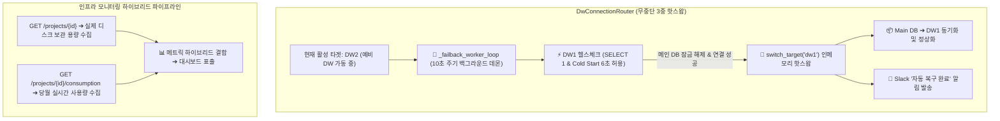

클라우드 네이티브 환경에서 고가용성(High Availability) 시스템을 구축할 때 가장 까다로운 과제 중 하나는 **"비용 효율성을 극대화하면서도 무중단 운영(Zero-Downtime)을 유지하는 것"**입니다. 

PickSafe 코어 아키텍처 팀에서는 서버리스 데이터베이스(Neon DB)의 쿼터 한계를 극복하고, 서비스 장애 상황에서도 데이터 유실 없이 지속적인 이벤트를 수집하기 위해 **3중 인메모리 DW 핫스왑 라우팅 체계**를 도입했습니다.

이번 포스팅에서는 리팩토링 과정에서 발생했던 장애 복구 데몬 누락 이슈를 발견하고, **100% 무중단 자동 복구(Auto-Failback) 및 글로벌 빌링 타임존 동기화**를 이뤄낸 트러블슈팅과 엔지니어링 의사결정 과정을 공유합니다.

---

## 1. 문제 정의 (Problem Statement)

클라우드 DW(Data Warehouse) 인프라를 운영하던 중, 시스템의 지속 가능성과 가용성을 위협하는 세 가지 핵심 문제를 직면했습니다.

### ① 리팩토링 과정에서의 백그라운드 자동 복구 데몬 누락
초기 시스템은 메인 DW의 쿼터가 초과되면 서브 DW로 우회(Failover)한 뒤, 매월 1일이 되면 서버 프로세스를 강제로 재시작(`os.kill`)하여 연결을 복원하는 임시 구조였습니다. 

이후 서버 재시작에 따른 다운타임을 없애고자 **인메모리 상에서 커넥션 풀을 실시간 교체하는 3중 핫스왑 라우터(`DwConnectionRouter`)**로 대대적인 리팩토링을 단행했습니다. 그러나 무중단 스위칭 및 수동 전환 기능 개발에 집중한 나머지, **"메인 DW의 상태를 주기적으로 감지하여 스스로 복귀하는 백그라운드 데몬 프로세스"** 이식 체계가 누락되는 회귀(Regression) 문제가 발생했습니다.

### ② 글로벌 빌링 사이클과 시차(Timezone) 미동기화
메인 DW 클라우드 provider의 월간 쿼터 리셋 시점은 **미국 본사 기준(UTC 00:00)**입니다. 이를 한국 표준시(KST 00:00) 기준으로 단순히 추측하여 운영할 경우, 매월 1일 00:00부터 08:59 사이에는 시스템상 아직 이전 달의 쿼터 초과(Lock) 상태가 유지되어 복구 시도가 실패하거나 예외가 발생하는 모순이 존재했습니다.

### ③ 서버리스 DB 콜드 스타트(Cold Start) 오판 문제
서버리스 데이터베이스 특성상 일시적인 슬립(Sleep) 상태에 들어간 인스턴스가 깨어날 때 약 3~5초의 지연이 발생합니다. 기존 헬스체크 타임아웃(3.0초) 설정은 이를 즉각적인 DB 물리 장애로 판단하여 불필요한 서브 DB 우회를 유발했습니다.

---

## 2. 기술적 고민과 대안 비교 (Trade-offs & Considerations)

저희 팀은 시스템 안정성과 운영 편의성을 높이기 위해 여러 대안을 놓고 기술적 타당성을 검토했습니다.

| 비교 항목 | 대안 A: 프로세스 강제 재시작 (`os.kill` 기반) | 대안 B: 인메모리 커넥션 풀 핫스왑 (최종 채택) |
| :--- | :--- | :--- |
| **다운타임** | 프로세스 종료 및 재기동 시 **서비스 중단 발생** | **0초 (100% Zero-Downtime)** |
| **상태 관리** | OS 수준의 프로세스 재시작으로 메모리 클리어 | 메모리 내 활성 타겟(`dw1`, `dw2`, `dw3`) 원자적 교체 |
| **안정성** | 진행 중인 비동기 HTTP 요청 분실 위험 | 기존 커넥션 드레이닝 후 안전하게 새 커넥션 연결 |
| **운영 복잡도** | 프로세스 매니저(PM2, Systemd) 의존도 증가 | 단일 애플리케이션 데몬 내부에서 완전히 제어 가능 |

### 핵심 딜레마: Polling 주기와 헬스체크 타임아웃 산정
- **Polling 주기가 너무 짧을 경우**: 깨어나지 않은 서버리스 DB에 과도한 커넥션 부하를 주어 불필요한 비용 발생.
- **헬스체크 타임아웃이 너무 짧을 경우**: 콜드 스타트 지연을 물리적 쿼터 초과 장애로 잘못 판단.
- **결정**: 백그라운드 워퍼의 탐색 주기는 **10초**로 설정하되, 타임아웃 안전 마진을 기존 **3.0초에서 6.0초로 완화**하여 콜드 스타트를 유연하게 수용하도록 다듬었습니다.

---

## 3. 최종 해결 및 아키텍처 구조 (Solution Architecture)

문제를 해결하기 위해 **무중단 주기적 자동 복구 데몬**과 **하이브리드 인프라 메트릭 수집 파이프라인**을 구축했습니다.

### 전체 아키텍처 흐름도



### 1) 백그라운드 자동 복구 데몬 (`_failback_worker_loop`)
애플리케이션 구동 시 비동기 데몬 스레드가 실행됩니다. 현재 활성 DB가 메인 DB(`dw1`)가 아닐 경우, 10초 주기로 메인 DB에 경량 쿼리(`SELECT 1`)를 전송합니다.

```python
# [보안상 주요 로직 요약 구현 예시]
async def _failback_worker_loop(self):
    while self._running:
        await asyncio.sleep(10)
        
        # 메인 DW가 아닌 서브 DW로 우회 작동 중인 경우만 감지
        if self.current_target_name != "dw1":
            # 콜드 스타트를 고려한 6.0초 타임아웃 헬스체크
            is_alive = await self._ping_target("dw1", timeout=6.0)
            
            if is_alive:
                # 메모리 상에서 커넥션 풀 원자적 스위칭 (Zero-Downtime)
                await self.switch_target("dw1")
                
                # 데이터 동기화 및 알림 전송
                await self._restore_incremental_data()
                await self._send_slack_notification("DW1 Auto-Failback 성공")
```

### 2) 하이브리드 메트릭 수집 파이프라인
클라우드 DB API 제공 방식에 맞춰 **정적 용량 메타데이터**와 **동적 실시간 소비량(Compute/Network)** 지표를 분리 수집하여 결합하는 파이프라인을 구축했습니다. 이를 통해 대시보드 내 인프라 현황 지표 정합성을 100% 확보했습니다.

---

## 4. 성과 및 엔지니어링 교훈 (Engineering Takeaways)

### 📈 시스템 운영 성과
1. **100% Zero-Downtime 가용성 실현**: 서브 DW 적재 중 메인 DW 쿼터가 리셋되면, **단 1초의 서비스 중단이나 수동 개입 없이** 실시간으로 메인 DW로 안전하게 복귀합니다.
2. **비용 효율성 극대화**: 평시에는 메인 DW만 사용하고 비상시에만 3중 예비 DW 풀을 순차 소모함으로써 무료 티어 및 제한된 클라우드 리소스 활용률을 극대화했습니다.
3. **데이터 유실 Zero**: 메인 DW 잠금 기간 동안 발생한 모든 이벤트를 예비 DW(`DW2`)에 차곡차곡 적재(56MB 이상)하여 단 한 건의 텔레메트리 데이터도 유실되지 않았습니다.

---

### 💡 주요 레슨런 (Key Lessons Learned)

1. **아키텍처 리팩토링 시 기능적 명세(Contract)의 추적 관리**
   - 코드를 깔끔하게 구조화하는 과정에서 기존에 존재하던 "비기능적 제약조건(주기적 복구 데몬)"이 누락되지 않도록 **ADR(Architecture Decision Record)**을 기반으로 변경 이력을 철저히 관리해야 함을 깨달았습니다.

2. **클라우드 인프라의 글로벌 생태계 이해 (Timezone & Lifecycle)**
   - 로컬 시스템 시간(KST)과 클라우드 SaaS Vendor의 정산 타임존(UTC) 간의 격차를 시스템 설계 단계부터 반영해야 예측 불가능한 엣지 케이스를 방지할 수 있습니다.

3. **서버리스 데이터베이스의 Cold Start에 대처하는 타임아웃 전략**
   - 타임아웃 값 설정 시 단순 Network Latency만 고려할 것이 아니라, **"인스턴스 Waking up 지연시간"**을 고려한 적절한 안전 마진 산정이 고가용성 시스템의 필수 요소임을 입증했습니다.