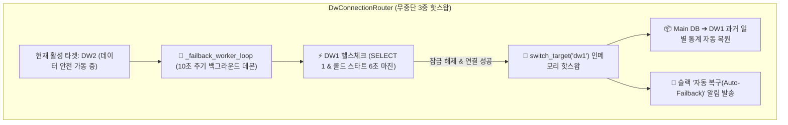

안녕하세요. PickSafe Core Architecture Team입니다.

이번 포스팅에서는 클라우드 기반 데이터베이스(DW)의 쿼터 초과(Quota Exceeded) 및 잠금(Connection Restricted) 상황에 대응하기 위해 구축한 **Multi-DW 3중 핫스왑 라우터**와, 이를 완전히 자동화한 **무중단 자동 복구(Auto-Failback) 백그라운드 데몬** 아키텍처의 설계 고민과 해결 과정을 공유합니다.

---

## 1. 문제 정의 (Problem): 서버 다운타임과 타임존의 함정

### 구버전 장애 복구 방식의 한계
초기 설계에서는 메인 DW의 쿼터가 초과되면 예비 DW(`DW2`)로 우회(Failover)하도록 설계되었습니다. 문제는 매월 1일 쿼터가 갱신된 후 메인 DW로 다시 연결을 재시도할 때, **서버 프로세스를 강제로 재시작(`os.kill`)하는 임시 스레드 방식**을 사용했다는 점입니다. 이는 서비스 운영 중 불필요한 다운타임(Downtime)을 유발하고, 실시간 수집 중이던 텔레메트리 데이터의 유실 위험을 안고 있었습니다.

### 글로벌 과금 리셋 타임존 (UTC vs KST)
클라우드 빌링 시스템은 미국 본사 기준(UTC 00:00)으로 동작합니다. 
* **UTC 기준**: 매월 1일 00:00 
* **한국 시간(KST) 기준**: 매월 1일 **09:00**

따라서 한국 시간 기준 9월 1일 00:00부터 08:59까지는 시스템상 아직 전월 말일로 인식되어 쿼터가 리셋되지 않는 것이 정상입니다. 단순 날짜 기준으로 복구를 시도하면 불필요한 에러 로그가 발생하고 시스템이 혼란에 빠지게 됩니다.

---

## 2. 기술적 고민과 대안 비교 (Trade-offs)

### 2.1. 수동 전환 vs 인메모리 3중 핫스왑 (`DwConnectionRouter`)
서버 다운타임을 없애기 위해 **ADR #16 리팩토링**을 통해 `DwConnectionRouter`(`dw1`, `dw2`, `dw3` 3중 인메모리 핫스왑) 체계를 도입했습니다.

* **대안 A (서버 재시작 방식)**: 구현이 단순하지만, 배포 및 복구 시마다 서비스 중단(Downtime) 발생 ❌
* **대안 B (인메모리 핫스왑 라우터 - 채택)**: 애플리케이션 메모리 상에서 커넥션 풀을 실시간으로 교체하여 **0초의 다운타임(Zero-Downtime)** 달성 ✅

단, 3중 핫스왑 구조로 전환하는 과정에서 "주 DW의 쿼터가 풀렸을 때 자동으로 메인으로 돌아오는 **Auto-Failback 백그라운드 데몬**"의 이식이 누락되어 있다는 점을 발견했습니다.

### 2.2. 클라우드 API 하이브리드 메트릭 수집
클라우드 프로바이더의 API는 물리적 스토리지 용량(State)과 당월 실시간 사용량(Delta)을 서로 다른 엔드포인트로 분리하여 제공하고 있었습니다.
* **프로젝트 메타 정보 API**: 실제 보관 중인 디스크 스토리지 크기 조회
* **소비량(Consumption) API**: 당월 실시간 컴퓨팅/네트워크 사용량 조회

관리자 대시보드의 정합성을 맞추기 위해, 이 둘을 결합한 **하이브리드 수집 파이프라인**을 설계하여 콘솔과 100% 일치하는 지표를 제공하도록 했습니다.

---

## 3. 아키텍처 구현 및 해결 (Solution)



### 3.1. 무중단 주기적 자동 복귀(Auto-Failback) 백그라운드 데몬
현재 활성 타겟이 주 DW(`dw1`)가 아닐 경우, 백그라운드 데몬(`_failback_worker_loop`)이 **10초 주기로 `dw1`의 가용성을 헬스체크(`SELECT 1`)**합니다.

```python
# 개념적 구현 예시
async def _failback_worker_loop(self):
    while self.is_running:
        await asyncio.sleep(10)
        if self.current_target != "dw1":
            if await self._test_availability("dw1"):
                # 서버 재시작 없이 인메모리 핫스왑 수행
                await self.switch_target("dw1")
                await self.notify_slack("Auto-Failback 성공: DW1로 복귀 완료")
```

* **콜드 스타트(Cold Start) 안전 마진 확보**: 슬립 상태인 클라우드 DB 인스턴스가 깨어나는 시간을 고려해 타임아웃을 기존 3.0초에서 **6.0초**로 완화하여 성급한 장애 오판을 방지했습니다.
* **슬랙 알림 연동**: 복구 즉시 엔지니어링 채널에 알림을 전송하여 운영 가시성을 높였습니다.

---

## 4. 엔지니어링 교훈 (Takeaways)

1. **무중단 아키텍처의 완성은 '복구(Failback)'까지 고려할 때 비로소 완성된다.**
   장애 발생 시 우회(Failover)하는 로직만 구현하고 복구 로직을 누락하면, 예비 자원이 계속 소모되거나 수동 개입이 필요해집니다. 시스템은 언제나 '원래 상태로 안전하게 돌아오는 과정'까지 자동화되어야 합니다.
2. **클라우드 인프라의 특성(타임존 및 슬립 상태)을 이해한 방어적 설계.**
   UTC와 KST의 시차, 서버less/클라우드 DB의 콜드 스타트 지연 시간 등을 고려한 타임아웃 및 주기 설정이 안정적인 시스템 운영을 만든다는 것을 다시 한번 확인했습니다.

---

*PickSafe는 앞으로도 고가용성과 무중단 서비스를 위한 아키텍처 개선 여정을 이어 나갑니다.*