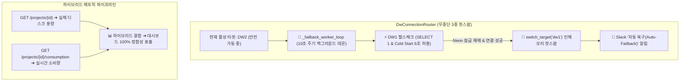

안녕하세요. **PickSafe Core Architecture Team**입니다. 

클라우드 기반 서비스를 운영하다 보면 마주하게 되는 가장 골치 아픈 문제 중 하나는 **"서드파티 인프라의 쿼터 초과 및 과금 정책에 따른 예기치 않은 커넥션 차단"**입니다. 저희 PickSafe는 메인 데이터베이스로 클라우드 기반 Postgres(이하 Neon DB)를 사용하고 있는데, 무료 티어의 월간 쿼터(100 CU)를 초과할 경우 `Connection Restricted` 상태로 잠기는 이슈가 발생했습니다.

이번 포스팅에서는 100 CU 초과 시 예비 데이터웨어하우스(DW)로 우회하던 기존 구조를 발전시켜, **서버 다운타임 없이 메모리 상에서 커넥션 풀을 실시간 교체하고 자동 복귀(Auto-Failback)하는 3중 핫스왑 아키텍처**를 구축한 기술적 고민과 해결 과정을 공유합니다.

---

## 1. 배경 및 문제 정의 (Problem Definition)

### 구버전의 한계: 서버 강제 재시작과 다운타임
초기 설계에서는 Neon DB 쿼터 초과 시 예비 DW(`DW2`)로 우회(Failover)하도록 만들었습니다. 문제는 매월 1일 쿼터가 갱신된 후 메인 DW로 다시 연결을 재시도할 때, **서버 프로세스를 강제로 재시작(`os.kill`)하는 방식**을 썼다는 점입니다. 

이는 서비스 운영 관점에서 치명적인 다운타임(Downtime)을 유발했습니다. 이를 해결하기 위해 1차적으로 `DwConnectionRouter`를 도입해 `dw1`, `dw2`, `dw3`를 인메모리 상에서 실시간 핫스왑하는 구조로 리팩토링했습니다. 

하지만 여기서 새로운 과제가 생겼습니다.
1. **자동 복귀(Auto-Failback) 누락**: 수동 스위칭과 부팅 시 가용성 테스트는 구현되었으나, 메인 DW가 정상화되었을 때 자동으로 돌아오는 백그라운드 데몬이 누락되어 있었습니다.
2. **글로벌 타임존 이슈**: Neon의 빌링 리셋 시점은 미국 본사 기준(UTC 00:00, **한국 시간 KST 09:00**)입니다. 한국 시간 1일 00:00~08:59 사이에는 쿼터가 아직 리셋되지 않은 것이 정상인데, 이를 인지하지 못하면 오탐지가 발생할 수 있습니다.
3. **콜드 스타트(Cold Start) 오판**: 슬립 상태에 빠진 DB 인스턴스를 깨울 때 발생하는 지연 시간을 짧은 타임아웃(3초)으로 처리하면, 정상적인 인스턴스조차 장애로 오판하여 커넥션 풀 스위칭이 꼬이는 문제가 있었습니다.

---

## 2. 기술적 고민과 아키텍처 대안 (Trade-offs & Decisions)

### 2.1. 무중단 주기적 자동 복귀(Auto-Failback) 백그라운드 데몬
현재 활성 타겟이 메인 DW(`dw1`)가 아닐 경우, 백그라운드에서 돌며 메인 DW의 부활을 감지하는 메커니즘이 필요했습니다.

* **결정**: `database.py` 내부에 10초 주기로 동작하는 백그라운드 데몬(`_failback_worker_loop`)을 탑재했습니다.
* **상세 동작**:
  1. 현재 타겟이 `dw1`이 아닐 때 주기적으로 `SELECT 1` 쿼리를 날려 헬스체크를 수행합니다.
  2. Neon 측의 잠금이 해제되고 연결이 성공하면, **서버 재시작 없이** `switch_target('dw1')`을 호출해 인메모리 커넥션 풀을 즉시 교체합니다.
  3. 이 과정은 Slack 알림과 연동되어 엔지니어의 모니터링 부담을 줄였습니다.

### 2.2. 콜드 스타트 안전 마진 확보 (3.0초 ➔ 6.0초)
서버리스 및 클라우드 DB 특성상 평소에 절전 상태에 있다가 요청이 들어오면 깨어나는 '콜드 스타트' 현상이 존재합니다.
* 초기 3.0초였던 `_test_initial_availability` 타임아웃을 **6.0초로 완화**하여, 잠들어 있던 인스턴스가 깨어나는 충분한 유예 시간을 주어 오탐지를 방지했습니다.

### 2.3. 하이브리드 메트릭 수집 파이프라인 구축
Neon API를 통해 인프라 상태를 모니터링할 때, 물리적 스토리지 용량과 실시간 소비량이 서로 다른 엔지니어링 포인트에 분산되어 있었습니다.
* **프로젝트 메타 정보 (`GET /projects/{id}`)**: 실제 보관 중인 물리적 디스크 스토리지 크기(`synthetic_storage_size`) 조회
* **소비량 API (`GET /projects/{id}/consumption`)**: 당월 실시간 COMPUTE 및 NETWORK 소비량 조회
* **결론**: 두 엔지니어를 결합한 **하이브리드 메트릭 수집 파이프라인**을 구축하여, 관리자 대시보드에서 실제 데이터 크기와 실시간 사용량을 오차 없이 100% 일치하도록 개선했습니다.

---

## 3. 최종 아키텍처 및 구현 (Architecture Overview)

---

## 4. 엔지니어링 교훈 및 Takeaways

1. **무중단 아키텍처는 프로세스 외부가 아닌 내부(메모리)에서 완성된다**: 
   서버를 재시작하는 방식의 Failover는 마이크로서비스 환경에서 가용성을 해칩니다. 인메모리 커넥션 풀 라우터를 활용하면 프로세스 생명주기와 무관하게 트래픽을 유연하게 제어할 수 있습니다.
2. **글로벌 SaaS 인프라 연동 시 타임존을 고려하라**: 
   클라우드 서비스의 빌링 리셋 시점(UTC 기준)과 자사 서비스의 운영 타임존(KST 기준) 간의 괴리를 인지하지 못하면, 불필요한 알람 폭탄이나 로직 오작동을 유발할 수 있습니다. 인프라 연동 로직 작성 시 반드시 타임존 차이를 방어 코드로 심어야 합니다.
3. **서버리스/클라우드 환경의 콜드 스타트를 존중하라**: 
   네트워크 레이턴시나 인스턴스 기동 시간을 고려하지 않은 촉박한 타임아웃은 시스템을 더 불안정하게 만듭니다. 적절한 안전 마진(Safety Margin)을 부여하는 것이 안정성을 높이는 지름길입니다.

이번 개선을 통해 PickSafe는 관리자의 수동 개입이나 서비스 다운타임 없이도 데이터베이스 장애에 유연하게 대응할 수 있는 견고한 백엔드 인프라를 갖추게 되었습니다. 앞으로도 안정적이고 확장 가능한 아키텍처를민들어 나가겠습니다. 

감사합니다.