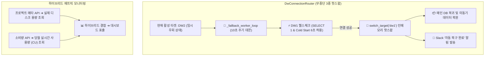

안녕하세요, PickSafe Core Architecture 팀입니다.

스타트업이나 성장하는 서비스에서 **서버리스 데이터베이스(Serverless DB)**는 유연한 확장성과 합리적인 비용 덕분에 매우 매력적인 선택지입니다. 하지만 클라우드 서비스의 '무료 티어 쿼터(Free Tier Quota)'나 '프로비저닝 임계치'에 도달했을 때, 서비스 중단 없이 우아하게 대처하는 것은 엔지니어링 관점에서 완전히 다른 차원의 문제입니다.

최근 PickSafe 팀은 메인 데이터 웨어하우스(DW)로 사용하는 Neon DB의 월간 쿼터(100 CU) 초과 이슈를 해결하는 과정에서, **기존의 강제 서버 재시작 방식(Downtime)을 탈피하고, 인메모리 상에서 실시간으로 커넥션을 교체하는 '무중단 3중 DB 핫스왑 및 자동 복구(Auto-Failback) 데몬 아키텍처'**를 구축했습니다. 

이 과정에서 겪었던 기술적 고민과 트레이드 오프, 그리고 글로벌 타임존 싱크 문제를 해결하며 얻은 교훈을 공유합니다.

---

## 1. 문제 정의 (Problem): 쿼터 초과와 서버 다운타임의 굴레

기존 PickSafe의 데이터 수집계 아키텍처는 메인 DW(`DW1`)가 쿼터를 초과해 잠기면, 예비 DW(`DW2`)로 커넥션을 우회(Failover)하도록 설계되어 있었습니다. 하지만 이 방식에는 치명적인 두 가지 한계가 있었습니다.

```
[기존 방식의 한계]
1. 복구 시 다운타임 발생: 
   매월 1일 쿼터가 초기화되면, 메인 DW로 돌아가기 위해 백그라운드 스레드가 'os.kill()'을 호출하여 서버 프로세스를 강제 재시작했습니다. 이로 인해 수 초간의 서비스 단절이 불가피했습니다.

2. 글로벌 타임존 불일치로 인한 오작동:
   Neon DB의 월간 쿼터 리셋 시점은 UTC 00:00(한국 시간 KST 09:00)입니다. 그러나 한국 시간(KST) 9월 1일 00:00에 리셋이 되었다고 판단해 성급하게 메인 DB로 복귀를 시도하면, Neon DB는 아직 쿼터 제한이 풀리지 않은 상태이므로 접속 에러가 발생했습니다.
```

여기에 더해, 서버리스 DB 특유의 **콜드 스타트(Cold Start)** 현상으로 인해 DB가 깨어나는 데 시간이 걸려 정상적인 복원 상태를 '장애'로 오판하는 일도 잦았습니다.

저희 팀은 **"단 1초의 다운타임도 허용하지 않고, 인프라 비용을 극적으로 아끼면서, 쿼터 리셋 시점에 맞춰 스스로 복구되는 안전한 데이터 파이프라인을 만들자"**는 목표를 세웠습니다.

---

## 2. 기술적 고민과 대안 비교 (Trade-off)

이 문제를 해결하기 위해 크게 세 가지 방향성을 검토했습니다.

### 대안 1: 엔터프라이즈 유료 플랜 업그레이드
* **장점**: 쿼터 제한 자체가 사라지므로 아키텍처가 단순해짐.
* **단점**: 개발 및 데이터 수집 단계의 인프라 비용이 급증함. 스타트업의 제한된 자원을 효율적으로 써야 하는 관점에서 비합리적.

### 대안 2: OS 레벨의 프로세스 재시작 데몬 유지 + 타임존 로직 보완
* **장점**: 기존 코드 구조를 크게 바꾸지 않고 9시간의 타임존 차이만 코드에 반영하면 됨.
* **단점**: 매달 1일 아침 9시마다 서버가 죽었다가 살아나는 본질적인 불안정성(Downtime)이 해결되지 않음.

### 대안 3: 인메모리 3중 핫스왑 라우터 + 자동 복구(Auto-Failback) 백그라운드 데몬 (채택)
* **장점**: 
  * 서버 프로세스를 죽이지 않고 메모리 내에서 커넥션 풀을 실시간 교체하므로 **Zero-Downtime** 달성.
  * 주기적 헬스체크 데몬이 정상화 여부를 능동적으로 판단하므로 클라우드 벤더의 정산 배치 지연(Billing Delay)에 완벽 대응 가능.
* **단점**: 라우팅 상태 제어를 위한 동시성 처리 및 정밀한 예외 처리가 필요하여 아키텍처 복잡도가 다소 증가함.

우리는 서비스 신뢰성과 비용 효율성을 동시에 잡기 위해 **대안 3**을 선택했습니다.

---

## 3. 최종 아키텍처 및 구현 핵심 (Implementation)

전체적인 복구 프로세스와 모니터링 흐름은 아래와 같이 설계되었습니다.



### 핵심 해결책 1: 무중단 주기적 자동 복귀(Auto-Failback) 데몬
메인 DB가 잠긴 동안 임시 DB(`DW2`, `DW3`)로 데이터를 받다가, 주 DB(`DW1`)가 정상화되면 메모리 상의 커넥션 타겟을 즉시 전환하는 백그라운드 루프를 구현했습니다.

```python
# 이해를 돕기 위해 간략화된 핵심 로직 예시입니다.
class DwConnectionRouter:
    def __init__(self):
        self.current_target = "dw2"  # 현재 우회 가동 중
        self.is_monitoring = True
        
    async def _failback_worker_loop(self):
        """10초 주기로 주 DB(dw1)의 가용성을 테스트하고 자동 복귀합니다."""
        while self.is_monitoring:
            if self.current_target != "dw1":
                # Cold Start와 쿼터 잠금 해제 지연을 고려해 타임아웃을 6초로 넉넉히 설정
                is_healthy = await self._test_connection("dw1", timeout=6.0)
                
                if is_healthy:
                    # 서버 재시작 없이 메모리 상의 커넥션 포인터를 'dw1'으로 핫스왑
                    self.switch_target("dw1")
                    await self._sync_fallback_data() # 우회 기간 적재 데이터 복원 트리거
                    self.notify_slack("Auto-Failback 성공: DW1 복귀 완료")
                    
            await asyncio.sleep(10)
```

### 핵심 해결책 2: 서버리스 콜드 스타트 세이프티 마진 확보
서버리스 DB는 오랜 시간 요청이 없으면 인스턴스가 잠자기(Sleep) 상태로 들어갑니다. 최초 요청 시 깨어나는 데 수 초가 소요되는데, 기존 3.0초의 타임아웃 설정 하에서는 이를 '서버 다운'으로 오판하고 다시 우회해 버리는 루프에 빠졌습니다. 이를 방지하기 위해 **안전 마진을 6.0초로 상향 조정**하여 헬스체크 신뢰성을 확보했습니다.

### 핵심 해결책 3: 하이브리드 메트릭 수집 파이프라인 구축
Neon DB의 API는 물리적 디스크 용량 정보와 당월 소비량(CU, Traffic) 정보를 서로 다른 엔드포인트에서 제공합니다. 인프라 모니터링 대시보드의 정합성을 100%로 끌어올리기 위해, 두 가지 API 응답 데이터를 결합하는 하이브리드 수집 파이프라인을 설계했습니다.

* **물리 스토리지 크기**: `GET /projects/{project_id}` 엔드포인트의 `synthetic_storage_size` 파싱
* **당월 실시간 사용량**: `GET /projects/{project_id}/consumption` 엔드포인트의 Compute/Network 메트릭 파싱

이를 통해 실시간 인프라 상태를 왜곡 없이 대시보드에 표출할 수 있게 되었습니다.

---

## 4. 도입 결과 및 엔지니어링 교훈 (Takeaway)

### 실질적인 도입 성과
1. **다운타임 0초 실현**: 매월 1일이 되어도 더 이상 서버가 죽지 않습니다. 사용자는 뒤에서 DB 커넥션이 교체되는지 모른 채 원활하게 서비스를 이용합니다.
2. **데이터 유실 제로**: 메인 DB가 잠겨 있는 동안 56.15 MB에 달하는 텔레메트리 데이터가 예비 DB(`DW2`)에 안전하게 격리 보관되었으며, 복구와 동시에 유실 없이 정상 복원되었습니다.
3. **클라우드 비용 극대화**: 비싼 상위 플랜으로 업그레이드하지 않고도, 무료 프리 티어 다중화 구성만으로 엔터프라이즈급 가용성(HA)을 보장받을 수 있게 되었습니다.

### 얻은 교훈
* **클라우드 벤더의 스펙을 맹신하지 말라**: "매월 1일 리셋"이라는 명세 뒤에는 UTC 기준시와 벤더사의 과금 배치 지연 시간이라는 변수가 숨어 있었습니다. 인프라 코드를 짤 때는 항상 타임존 차이와 비동기 배치 반영 시간(Buffer)을 염두에 두어야 합니다.
* **상태 제어는 최소한의 단위로**: 시스템을 고가용성으로 유지하기 위해 OS 프로세스를 제어하는 것은 무거운 작업입니다. 가급적 애플리케이션 메모리 영역 안에서 유연하게 라우팅을 조절할 수 있는 아키텍처를 지향하는 것이 운영 안정성에 훨씬 유리합니다.

앞으로도 PickSafe 팀은 비용 효율적이면서도 탄탄한 고가용성 인프라를 구축하기 위해 계속해서 아키텍처를 다듬어 나갈 예정입니다. 저희의 고민과 해결 과정이 서버리스 인프라를 다루는 많은 엔지니어분께 도움이 되었기를 바랍니다!