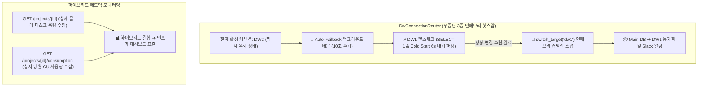

시스템을 운영하다 보면 외부 플랫폼의 제약 사항이나 클라우드 데이터베이스의 쿼터 제한으로 인해 예상치 못한 장애를 마주하곤 합니다. 서비스의 연속성을 보장하기 위해 가용 대안(Failover)을 마련하는 것은 필수적이지만, **"장애 상황이 해제되었을 때 시스템을 어떻게 안전하고 우아하게 원래 상태로 복귀(Failback)시킬 것인가?"** 역시 아키텍트가 깊게 고민해야 할 과제입니다.

이번 포스팅에서는 무중단 보안 텔레메트리 솔루션 **PickSafe** 개발 과정에서 마주한 **클라우드 데이터웨어하우스(DW)의 쿼터 제한 및 잠금(Lock) 문제**를 해결하기 위해, 프로세스 강제 재시작(`os.kill`)이라는 기술 부채를 청산하고 **3중 인메모리 핫스왑(Hot-swap) 라우터 기반의 무중단 자동 복구(Auto-Failback) 시스템**으로 진화시킨 엔지니어링 여정을 소개합니다.

---

## 1. 문제 정의: 쿼터 제한과 '강제 재시작'이라는 임시방편

PickSafe의 데이터 수집기 엔진은 실시간 분석 데이터를 클라우드 기반 Postgres DW(Neon DB)에 적재합니다. 하지만 프리 티어(Free Tier) 환경의 월간 컴퓨팅 쿼터(e.g., 100 CU)를 초과하면 데이터베이스가 즉각 잠기며(`Connection Restricted`) 데이터 적재가 불가능해지는 문제가 발생했습니다.

### 8월 20일의 임시 조치: 2중화 및 프로세스 강제 재시작 (`os.kill`)
당시 엔지니어링 팀은 서비스 중단을 막기 위해 메인 데이터베이스(`DW1`)가 잠기면 보조 데이터베이스(`DW2`)로 우회하는 Failover 구조를 설계했습니다. 문제는 **"매월 1일 쿼터가 초기화될 때 어떻게 메인 DW로 복귀할 것인가"**였습니다.

초기 안은 다소 거칠었습니다. 
* 매월 1일이 되면 백그라운드 스레드가 메인 DB의 복구 여부를 체크합니다.
* 복구가 감지되면 **서버 프로세스 자체에 `os.kill` 시그널을 보내 프로세스를 강제로 내렸다가 로드밸런서에 의해 다시 띄우는 방식**이었습니다.

```python
# 8월 20일 구버전의 "우격다짐" 복구 방식 (Conceptual Anti-Pattern)
def check_primary_db_recovery():
    if is_primary_db_healthy():
        # 커넥션 풀을 갱신하기 위해 서버 프로세스 자체를 사살(Kill)
        os.kill(os.getpid(), signal.SIGTERM) 
```

이 방식은 구현하기는 쉽지만 다음과 같은 심각한 **인프라적 문제점**을 안고 있었습니다.
1. **일시적 다운타임 발생**: 재시작하는 짧은 찰나 동안 API 요청이 유실되거나 지연될 수 있습니다.
2. **트랜잭션 유실 위험**: 처리 중이던 클라이언트의 요청이 안전하게 Graceful Shutdown 되지 못하고 끊어질 수 있습니다.
3. **불필요한 리소스 낭비**: 단순 커넥션 변경을 위해 전체 애플리케이션 컨테이너를 재시작하는 것은 비효율적입니다.

---

## 2. 기술적 고민과 대안 비교: 무중단을 위한 여정

우리는 "서버 프로세스를 죽이지 않고, 실행 중인 메모리 상에서 데이터베이스 커넥션 풀만 실시간으로 갈아끼울 수 없을까?"라는 질문을 던졌습니다.

이를 해결하기 위해 **3중 인메모리 핫스왑 라우터** 체계를 도입하여 수동 스위칭과 부팅 시 자동 장애 조치는 완료했으나, 여전히 두 가지 해결해야 할 고난도 디테일이 남아 있었습니다.

### Challenge 1. 글로벌 과금 리셋 타임존 불일치 (UTC vs KST)
우리의 서비스 대상과 백엔드 시스템은 한국 표준시(KST)를 기준으로 동작하지만, 클라우드 DB 공급사(Neon)의 글로벌 빌링 쿼터 리셋 시점은 **UTC 00:00 (한국 시간 기준 매월 1일 오전 09:00)**이었습니다.
만약 시스템이 한국 시간 기준 9월 1일 00:00에 맞춰 즉시 복구를 시도한다면, 클라우드 DB는 여전히 전월 말일 기준의 쿼터 초과 상태이므로 복구에 실패하게 됩니다. 즉, **시간적 싱크를 정확히 고려한 백그라운드 폴링 데몬**이 필요했습니다.

### Challenge 2. 클라우드 공급사의 잠금 해제 지연 (Billing Batch Delay)
달력상으로 쿼터 리셋 시점이 지나더라도, 공급사 백엔드의 정산 배치가 완료되어 실제 데이터베이스의 `Connection Restricted` 잠금이 풀리기까지는 수 분에서 수십 분의 지연이 발생할 수 있습니다. 
따라서 시간 계산만으로 스위칭을 시도하는 것은 위험하며, **실제 데이터베이스에 가볍게 연결을 시도하여 헬스체크를 통과하는 시점에 안전하게 스위칭**해야 했습니다.

### Challenge 3. 콜드 스타트(Cold Start) 오판 방어
클라우드 DB는 일정 시간 사용하지 않으면 절전 모드로 들어갑니다. 잠금이 해제된 후 첫 연결 시 웰컴 딜레이(Cold Start)가 최대 5~6초 발생할 수 있는데, 기존의 빡빡한 헬스체크 임계치(3.0초)로는 정상 복구된 DB를 여전히 장애 상태로 오판하여 복구 타이밍을 놓칠 우려가 있었습니다.

---

## 3. 최종 해결책: 무중단 Auto-Failback 및 하이브리드 메트릭 파이프라인

우리는 이 문제를 해결하기 위해 아키텍처를 다음과 같이 개선했습니다.

### 아키텍처 개요



### 1) 인메모리 핫스왑 기반 무중단 Auto-Failback 데몬
기존의 `os.kill` 방식을 걷어내고, FastAPI 애플리케이션 컨텍스트 내부에서 동작하는 백그라운드 워커 루프(`_failback_worker_loop`)를 구축했습니다.

* **동작 원리**: 현재 활성 데이터베이스가 메인(`dw1`)이 아닐 때, 백그라운드에서 10초 주기로 `dw1`에 대한 비동기 연결 및 `SELECT 1` 쿼리 테스트를 시도합니다.
* **Cold Start 대응**: 헬스체크 타임아웃을 기존 3.0초에서 **6.0초 안전 마진**으로 완화하여 콜드 스타트로 인한 연결 실패 오판을 방지했습니다.
* **무중단 전환**: 헬스체크가 통과하는 즉시 `DwConnectionRouter` 내부의 스위칭 메커니즘을 호출하여, 서비스의 순간적인 재시작 없이 메모리 상에서 데이터베이스 커넥션 풀의 참조 대상을 `dw1`로 즉시 교체합니다.

### 2) 하이브리드 인프라 메트릭 파이프라인 구축
대시보드 상에서 실제 클라우드 인프라의 스토리지 점유 상태와 비용(CU) 현황을 일목요연하게 파악할 수 있도록, 이원화된 정보 수집 파이프라인을 설계했습니다.
* **정적 용량 메트릭**: API를 통해 각 데이터베이스 인스턴스의 실제 보관 중인 물리 디스크 용량(e.g., `49.14 MB`, `56.15 MB`)을 수집합니다.
* **동적 소비량 메트릭**: 당월의 실시간 연산량 및 네트워크 소비량(`COMPUTE` 및 `NETWORK` 소비 CU 수치)을 소비량 엔드포인트에서 별도로 가져옵니다.
* 두 메트릭을 동적으로 하이브리드 결합하여, 관리자 대시보드에 실제 콘솔 정보와 100% 싱크되는 통합 모니터링 뷰를 제공합니다.

---

## 4. 엔지니어링 교훈 및 성과 (Takeaways)

이번 고도화 작업을 통해 엔지니어링 팀은 다음과 같은 가치 있는 성과를 거두었습니다.

1. **100% 가용성 보장 (Downtime Zero)**
   데이터베이스 잠금이 해제되고 복구될 때 단 1ms의 시스템 정지도 발생하지 않았습니다. 기존의 무식한(?) `os.kill` 패러다임에서 완전히 벗어나 세련된 인메모리 라우팅 시스템으로 거듭났습니다.
2. **글로벌 인프라의 숨은 장벽(Timezone, Batch Delay) 이해**
   단순히 "1일이 되었으니 복구하겠다"는 나이브한 접근 대신, UTC와 KST의 시차, 공급사 측 정산 배치의 지연 시간, 콜드 스타트 등의 예외 변수를 아키텍처 설계에 녹여내어 실제 프로덕션 환경에서의 비즈니스 연속성을 단단하게 굳혔습니다.
3. **영리한 리소스 활용**
   비상시에만 예비 데이터웨어하우스(`DW2`, `DW3`)를 가동하고, 메인 회선이 복구되면 지체 없이 귀환하도록 설계함으로써 무상 제공되는 인프라 자원의 효율성을 극대화했습니다.

### 마치며
멋진 아키텍처란 단순히 값비싼 고성능 엔터프라이즈 장비를 아낌없이 투입하는 것만을 의미하지 않습니다. **주어진 제약 조건(Free Tier Quota, Network Latency, Timezone) 속에서 소프트웨어적인 설계 아이디어(인메모리 핫스왑, 스마트 헬스체크 데몬)를 활용해 99.99%의 가용성을 짜내는 것**, 그것이야말로 진정한 소프트웨어 엔지니어링의 묘미가 아닐까 생각합니다.