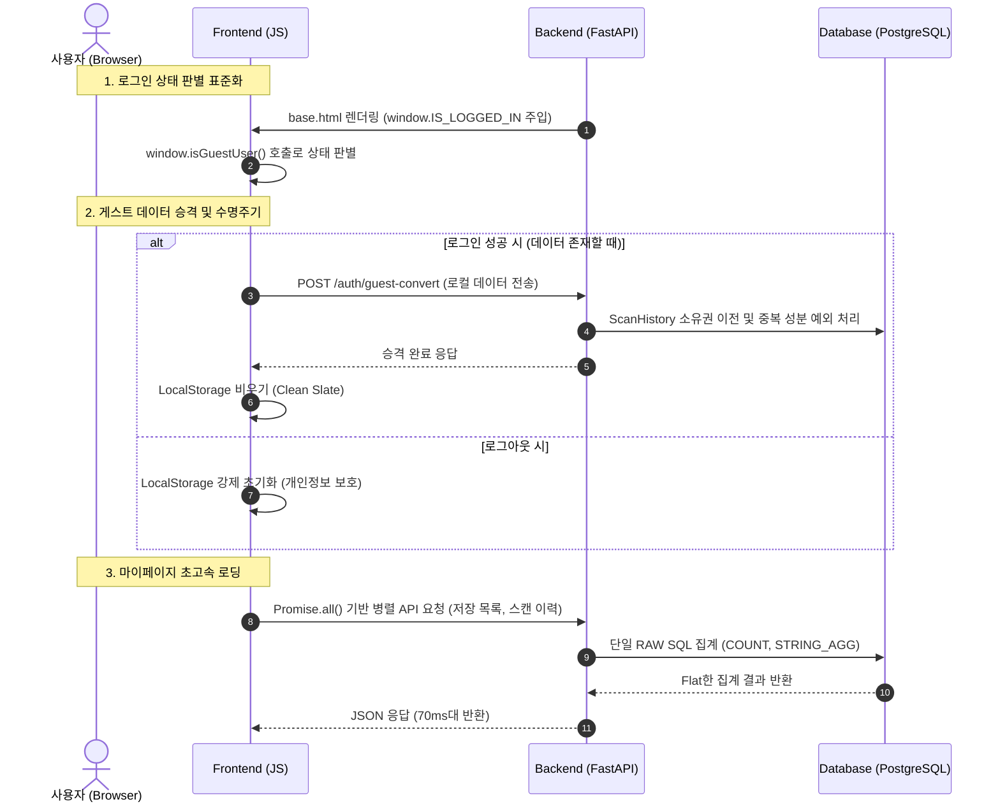

화장품 성분 분석 서비스인 **PickSafe**를 개발하고 운영하면서, 최근 서비스 활성화를 위해 게스트 사용자의 이용 한도를 제한하고 회원 가입을 유도하는 기능을 도입했습니다. 

하지만 이 과정에서 예상치 못한 곳에서 병목과 정합성 결함이 드러나기 시작했습니다. 보안을 위해 설정한 `HttpOnly` 쿠키가 프론트엔드의 상태 감지를 방해했고, 느슨하게 설계된 게스트 데이터 이관 로직은 유저 데이터를 누락시켰으며, 마이페이지는 수백 개의 성분 데이터를 ORM으로 조회하느라 심각한 로딩 지연을 겪고 있었습니다.

문제를 하나씩 뜯어보며 원인을 분석하고, 아키텍처를 정형화하며 해결해 나간 과정의 기록입니다.

---

## 🎯 마주한 고민과 문제 배경

### 1. 보안 쿠키와 프론트엔드 상태 인식의 충돌
보안을 강화하기 위해 인증 토큰(`access_token`)을 `HttpOnly=True` 옵션의 쿠키로 발급하도록 구성했습니다. 이 조치로 클라이언트 사이드 스크립트가 토큰에 직접 접근하는 것은 차단할 수 있었으나, 프론트엔드(`result.js`, `scan.js`)에서 사용자가 로그인 상태인지 게스트 상태인지를 `document.cookie`로 판별할 수 없는 문제가 발생했습니다. 

결국 로그인한 사용자임에도 프론트엔드는 이를 게스트로 오인하여 성분 스캔 결과를 서버 DB가 아닌 브라우저 로컬 스토리지에 적재하는 현상이 발생했습니다.

### 2. 게스트 데이터 승격(Migration)의 누락
온보딩 과정을 건너뛰어 기기 식별자(`guest_device_id`)를 발급받지 않은 게스트가 가입/로그인을 진행할 경우, 동기화 API가 조기 반환되어 그동안 쌓인 스캔 기록과 찜 목록이 계정으로 이전되지 않고 소실되는 버그가 있었습니다.

### 3. 마이페이지 로딩 지연 (최대 10초)
사용자가 마이페이지에 진입할 때, 저장한 화장품 목록(평균 6개)과 최근 스캔 이력(평균 50개)을 보여주어야 합니다. 그런데 각 상품마다 연결된 수십 개의 성분 관계 객체들이 루프를 돌며 개별적으로 조회되는 **N+1 쿼리 문제**가 발생했습니다. 파이썬 ORM 객체 수백 개가 한 번에 인스턴스화되면서 CPU 오버헤드가 발생했고, 응답 시간이 최악의 경우 10초까지 늘어났습니다.

---

## ⚖️ 기술적 대안 비교 및 선택 이유

문제를 해결하기 위해 몇 가지 설계 대안을 검토하고, 현실적인 트레이드오프를 고려해 결정을 내렸습니다.

### 대안 1. 로그인 상태 판별 방식
*   **안 1) 쿠키 보안 수준 완화**: `HttpOnly` 옵션을 제거하고 JS에서 쿠키를 직접 읽도록 설정.
    *   *장점*: 프론트엔드 구현이 매우 단순해짐.
    *   *단점*: XSS 공격에 토큰이 그대로 노출되므로 보안 설계 원칙에 위배됨.
*   **안 2) 서버 세션 상태 주입 (선택)**: HTML 템플릿 렌더링 시점에 서버가 세션 상태를 판단하여 전역 객체(`window.IS_LOGGED_IN`)를 주입.
    *   *장점*: 쿠키 보안을 최고 수준으로 유지하면서, 프론트엔드가 명확한 단일 출처의 상태 값을 참조할 수 있음.

### 대안 2. 마이페이지 N+1 쿼리 해결 방식
*   **안 1) SQLAlchemy `joinedload` / `selectinload` 적용**: ORM 수준에서 관계형 데이터를 미리 로드(Eager Loading).
    *   *장점*: 파이썬 코드가 직관적이고 ORM 추상화가 유지됨.
    *   *단점*: 마이페이지 화면에는 성분의 전체 상세 정보가 아닌 '주의 성분 개수', '총 성분 수', '대표 성분 이름 2개' 같은 **요약 데이터**만 필요함에도 불필요하게 모든 성분 객체를 메모리에 로드하여 인스턴스화하는 성능 낭비가 여전함.
*   **안 2) 직접 집계 SQL (Raw Query) 도입 (선택)**: `COUNT`, `STRING_AGG`, `LEFT JOIN`을 사용하여 단일 쿼리로 요약 데이터를 가공해 조회.
    *   *장점*: DB 레이어에서 연산을 끝내고 필요한 데이터만 로드하므로 메모리 사용량과 네트워크 페이로드가 극적으로 감소함. (400ms -> 79ms로 개선)
    *   *단점*: ORM의 추상화 혜택을 잃고 SQL 의존성이 높아짐.

---

## 🏗️ 시스템 아키텍처 및 흐름

인증 상태 인식, 게스트 데이터의 승격 파이프라인, 그리고 마이페이지의 렌더링 흐름을 구조화한 아키텍처는 다음과 같습니다.



---

## 💻 핵심 구현 및 트러블슈팅

### 1. 마이페이지 초고속 집계 SQL 구현 (`mypage.py`)
ORM 객체 생성 오버헤드를 없애기 위해 작성한 직접 집계 SQL 쿼리입니다. `STRING_AGG`를 이용해 성분명을 단일 문자열로 합치고, 필요한 카운트 값을 DB 단에서 미리 계산했습니다.

```python
# web/backend/app/routers/mypage.py
from sqlalchemy import text
from app.database import engine

async def get_saved_products_fast(user_id: int):
    # N+1 문제를 방지하기 위해 단일 쿼리로 주의 성분 수와 상위 성분 2개를 집계
    query = text("""
        SELECT 
            sp.id AS saved_product_id,
            p.id AS product_id,
            p.name AS product_name,
            p.image_url,
            COUNT(pi.ingredient_id) AS total_ingredients,
            COUNT(CASE WHEN i.is_caution = TRUE THEN 1 END) AS caution_count,
            (
                SELECT STRING_AGG(sub_i.name, ', ')
                FROM products_ingredients sub_pi
                JOIN ingredients sub_i ON sub_pi.ingredient_id = sub_i.id
                WHERE sub_pi.product_id = p.id
                LIMIT 2
            ) AS top_ingredients
        FROM saved_products sp
        JOIN products p ON sp.product_id = p.id
        LEFT JOIN products_ingredients pi ON p.id = pi.product_id
        LEFT JOIN ingredients i ON pi.ingredient_id = i.id
        WHERE sp.user_id = :user_id
        GROUP BY sp.id, p.id
        ORDER BY sp.created_at DESC
    """)
    
    with engine.connect() as conn:
        result = conn.execute(query, {"user_id": user_id})
        return [dict(row) for row in result]
```

### 2. 게스트 데이터 승격 시 중복 제약 조건 예외 트러블슈팅
게스트 상태에서 스캔한 이력을 회원 계정으로 이전할 때, 백엔드에서 `ProductIngredient` 테이블의 복합 유니크 제약 조건(`_products_ingredient_uc`)을 위반하며 `500 Internal Server Error`가 발생하는 현상이 있었습니다. 

이미 DB에 존재하는 동일 성분 매핑 관계를 중복해서 삽입하려 한 것이 원인이었습니다. 파이썬 메모리 상에서 이미 처리한 성분 ID를 추적하는 `seen_ingredients` 셋(Set)을 도입하여 이 문제를 해결했습니다.

```python
# web/backend/app/routers/auth.py
@router.post("/guest-convert")
async def convert_guest_data(
    payload: GuestConvertPayload, 
    current_user: User = Depends(get_current_user),
    db: Session = Depends(get_db)
):
    # 중복 저장 방지를 위한 메모리 캐시 셋
    seen_ingredients = set()
    
    # 1. 스캔 히스토리 소유권 이전
    db.query(ScanHistory).filter(
        ScanHistory.guest_device_id == payload.guest_device_id
    ).update({ScanHistory.user_id: current_user.id})
    
    # 2. 찜 목록 이전 및 중복 제약 예외 처리
    for product_data in payload.guest_saved_products:
        # 이미 존재하는 매핑인지 확인
        exists = db.query(SavedProduct).filter_by(
            user_id=current_user.id, 
            product_id=product_data.id
        ).first()
        
        if not exists and product_data.id not in seen_ingredients:
            new_saved = SavedProduct(
                user_id=current_user.id, 
                product_id=product_data.id
            )
            db.add(new_saved)
            seen_ingredients.add(product_data.id)
            
    db.commit()
    return {"status": "success", "migrated_count": len(seen_ingredients)}
```

### 3. 프론트엔드 비동기 병렬화 및 동기화 격리 (`mypage.html`)
마이페이지에 접속할 때 발생하는 체감 대기 시간을 최소화하기 위해 화면 렌더링에 필요한 API 요청들을 `Promise.all`로 묶어 병렬 처리하고, 게스트 데이터 동기화(`syncGuestData`)는 백그라운드 비동기로 격리하여 렌더링을 방해하지 않도록(Non-blocking) 설계했습니다.

```javascript
// web/frontend/static/js/mypage.js
async function initMypage() {
    try {
        // UI 렌더링에 필수적인 데이터만 병렬로 우선 로드
        const [savedProducts, scanHistory] = await Promise.all([
            fetch('/api/mypage/saved-products').then(res => res.json()),
            fetch('/api/mypage/scan-history').then(res => res.json())
        ]);
        
        renderSavedProducts(savedProducts);
        renderScanHistory(scanHistory);
        
        // 게스트 데이터 이관 처리는 백그라운드에서 비동기로 수행하여 화면 진입 지연 방지
        if (!window.isGuestUser()) {
            syncGuestData().catch(err => console.error("Background sync failed:", err));
        }
    } catch (error) {
        console.error("Mypage initialization error:", error);
    }
}
```

---

## 💡 돌아보며 배운 점 (회고)

### ORM의 편리함 뒤에 숨겨진 비용
ORM은 생산성을 극대화해 주지만, 대량의 데이터나 복잡한 관계형 조회가 일어나는 시점에는 치명적인 병목이 될 수 있음을 다시 한번 절감했습니다. 화면에 필요한 데이터의 스펙을 명확히 정의하고, 필요한 데이터만 딱 맞게 aggregate하는 쿼리를 직접 작성하는 것이 때로는 수십 배의 성능 향상을 가져옵니다. 이번 최적화로 마이페이지 전체 응답 시간이 최대 10초 대에서 평균 0.1초 대로 대폭 개선되었습니다.

### 데이터 수명주기와 보안의 일관성
로그인 상태를 판별하는 단일화된 전역 헬퍼(`window.isGuestUser()`)를 구축함으로써 프론트엔드 코드의 복잡성을 크게 낮출 수 있었습니다. 

또한, 로그아웃 시 공용 기기에서의 데이터 유출을 방지하기 위해 로컬 스토리지를 비우는 **Clean Slate 원칙**과 회원 탈퇴 시 DB 데이터를 영구 파기하는 **Hard Delete 정책**을 명확히 수립하면서, 기술적 정합성뿐만 아니라 사용자 개인정보 보호 측면에서도 한 단계 더 성숙한 서비스를 만들 수 있었습니다.