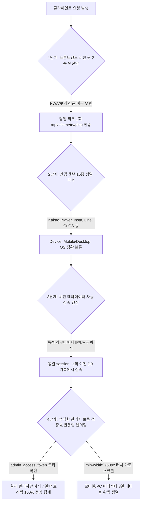

화장품 성분 분석 서비스 **PickSafe**를 운영하며 서비스 이용 흐름과 기기 환경을 추적하기 위해 Data Warehouse 기반의 방문자 분석 시스템(텔레메트리)을 구축했습니다. 

서비스 출시 이후 실운영 환경과 멀티 디바이스(리눅스 데스크톱, 외부 LTE 모바일, 인앱 브라우저 등) 환경에서 테스트를 거치는 과정에서, 수집되는 데이터에 심각한 누락과 왜곡이 발생하고 있음을 확인했습니다. 단순한 로그 누락을 넘어 통계 지표 전체의 신뢰도를 흔드는 문제들이었기에, 이를 구조적으로 해결하기 위한 **4중 원천 방어벽**을 설계하고 적용했습니다. 이 글에서는 당시 마주한 문제들과 이를 해결하기 위해 검토한 아키텍처적 고민을 담담하게 기록하고자 합니다.

---

## 1. 마주한 고민과 문제 배경

초기 텔레메트리 시스템은 미들웨어 중심의 단순한 요청 로깅 방식으로 구현되어 있었습니다. 하지만 실제 사용자의 다양한 접속 환경을 마주하면서 다음과 같은 5가지 취약점이 드러났습니다.

1. **세부 이벤트 라우터의 메타데이터 누락 취약점**:
   - `session_started` 이벤트는 미들웨어에서 IP와 User-Agent를 정상적으로 캡처했지만, `onboarding_completed`, `guest_converted` 등의 세부 라우터에서는 IP와 User-Agent를 명시적으로 넘기지 않아 DB에 `ip_address = NULL`, `device_type = NULL`로 적재되었고, 결국 통계에서 `Unknown/Other`로 합산되었습니다.
2. **모바일 인앱 웹뷰(In-App Browser) 판별 실패**:
   - 카카오톡, 네이버, 인스타그램, 라인 등 15종 이상의 모바일 인앱 브라우저는 표준 크롬이나 사파리와 다른 User-Agent 토큰을 사용하여 기기 및 OS 감지 로직에서 누락되는 문제가 있었습니다.
3. **PWA 및 브라우저 캐시 환경에서의 세션 미들웨어 침묵(Silent) 현상**:
   - 브라우저에 과거 발급받은 `session_id` 쿠키가 남아 있는 상태로 재접속할 경우, 서버 미들웨어가 신규 세션이 아니라고 판단하여 `session_started` 이벤트를 아예 발송하지 않는 사각지대가 존재했습니다.
4. **관리자 IP 오판정에 의한 일반 모바일 트래픽 마스킹(0 처리)**:
   - 모바일로 접속하여 일반 스캔을 진행한 뒤, 관리자 권한으로 어드민 URL(`/admin`)을 열람했을 때 미들웨어가 해당 모바일의 동적 LTE IP를 '관리자 접속 기기'로 자동 등록해 버렸습니다. 이로 인해 이전에 발생했던 모든 스캔과 접속 기록이 대시보드 통계에서 통째로 숨겨지는 치명적인 결함이 발생했습니다.
5. **모바일 뷰포트에서의 상세 통계 테이블 UI 깨짐**:
   - 8개의 컬럼으로 구성된 통계 테이블이 모바일 환경(360px 등)에서 `min-width` 없이 압축되면서 텍스트가 세로로 찌그러지고 수치가 서로 겹치는 시각적 결함이 있었습니다.

---

## 2. 4중 원천 방어벽 아키텍처 설계

위 문제들을 개별적인 패치로 해결하면 향후 새로운 라우터나 브라우저가 추가될 때마다 동일한 문제가 재발할 것이라 판단했습니다. 따라서 어떠한 비정상 요청이나 환경에서도 `Unknown`, `None`, 메타데이터 누락이 원천 차단되도록 4단계의 방어 구조를 설계했습니다.



### 제1단계: 프론트엔드 세션 핑 2중 안전망
브라우저 쿠키나 PWA 캐시 상태와 무관하게 세션 기록을 보장하기 위해, 클라이언트 로드 시 `localStorage` 기반의 일일 단위 핑 메커니즘을 도입했습니다.

```javascript
// web/frontend/static/js/base.js
function initSessionTelemetry() {
    const todayStr = new Date().toISOString().split('T')[0];
    const pingKey = `picksafe_session_ping_${todayStr}`;
    if (localStorage.getItem(pingKey)) return;

    fetch('/api/telemetry/ping', {
        method: 'POST',
        headers: { 'Content-Type': 'application/json' },
        body: JSON.stringify({ path: window.location.pathname, referrer: document.referrer || '' })
    }).then(res => {
        if (res.ok) localStorage.setItem(pingKey, 'true');
    }).catch(() => {});
}
```

### 제2단계: 15종 이상의 인앱 웹뷰 정밀 파서
대소문자 차이나 토큰 순서에 구애받지 않도록 파싱 로직을 보강했습니다. 카카오톡, 네이버, 인스타그램, 페이스북 IAB, 라인, 크롬 iOS(`CriOS`) 등 주요 비표준 User-Agent 토큰을 정규식 및 포함 관계 검사로 정밀하게 분기 처리하여 모바일과 데스크톱, OS 구분을 명확히 했습니다.

### 제3단계: 세션 메타데이터 자동 상속 엔진 (Session Context Inheritance)
개발 과정에서 특정 라우터가 IP나 User-Agent를 누락해 전달하더라도 데이터가 유실되지 않도록 백엔드 서비스 계층에 방어 로직을 추가했습니다. 동일한 `session_id`를 가진 직전 DB 이벤트에서 정보를 조회해 자동으로 계승합니다.

```python
# web/backend/app/services/analytics_service.py
def log_analytics_event(db, event_type, session_id, user_id=None, locale=None, device_type=None, os_name=None, country=None, city=None, ip_address=None):
    # [세션 컨텍스트 자동 상속] IP나 디바이스 정보가 누락된 경우 동일 session_id의 이전 이벤트에서 정보 계승
    if not ip_address or not device_type or device_type == "Unknown" or not os_name or os_name == "Other":
        prev_event = db.query(AnalyticsEvent).filter(
            AnalyticsEvent.session_id == session_id,
            AnalyticsEvent.ip_address.isnot(None)
        ).order_by(AnalyticsEvent.created_at.desc()).first()
        if prev_event:
            ip_address = ip_address or prev_event.ip_address
            device_type = device_type if (device_type and device_type != "Unknown") else prev_event.device_type
            os_name = os_name if (os_name and os_name != "Other") else prev_event.os_name
            locale = locale or prev_event.locale
            country = country or prev_event.country
            city = city or prev_event.city
```

### 제4단계: 엄격한 관리자 토큰 검증 & 반응형 터치 스크롤 레이아웃
단순 URL 접근만으로 관리자 IP가 등록되던 문제를 해결하기 위해, 실제 관리자 인증 쿠키인 `admin_access_token`이 존재하는 세션에서만 관리자 기기로 등록되도록 조건을 강화했습니다. 이로 인해 일반 사용자가 모바일 환경에서 어드민 페이지를 단순 열람하더라도 트래픽이 누락되는 문제가 해결되었습니다. 

또한, UI 측면에서는 `table-layout: fixed; min-width: 760px;`과 터치 스크롤 스타일을 적용하여 모바일 뷰포트에서도 테이블이 깨지지 않도록 정돈했습니다.

---

## 3. 검증 결과

개선 사항을 적용한 뒤 DW DB의 전수 레코드를 감사한 결과는 다음과 같습니다.

| 검증 항목 | 개선 전 | 개선 후 |
| :--- | :--- | :--- |
| **Unknown 디바이스 비율** | 간헐적 발생 | **0건 (100% 해소)** |
| **누락된 IP (None)** | 일부 라우터에서 발생 | **0건 (3단계 상속으로 100% 방어)** |
| **모바일 LTE 스캔 세션 정합성** | 관리자 오판정으로 누락 | **정상 수집 및 대시보드 반영** |

실시간 당일 통계 집계에서도 성분 스캔, 회원 전환, 찜 등의 이벤트가 누락 없이 정확히 합산되는 것을 확인했습니다.

---

## 4. 돌아보며 배운 점 (회고)

이번 작업을 통해 모니터링 및 텔레메트리 시스템은 **"클라이언트와 네트워크 환경의 변칙성을 언제나 가정해야 한다"**는 점을 뼈저리게 느꼈습니다. 

처음에는 각 라우터마다 파라미터를 빠짐없이 넘기도록 코드를 수정하는 데 집중했습니다. 하지만 휴먼 에러나 다양한 브라우저 환경의 특수성은 개발자의 주의만으로는 100% 통제할 수 없다는 한계를 깨달았습니다. 결국 프론트엔드의 2중 핑 안전망과 백엔드의 **상속(Inheritance) 패턴**처럼, 구조적인 안전장치를 여러 겹으로 두는 것이 견고한 시스템을 만드는 핵심이라는 교훈을 얻었습니다. 앞으로도 새로운 기능을 추가할 때 데이터의 무결성을 최우선으로 고려하는 아키텍처적 고민을 이어가고자 합니다.