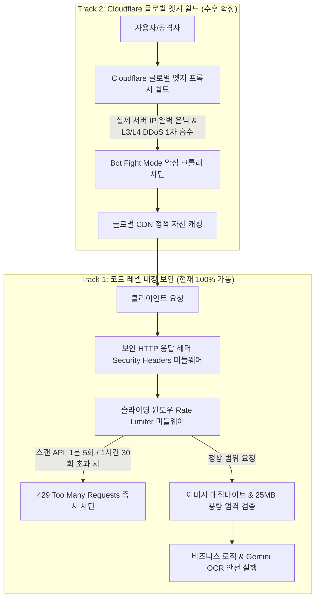

화장품 성분 분석 서비스 PickSafe를 개발하며 가장 경계했던 지점 중 하나는 외부 AI API 의존성에서 오는 비용 리스크와 비정상적인 트래픽 유입이었습니다. PickSafe는 사용자가 업로드한 화장품 라벨 이미지를 Gemini Vision AI를 통해 OCR 분석하는 핵심 기능을 제공합니다. 

이 구조는 필연적으로 한 가지 취약점을 동반합니다. 악의적인 봇이나 스크립트가 `/scan/upload` 엔드포인트로 대용량 이미지를 초당 수십 건씩 밀어 넣는다면, AI API 쿼터는 순식간에 고갈되고 서버 리소스가 마비되어 일반 사용자들이 서비스를 이용하지 못하는 상황이 벌어질 수 있습니다.

이번 글에서는 이러한 비용 폭탄과 DoS 공격을 방어하기 위해 적용한 **2-Track 방어 아키텍처**와 **슬라이딩 윈도우 Rate Limiter**, 그리고 **파일 무결성 검증 로직**을 구현하며 마주했던 고민과 해결 과정을 기록합니다.

---

## 🎯 마주한 고민과 문제 배경

서비스를 운영 관점에 두고 바라보았을 때, 코드가 정상적으로 동작하는 것 외에도 외부의 비정상적인 접근을 어떻게 차단할 것인가가 큰 화두였습니다. 구체적으로 마주한 위협은 다음과 같았습니다.

1. **AI API 비용 폭탄 (Cost Bombing)**: 스캔 API가 무차별적으로 호출될 경우 발생하는 API 사용료 급증 및 쿼터 고갈.
2. **인증 무차별 대입 공격 (Brute Force)**: 로그인 및 소셜 인증 엔드포인트(`/auth/login`, `/auth/google`)를 대상으로 한 계정 탈취 시도.
3. **악성 파일 업로드 및 대용량 페이로드**: 확장자만 `.jpg`로 위장한 실행 파일(.php, .sh 등)이나 수십 MB에 달하는 거대 파일을 전송해 서버 I/O를 점유하는 행위.
4. **클라이언트 사이드 웹 취약점**: XSS, Clickjacking, MIME Sniffing 등을 방어하기 위한 HTTP 응답 헤더 누락 문제.

이 문제들을 해결하기 위해 외부 인프라에만 의존하지 않고, 애플리케이션 레벨에서 즉각 동작하는 강력한 방어선과 향후 인프라 확장성을 고려한 설계를 시작했습니다.

---

## ⚖️ 기술적 대안 비교 및 선택 이유

rate limiting과 보안 처리를 구현할 때 몇 가지 대안을 검토했습니다.

| 접근 방식 | 장점 | 단점 | 최종 선택 여부 |
| :--- | :--- | :--- | :--- |
| **1. Nginx / 외부 API Gateway 설정** | 애플리케이션 코드 수정 없이 인프라 레벨 차단 가능 | 현재 배포 환경(Render/Vercel) 제어의 한계, 유연한 커스텀 응답 헤더 제어 번거로움 | ❌ (추후 Cloudflare 연동 시 활용) |
| **2. 고정 윈도우 (Fixed Window) 인메모리** | 구현이 매우 단순하고 가벼움 | 윈도우 경계 시점에 트래픽이 몰리면(Burst) 허용량의 2배가 넘는 요청이 단시간에 유입될 수 있음 | ❌ |
| **3. 슬라이딩 타임 윈도우 (Sliding Window Log)** | 시간 흐름에 따른 정밀한 요청 제어 가능, 버스트 트래픽 효과적 방어 | 메모리에 타임스탬프 로그를 유지해야 하므로 약간의 메모리 오버헤드 존재 | **O (채택)** |

PickSafe는 현재 환경에서 즉시 동작해야 하며, 스캔 API와 인증 API의 성격에 맞게 세밀한 제어가 필요했습니다. 따라서 인메모리 기반의 **슬라이딩 타임 윈도우 Rate Limiter**를 직접 구현하여 미들웨어로 장착하기로 결정했습니다.

---

## 🏗️ 시스템 아키텍처 및 흐름

현재 코드 레벨의 내장 방어와 추후 글로벌 엣지 확장을 고려한 2-Track 방어 아키텍처는 다음과 같습니다.



---

## 💻 핵심 구현 및 트러블슈팅

### 1) 슬라이딩 윈도우 Rate Limiter (`app/services/rate_limiter.py`)
엔드포인트의 특성에 따라 차등적인 제한 규칙을 두었습니다.
- **스캔 API (`/scan`)**: 동일 IP당 **1분 5회**, **1시간 30회**
- **인증 API (`/auth/login`, `/auth/google`)**: 동일 IP당 **1분 10회**
- **관리자 및 헬스체크 (`/health`)**: Whitelist 처리하여 제외

제한을 초과한 경우 단순 거부가 아니라 `HTTP 429 Too Many Requests` 상태 코드와 함께 `Retry-After` 헤더를 내려주어 클라이언트가 대기 시간을 인지할 수 있도록 설계했습니다. 또한 Cloudflare 프록시 환경을 고려해 `request.headers["cf-connecting-ip"]`를 최우선으로 추출하여 실제 클라이언트 IP를 정확히 식별하도록 했습니다.

### 2) 이미지 파일 무결성 및 매직 바이트 검증 (`app/routers/scan.py`)
단순히 파일 확장자만 검사하는 방식은 우회하기 너무 쉽습니다. 따라서 25MB 이하의 용량 제한과 함께 파일 헤더의 매직 바이트(Magic Bytes)를 직접 검사하는 로직을 도입했습니다.

```python
# 파일 헤더 매직 바이트 검증 예시 로직
MAGIC_BYTES = {
    "jpeg": b"\xFF\xD8\xFF",
    "png": b"\x89\x50\x4E\x47",
    "webp": b"RIFF"  조합 및 WEBP 확인
}

def validate_image_header(file_header: bytes) -> bool:
    if file_header.startswith(b"\xFF\xD8\xFF"):
        return True
    if file_header.startswith(b"\x89\x50\x4E\x47"):
        return True
    if file_header.startswith(b"RIFF") and b"WEBP" in file_header:
        return True
    return False
```

최신 스마트폰의 고화질 성분표 사진(7MB~15MB)은 충분히 수용하면서도, 50MB 이상의 거대 파일이나 확장자를 위조한 쉘 스크립트 등은 진입 단계에서 `413 Payload Too Large` 혹은 `400 Bad Request`로 즉시 차단합니다.

### 3) 엔터프라이즈 보안 HTTP 응답 헤더 (`app/main.py`)
모든 응답에 아래 5대 표준 보안 헤더를 강제 주입하여 클라이언트 사이드 취약점을 원천 방어합니다.
- `X-Content-Type-Options: nosniff`
- `X-Frame-Options: SAMEORIGIN`
- `X-XSS-Protection: 1; mode=block`
- `Referrer-Policy: strict-origin-when-cross-origin`
- `Permissions-Policy: camera=(self), microphone=(), geolocation=()`

---

## 💡 돌아보며 배운 점 (회고)

이번 보안 및 Rate Limiting 구조를 설계하고 적용하면서 얻은 가장 큰 교훈은 **"비즈니스 로직만큼이나 방어 로직의 경계 설정이 서비스의 수명을 좌우한다"**는 점이었습니다.

처음에는 단순히 라이브러리를 가져다 붙이는 방식으로 가볍게 접근하려 했으나, 실제 운영 환경에서 발생할 수 있는 API 비용 폭탄과 악성 파일 유입 시나리오를 구체화해보니 인프라와 애플리케이션 레벨의 유기적인 방어가 필수적이었습니다. 

특히 스마트폰 카메라 화질 향상에 맞춰 업로드 용량을 25MB로 넉넉히 허용하되, 매직 바이트 검증을 통해 유효성 원칙을 엄격하게 가져간 점은 사용자 경험과 보안성 사이에서 적절한 균형을 찾은 타협점이었습니다. 앞으로도 PickSafe가 안정적인 서비스를 이어갈 수 있도록, 성능 병목과 보안 위협에 선제적으로 대응하는 엔지니어링 기조를 유지해 나갈 것입니다.