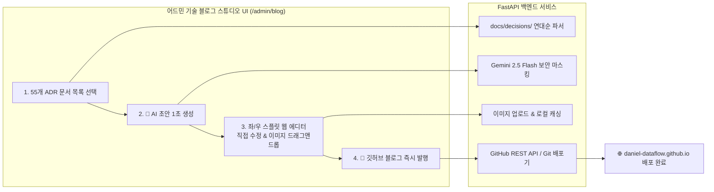

화장품 성분 분석 서비스인 **PickSafe**를 개발하면서, 그동안 쌓아온 55개의 기술 의사결정 문서(ADR, Architecture Decision Records)를 대외 공개용 기술 블로그(`daniel-dataflow.github.io`)로 발행하기로 결정했습니다. 

내부 아키텍처의 핵심 고민이 담긴 이 문서들을 외부로 공유하는 것은 의미 있는 일이지만, 단순히 파일을 복사해서 올리는 것만으로는 해결하기 어려운 현실적인 한계들이 존재했습니다. 이 글에서는 전면 자동화의 한계를 극복하고, 안전하게 검수된 고품질의 기술 포스팅을 원클릭으로 발행할 수 있는 **어드민 기반 기술 블로그 스튜디오(Blog Studio)**를 설계하고 개발한 과정을 공유합니다.

---

## 🎯 마주한 고민과 문제 배경

처음에는 단순히 GitHub Actions를 이용해 `docs/decisions/` 디렉토리에 새 ADR이 추가될 때마다 자동으로 블로그 레포지토리에 커밋을 밀어 넣는 방식을 검토했습니다. 하지만 실제 구현 단계에서 다음과 같은 세 가지 장벽에 부딪혔습니다.

1. **전면 자동화의 검수 불가 딜레마**
   - 100% 기계적인 변환은 개발자가 실제 발행될 글의 문맥, 강조 포인트, 생생한 디테일을 사전에 눈으로 확인하고 보충하기 어렵게 만들었습니다.
   - 또한, 내부용 ADR에 포함된 민감한 설정 정보나 미완성된 아이디어가 그대로 노출될 위험이 있었습니다. 그렇다고 블로그 레포지토리에서 직접 글을 고치면, 추후 PickSafe 메인 레포지토리와의 단방향 동기화 과정에서 수정본이 덮어씌워져 유실되는 문제가 발생했습니다.

2. **마크다운 렌더링 및 이미지 배치 확인의 어려움**
   - 로컬 마크다운 원문 텍스트만으로는 실제 웹 브라우저에서 제목 서식, 줄바꿈, 글 중간 이미지 배치가 어떻게 보일지 실시간으로 검증하기가 번거로웠습니다. 매번 로컬에서 정적 사이트 제너레이터를 띄워 확인하는 과정은 생산성을 크게 떨어뜨렸습니다.

3. **복잡한 개발 도구 의존성 탈피 필요**
   - 매번 터미널을 열어 Git 명령어를 입력하거나 파이썬 스크립트를 수동으로 실행하는 대신, 웹 브라우저 어드민 화면에서 **"원하는 ADR 선택 ➔ AI 초안 생성 ➔ 직접 수정 및 이미지 드래그앤드롭 ➔ 즉시 발행"**이 물 흐르듯 이어지는 원스톱 CMS(Content Management System)가 필요했습니다.

---

## ⚖️ 기술적 대안 비교 및 선택 이유

이 문제를 해결하기 위해 세 가지 아키텍처 대안을 비교했습니다.

| 비교 항목 | 대안 1: GitHub Actions 기반 완전 자동화 | 대안 2: 외부 CMS (WordPress/Ghost) 연동 | 대안 3: 자체 어드민 블로그 스튜디오 구축 (선택) |
| :--- | :--- | :--- | :--- |
| **개발 공수** | 매우 낮음 | 보통 (API 연동 필요) | 보통 ~ 높음 |
| **보안 검수 능력** | 없음 (완전 자동 노출 위험) | 보통 (수동 복사/붙여넣기 시 검수 가능) | **매우 높음 (Gemini API 기반 자동 마스킹)** |
| **편집 편의성** | 없음 (로컬 에디터 의존) | 높음 (자체 에디터 제공) | **높음 (실시간 스플릿 뷰 및 드래그앤드롭)** |
| **데이터 일관성** | 단방향 동기화 시 덮어쓰기 위험 | 데이터 파편화 가능성 있음 | **완벽함 (로컬 ADR을 소스로 삼아 동기화)** |

**선택 이유:**  
대안 1은 보안과 퀄리티 통제가 불가능했고, 대안 2는 깃허브 페이지 기반의 정적 블로그 체계와 정렬되지 않는 무거운 오버헤드였습니다. 결과적으로 FastAPI 백엔드에 **Gemini API**와 **GitHub REST API**를 결합하여, 직접 화면을 보며 통제할 수 있는 **자체 어드민 블로그 스튜디오**를 구축하기로 결정했습니다.

---

## 🏗️ 시스템 아키텍처 및 흐름

전체 시스템 흐름은 다음과 같이 어드민 프론트엔드와 FastAPI 백엔드, 그리고 최종 GitHub 블로그 레포지토리 간의 상호작용으로 구성됩니다.



---

## 💻 핵심 구현 및 트러블슈팅

### 1. 백엔드 핵심 라우터 구현 (`app/routers/admin/blog.py`)

FastAPI를 활용하여 로컬 ADR 파일을 파싱하고, Gemini API를 통해 민감 정보를 마스킹한 초안을 만든 뒤, 최종적으로 GitHub API를 통해 커밋을 푸시하는 핵심 흐름을 구현했습니다.

```python
import os
import httpx
from fastapi import APIRouter, HTTPException, UploadFile, File
from pydantic import BaseModel
from app.config import SETTINGS  # 환경변수 관리 객체 (마스킹 처리)

router = APIRouter(prefix="/admin/api/blog", tags=["Admin Blog"])

class DraftRequest(BaseModel):
    adr_filename: str

class PublishRequest(BaseModel):
    title: str
    content: str
    filename: str

@router.post("/generate-draft")
async def generate_draft(payload: DraftRequest):
    """
    선택한 ADR 파일을 읽어와 Gemini 2.5 Flash API를 호출,
    내부 보안 정보를 마스킹하고 정제된 블로그 포맷 초안을 생성합니다.
    """
    file_path = os.path.join("docs/decisions", payload.adr_filename)
    if not os.path.exists(file_path):
        raise HTTPException(status_code=404, detail="ADR 파일을 찾을 수 없습니다.")
        
    with open(file_path, "r", encoding="utf-8") as f:
        raw_content = f.read()

    # Gemini API 호출을 통한 보안 마스킹 및 초안 변환
    headers = {"Content-Type": "application/json"}
    prompt = (
        f"너는 전문 기술 블로거야. 아래의 내부 아키텍처 결정 문서(ADR)를 바탕으로, "
        f"민감한 비밀번호, 내부 IP, 비공개 API Key 키워드(예: {SETTINGS.KEY_PATTERN}) 등은 "
        f"적절한 환경변수명이나 범용 명칭으로 마스킹하고, 독자가 읽기 쉬운 구어체 기술 블로그 포스팅으로 변환해줘.\n\n"
        f"--- 원문 ---\n{raw_content}"
    )
    
    # 실제 구현 시에는 안전하게 설정된 SETTINGS.GEMINI_API_KEY를 사용합니다.
    gemini_url = f"https://generativelanguage.googleapis.com/v1beta/models/gemini-2.5-flash:generateContent?key={SETTINGS.GEMINI_API_KEY}"
    
    async with httpx.AsyncClient() as client:
        response = await client.post(
            gemini_url,
            headers=headers,
            json={"contents": [{"parts": [{"text": prompt}]}]}
        )
        if response.status_code != 200:
            raise HTTPException(status_code=500, detail="AI 초안 생성 중 오류가 발생했습니다.")
            
        result = response.json()
        draft_text = result['candidates'][0]['content']['parts'][0]['text']
        
    return {"draft": draft_text}

@router.post("/publish")
async def publish_to_github(payload: PublishRequest):
    """
    최종 검수된 마크다운 본문을 GitHub REST API를 통해 블로그 레포지토리에 직접 커밋합니다.
    """
    github_api_url = f"https://api.github.com/repos/{SETTINGS.BLOG_REPO_OWNER}/{SETTINGS.BLOG_REPO_NAME}/contents/content/posts/picksafe/{payload.filename}"
    headers = {
        "Authorization": f"token {SETTINGS.AUTO_BLOG_PAT}",
        "Accept": "application/vnd.github.v3+json"
    }
    
    # 기존 파일 존재 여부 확인 (SHA 값을 얻기 위함)
    async with httpx.AsyncClient() as client:
        get_res = await client.get(github_api_url, headers=headers)
        sha = None
        if get_res.status_code == 200:
            sha = get_res.json().get("sha")
            
        # Base64 인코딩 처리
        import base64
        encoded_content = base64.b64encode(payload.content.encode("utf-8")).decode("utf-8")
        
        commit_data = {
            "message": f"Feat: Publish post {payload.title} via PickSafe Blog Studio",
            "content": encoded_content,
        }
        if sha:
            commit_data["sha"] = sha
            
        put_res = await client.put(github_api_url, headers=headers, json=commit_data)
        if put_res.status_code not in [200, 201]:
            raise HTTPException(status_code=500, detail="GitHub API 전송 실패")
            
    return {"status": "success", "message": "블로그 발행 완료"}
```

---

### 2. 트러블슈팅: 드래그 앤 드롭 이미지 업로드와 상대 경로 매핑 문제

**문제 상황:**  
에디터 컴포넌트에서 이미지를 드래그 앤 드롭할 때, 백엔드 로컬 디렉토리(`docs/blog_posts/images/`)에 정상적으로 저장되더라도, 최종 발행 시 GitHub 레포지토리에는 이 이미지 파일들이 누락되는 현상이 발생했습니다. 또한 마크다운 내부의 이미지 링크가 로컬 호스트 기준(`http://localhost:8100/...`)으로 생성되어, 배포된 블로그에서 이미지가 깨지는 문제가 있었습니다.

**해결 방법:**  
이 문제를 해결하기 위해 **이중 업로드 및 동적 경로 치환 파이프라인**을 설계했습니다.

1. 사용자가 에디터에 이미지를 드롭하면 일시적으로 로컬 어드민 서버에 업로드하고 임시 URL을 반환해 에디터 뷰포트에 즉시 렌더링되도록 했습니다.
2. 사용자가 **"발행(Publish)"** 버튼을 누르는 시점에, 본문 마크다운에서 임시 이미지 경로를 정규식으로 추출했습니다.
3. 추출된 이미지 파일들을 GitHub REST API를 통해 블로그 레포지토리의 `static/images/` 경로로 먼저 푸시했습니다.
4. 푸시 성공 후 반환된 깃허브 상대 경로(`../../images/파일명`)로 마크다운 내 본문 링크를 동적으로 치환한 뒤, 최종 마크다운 문서를 커밋했습니다.

```python
# 이미지 업로드 및 경로 동적 치환 로직의 일부
import re

async def sync_images_to_github(markdown_content: str) -> str:
    # 로컬 임시 이미지 경로 패턴 검색 (예: /static/uploads/temp_image.png)
    image_pattern = r"\/static\/uploads\/([a-zA-Z0-9_\-\.]+)"
    matches = re.findall(image_pattern, markdown_content)
    
    for filename in matches:
        local_path = os.path.join("web/frontend/static/uploads", filename)
        if os.path.exists(local_path):
            # GitHub 이미지 저장소로 업로드 진행
            await upload_image_to_github(local_path, filename)
            # 마크다운 내 경로를 블로그용 상대 경로로 치환
            markdown_content = markdown_content.replace(
                f"/static/uploads/{filename}", 
                f"/images/posts/{filename}"
            )
    return markdown_content
```

이 파이프라인을 도입한 결과, 복잡한 수동 작업 없이도 글과 이미지가 깨짐 없이 완벽하게 동기화되어 배포되었습니다.

---

## 💡 돌아보며 배운 점

이번 블로그 스튜디오와 원클릭 퍼블리셔 구축 작업을 마친 후 얻은 실질적인 이점과 교훈은 다음과 같습니다.

1. **개발자 경험(DX)의 비약적인 향상**
   - 로컬 개발 환경(`http://localhost:8100/admin/blog`)과 실제 운영 환경 어디서든 브라우저만 열면 즉시 글을 쓰고 발행할 수 있게 되었습니다. 터미널을 열고 Git 브랜치를 따서 PR을 날리는 일련의 오버헤드가 사라졌습니다.

2. **'AI + 인간' 협업의 이상적인 모델 체득**
   - 100% 자동화 파이프라인에 의존했다면 정제되지 않은 날 것의 문서가 올라가거나, 혹은 보안 사고가 발생했을 것입니다. AI가 초안을 80% 작성해 주어 리소스를 절약하고, 남은 20%의 디테일을 개발자가 직접 확인하며 다듬는 구조를 설계함으로써 안전성과 효율성을 모두 잡을 수 있었습니다.

3. **도구 제작의 가치**
   - 나에게 필요한 맞춤형 도구를 직접 설계하고 구축하는 일은 초기 비용이 들지만, 장기적으로 콘텐츠의 지속 가능한 생산을 돕는 훌륭한 자산이 된다는 것을 다시 한번 깨달았습니다.

앞으로 글의 카테고리 분류 자동화나 태그 추천 기능 등을 점진적으로 고도화해 나갈 예정입니다. 조금 돌아가더라도 본질적인 문제를 아키텍처적으로 해결하는 과정은 언제나 값진 배움을 줍니다.