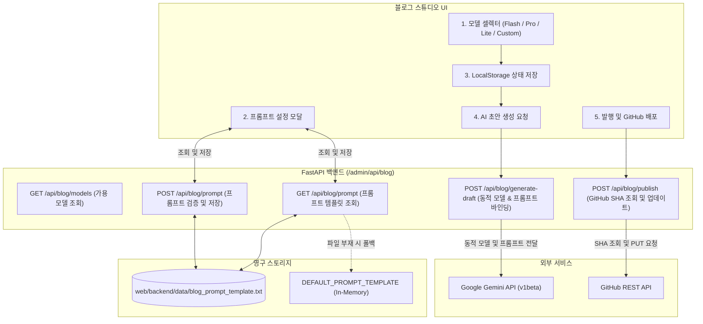

화장품 성분 분석 서비스인 **PickSafe**를 운영하면서 기술 블로그는 사용자와 소통하고 서비스의 기술적 지향점을 공유하는 중요한 채널입니다. 기존에 구축해 둔 어드민 블로그 스튜디오는 초안 작성과 배포 과정을 자동화하여 생산성을 크게 높여주었습니다. 

하지만 실제 운영 단계에 접어들자, 고정된 환경에서 오는 유연성 부족과 안정성 문제가 하나둘씩 드러나기 시작했습니다. 소스코드를 수정하지 않고도 변화하는 요구사항에 유연하게 대응할 수 있는 아키텍처가 필요해졌고, 이를 해결하기 위해 백엔드 파이프라인과 프론트엔드 UI의 전반적인 구조 개선을 진행했습니다.

---

### 🎯 마주한 고민과 문제 배경

블로그 스튜디오를 직접 사용하며 글을 작성하고 배포하는 과정에서 크게 다섯 가지의 병목과 한계를 마주했습니다.

1. **단일 하드코딩 모델의 한계**  
   기존 시스템은 AI 모델이 `gemini-3.6-flash`로 고정되어 있었습니다. 간단한 요약이나 초고속 개요 작성에는 적합했지만, 복잡한 아키텍처 분석이나 Mermaid 다이어그램을 포함한 심층 기술 포스팅을 작성할 때는 추론 능력이 더 뛰어난 `Pro` 모델의 필요성이 절실했습니다.

2. **신규 AI 모델 출시 시의 결합도 문제**  
   Google Gemini 등 글로벌 인공지능 모델은 주기적으로 업데이트됩니다. 새로운 모델이 출시될 때마다 백엔드 소스코드를 수정하고 서버를 재배포해야 하는 구조는 운영 관점에서 비효율적이었습니다.

3. **입력 오류 및 API 예외에 대한 방어벽 부재**  
   사용자가 직접 신규 AI 모델명을 입력하여 테스트할 수 있도록 개방할 경우, 오타로 인한 API 호출 실패(`404 Not Found`)나 쿼터 초과(`429 Too Many Requests`) 발생 시 시스템이 무방비하게 멈추거나 불친절한 에러 레이아웃을 노출했습니다.

4. **프롬프트 수정과 백엔드 코드의 강한 결합**  
   포스팅의 어조(전문적/친근함), 서식 규격(H2/H3 계층), 기밀 마스킹 정책 등을 미세 조정(Tuning)하려면 백엔드 파이썬 파일 내부의 문자열 상수를 직접 수정해야 했습니다. 이 역시 단순 기획성 템플릿 변경임에도 서버 재시작이 강제되는 원인이었습니다.

5. **재수정 발행 시 파일 중복 및 덮어쓰기 충돌**  
   이미 배포된 블로그 글을 스튜디오에서 다시 불러와 수정 후 발행할 때, 기존 파일의 식별을 정확히 처리하지 못해 파일이 중복 생성되거나 GitHub API 레벨에서 충돌(Conflict)이 발생하는 현상이 있었습니다.

---

### ⚖️ 기술적 대안 비교 및 선택 이유

이러한 문제들을 해결하기 위해 핵심 기능별로 대안을 검토하고 의사결정을 내렸습니다.

#### 1. 프롬프트 템플릿 관리 방식

| 비교 항목 | 대안 A: 데이터베이스(RDB) 관리 | 대안 B: 파일 시스템 기반 동적 관리 (.txt) |
| :--- | :--- | :--- |
| **장점** | 버저닝이 용이하고 롤백이 쉬움. | 가볍고 빠르며 데이터베이스 의존성이 없음. |
| **단점** | 단순 도구용 기능에 비해 스키마 설계 및 마이그레이션 공수가 큼. | 다중 인스턴스 환경에서 동기화 관리가 필요함. |
| **선택 이유** | 현재 PickSafe 블로그 스튜디오는 단일 어드민 세션에서 주로 활용되므로, 오버헤드가 적고 파일 백업이 단순한 **대안 B**를 선택했습니다. 파일이 존재하지 않을 때는 인메모리 기본 상수로 자동 폴백하도록 설계했습니다. |

#### 2. AI 모델 엔드포인트 바인딩 방식

| 비교 항목 | 대안 A: 백엔드 허용 모델 화이트리스트 제한 | 대안 B: 동적 페이로드 바인딩 + Fail-Safe 폴백 |
| :--- | :--- | :--- |
| **장점** | 잘못된 모델명 입력을 사전 차단하여 안전함. | 신규 모델 출시 시 백엔드 배포 없이 즉시 사용 가능 (Future-Proof). |
| **단점** | 신규 모델이 나올 때마다 코드 수정 필요. | 잘못된 모델명 입력 시 런타임 에러 발생 가능성 존재. |
| **선택 이유** | 유연성을 극대화하기 위해 **대안 B**를 채택하되, 런타임 에러 발생 시 백엔드에서 예외를 캐치하여 기본 안정 모델(`gemini-3.6-flash`)로 자동 폴백하는 안전망을 추가하기로 했습니다. |

---

### 🏗️ 시스템 아키텍처 및 흐름

전체적인 데이터 흐름과 컴포넌트 간 상호작용은 다음과 같이 설계했습니다.



---

### 💻 핵심 구현 및 트러블슈팅

#### 1. 동적 프롬프트 관리 및 유효성 검증 (`FastAPI`)

프롬프트 템플릿 파일이 유실되거나 손상되더라도 시스템이 멈추지 않아야 하며, 사용자가 저장 시 필수 플레이스홀더인 `{content}`를 빠뜨리지 않도록 유효성 검증을 구현했습니다.

```python
import os
from fastapi import APIRouter, HTTPException, status
from pydantic import BaseModel

router = APIRouter(prefix="/admin/api/blog", tags=["Admin Blog"])

PROMPT_FILE_PATH = "web/backend/data/blog_prompt_template.txt"
DEFAULT_PROMPT_TEMPLATE = """너는 화장품 성분 분석 서비스 PickSafe의 전문 기술 블로그 에디터야.
제공된 원시 데이터를 바탕으로 가독성이 높고 깊이 있는 기술 포스팅을 작성해줘.

[작성 규칙]
1. 마크다운 포맷 준수 (H2, H3 활용)
2. 기술적 개념 설명 시 필요하다면 Mermaid 다이어그램을 포함할 것

[대상 데이터]
{content}
"""

class PromptUpdateRequest(BaseModel):
    prompt: str
    reset: bool = False

@router.get("/prompt")
async def get_prompt_template():
    if not os.path.exists(PROMPT_FILE_PATH):
        return {"prompt": DEFAULT_PROMPT_TEMPLATE, "is_default": True}
    
    try:
        with open(PROMPT_FILE_PATH, "r", encoding="utf-8") as f:
            content = f.read()
        return {"prompt": content, "is_default": False}
    except Exception as e:
        # 파일 읽기 실패 시 기본값으로 세이프 폴백
        return {"prompt": DEFAULT_PROMPT_TEMPLATE, "is_default": True, "error": str(e)}

@router.post("/prompt")
async def update_prompt_template(payload: PromptUpdateRequest):
    if payload.reset:
        if os.path.exists(PROMPT_FILE_PATH):
            os.remove(PROMPT_FILE_PATH)
        return {"message": "기본 프롬프트로 초기화되었습니다.", "prompt": DEFAULT_PROMPT_TEMPLATE}

    # 필수 치환자 유효성 검증
    if "{content}" not in payload.prompt:
        raise HTTPException(
            status_code=status.HTTP_400_BAD_REQUEST,
            detail="프롬프트 템플릿에 필수 치환 변수인 '{content}'가 누락되었습니다."
        )

    try:
        os.makedirs(os.path.dirname(PROMPT_FILE_PATH), exist_ok=True)
        with open(PROMPT_FILE_PATH, "w", encoding="utf-8") as f:
            f.write(payload.prompt)
        return {"message": "프롬프트가 성공적으로 저장되었습니다."}
    except Exception as e:
        raise HTTPException(
            status_code=status.HTTP_500_INTERNAL_SERVER_ERROR,
            detail=f"프롬프트 저장 중 오류가 발생했습니다: {str(e)}"
        )
```

#### 2. 동적 모델 디스패처 및 예외 복구 루틴

사용자가 설정한 임의의 모델명으로 API를 요청하되, 에러가 발생하면 단계별로 안전하게 후퇴(Fallback)하도록 비즈니스 로직을 구성했습니다.

```python
import httpx
from typing import Optional
from pydantic import BaseModel

class DraftGenerationRequest(BaseModel):
    content: str
    model: str = "gemini-3.6-flash"

async def call_gemini_api(model_name: str, prompt: str) -> str:
    # 실제 운영 환경에서는 SETTINGS.GEMINI_API_KEY 등의 환경변수로 관리합니다.
    api_key = os.getenv("GEMINI_API_KEY", "MOCK_KEY")
    url = f"https://generativelanguage.googleapis.com/v1beta/models/{model_name}:generateContent?key={api_key}"
    
    headers = {"Content-Type": "application/json"}
    payload = {
        "contents": [{"parts": [{"text": prompt}]}]
    }

    async with httpx.AsyncClient() as client:
        response = await client.post(url, json=payload, timeout=60.0)
        
        if response.status_code == 404:
            raise ValueError("NOT_FOUND_MODEL")
        elif response.status_code == 429:
            raise ValueError("QUOTA_EXCEEDED")
        elif response.status_code != 200:
            raise Exception(f"API_ERROR: {response.text}")
            
        result = response.json()
        return result["candidates"][0]["content"]["parts"][0]["text"]

@router.post("/generate-draft")
async def generate_draft(payload: DraftGenerationRequest):
    # 1. 활성화된 프롬프트 템플릿 로드
    prompt_res = await get_prompt_template()
    template = prompt_res["prompt"]
    full_prompt = template.replace("{content}", payload.content)

    target_model = payload.model
    try:
        # 1차 시도: 사용자가 선택/입력한 모델
        draft = await call_gemini_api(target_model, full_prompt)
        return {"draft": draft, "used_model": target_model}
    
    except ValueError as ve:
        if str(ve) == "NOT_FOUND_MODEL":
            # 2차 시도 (Fallback): 안전성이 검증된 기본 모델로 재시도
            fallback_model = "gemini-3.6-flash"
            if target_model == fallback_model:
                raise HTTPException(status_code=500, detail="기본 모델 호출도 실패했습니다.")
            try:
                draft = await call_gemini_api(fallback_model, full_prompt)
                return {
                    "draft": draft, 
                    "used_model": fallback_model,
                    "warning": f"입력하신 모델({target_model})을 찾을 수 없어 기본 모델로 대체되었습니다."
                }
            except Exception as inner_e:
                raise HTTPException(status_code=500, detail=f"폴백 모델 호출 실패: {str(inner_e)}")
        elif str(ve) == "QUOTA_EXCEEDED":
            raise HTTPException(status_code=429, detail="API 호출 할당량을 초과했습니다. 잠시 후 다시 시도해주세요.")
    except Exception as e:
        raise HTTPException(status_code=500, detail=f"드래프트 생성 중 에러 발생: {str(e)}")
```

#### 3. 트러블슈팅: GitHub API 멱등성 및 409 Conflict 해결

**문제 현상:**  
블로그 스튜디오에서 이미 업로드된 포스팅을 수정하여 다시 발행할 때, 간헐적으로 `409 Conflict` 에러가 발생하며 커밋이 거부되는 현상이 있었습니다. GitHub REST API는 기존 파일을 수정할 때 해당 파일의 최신 **SHA 해시값**을 필수 인자로 요구하는데, 프론트엔드나 백엔드 세션에서 이 해시를 올바르게 추적하지 못해 발생한 문제였습니다.

**해결 방법:**  
파일의 생성과 수정을 명확히 구분하지 않고, 발행 요청이 들어올 때마다 **"SHA 사전 조회 후 있으면 Update, 없으면 Create"**를 수행하는 멱등성(Idempotency) 보장 로직을 백엔드에 구축했습니다.

```python
class PublishRequest(BaseModel):
    filename: str  # 예: "2026-09-07-dynamic-ai-selector.md"
    content: str
    commit_message: str

@router.post("/publish")
async def publish_to_github(payload: PublishRequest):
    github_token = os.getenv("GITHUB_TOKEN")
    repo_owner = "daniel-dataflow"
    repo_name = "daniel-dataflow.github.io"
    path = f"_posts/{payload.filename}"
    
    headers = {
        "Authorization": f"token {github_token}",
        "Accept": "application/vnd.github.v3+json"
    }
    
    # 1단계: 기존 파일의 SHA 해시값 조회 (존재 여부 확인)
    get_url = f"https://api.github.com/repos/{repo_owner}/{repo_name}/contents/{path}"
    existing_sha = None
    
    async with httpx.AsyncClient() as client:
        get_res = await client.get(get_url, headers=headers)
        if get_res.status_code == 200:
            existing_sha = get_res.json().get("sha")
        
        # Base64 인코딩 처리
        import base64
        encoded_content = base64.b64encode(payload.content.encode("utf-8")).decode("utf-8")
        
        # 2단계: 파일 생성 또는 업데이트 페이로드 구성
        put_payload = {
            "message": payload.commit_message,
            "content": encoded_content,
        }
        if existing_sha:
            put_payload["sha"] = existing_sha  # SHA가 존재하면 수정(Update) 모드로 동작

        # 3단계: GitHub에 커밋 요청 전송
        put_res = await client.put(get_url, headers=headers, json=put_payload)
        if put_res.status_code not in [200, 201]:
            raise HTTPException(
                status_code=put_res.status_code, 
                detail=f"GitHub 배포에 실패했습니다: {put_res.text}"
            )
            
        return {"message": "성공적으로 발행되었습니다.", "sha": put_res.json()["content"]["sha"]}
```

---

### 💡 돌아보며 배운 점

이번 엔진 아키텍처 개선 작업을 진행하며 엔지니어로서 한 단계 더 성장할 수 있는 소중한 교훈을 얻었습니다.

* **운영 유연성(Operational Agility)의 가치**  
  단순히 기능이 동작하는 것을 넘어, 비즈니스 요건(프롬프트 문체 수정, AI 모델 변경)이 바뀔 때마다 **"개발자의 개입(코드 수정 및 배포)을 최소화하는 구조"**가 얼마나 중요한지 깨달았습니다. 프롬프트 제어판과 동적 모델 선택기를 분리한 것만으로도 포스팅 작성 과정에서의 피로감이 극적으로 줄었습니다.
* **방어적 설계(Defensive Engineering)의 중요성**  
  외부 API에 의존하는 시스템은 언제든 실패할 수 있음을 가정해야 합니다. 모델명 오타 시의 자동 폴백 루틴과 GitHub SHA 사전 조회를 통한 멱등성 확보는 사용자 경험을 매끄럽게 유지하는 동시에, 예기치 않은 시스템 예외를 원천 차단해 주는 든든한 버팀목이 되었습니다.

앞으로도 PickSafe 서비스의 성장에 맞춰, 내부 관리 도구들 역시 안정적이고 단단한 구조로 계속해서 리팩토링해 나갈 계획입니다.