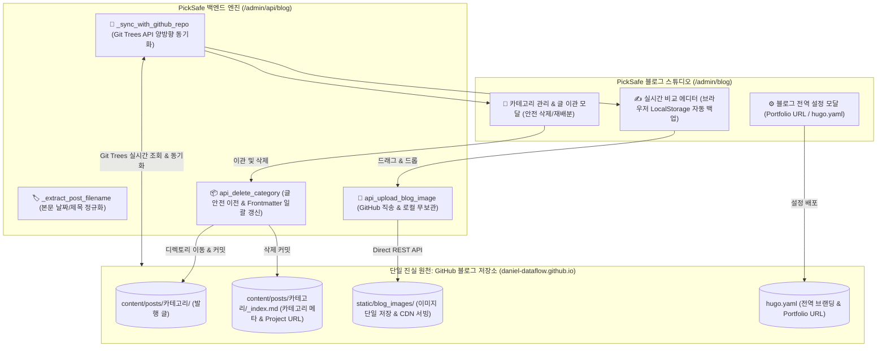

화장품 성분 분석 서비스 **PickSafe**를 개발하면서 서비스 소식과 기술 아티클을 외부 Hugo 기반 GitHub 블로그(`daniel-dataflow.github.io`)로 발행하기 위한 내부 **블로그 스튜디오(Blog Studio)** 어드민 기능을 운영해 왔습니다. 

처음에는 단순한 디렉토리 파일 읽기/쓰기 방식으로 스튜디오를 연동했으나, 운영 시간이 쌓이면서 외부 저장소와의 동기화 이격, 이미지 바이너리 파편화, 카테고리 삭제 시 데이터 유실 위험 등 다양한 아키텍처적 병목이 드러났습니다. 이를 해결하기 위해 수행했던 구조적 개편 작업과 기술적 의사결정 과정을 담담하게 기록해 봅니다.

---

## 1. 🎯 마주한 고민과 문제 배경

기존 블로그 스튜디오는 단순하게 로컬 디스크의 특정 폴더를 마운트하여 마크다운 파일만 정적으로 처리하는 구조였습니다. 이러한 접근은 초기 구현은 빨랐지만, 실제 운영 워크플로우에서 크게 5가지 문제점을 발생시켰습니다.

1. **원격 저장소와의 상태 이격 (캐시 고립)**: GitHub 웹 UI나 외부 모바일 환경에서 새로운 카테고리나 글을 추가하면, PickSafe 백엔드는 이를 알지 못하고 로컬 파일 시스템만 조회하여 최신 데이터가 반영되지 않았습니다.
2. **카테고리 삭제 시 포스트 유실 위험**: 카테고리를 삭제할 때 해당 디렉토리에 속해 있던 기존 마크다운 글들에 대한 안전 이전(Migration) 정책이 없어, 삭제 조치 시 글이 함께 사라지거나 고아 파일로 남는 위험이 존재했습니다.
3. **이미지 파일 3중 중복 복제 및 Git 오염**: 이미지 한 장을 본문에 올릴 때 `PickSafe 백엔드 static`, `내부 docs/ 디렉토리`, `GitHub 블로그 레포` 3곳에 각각 파편화되어 저장되었습니다. 이로 인해 PickSafe의 자체 Git 상태가 수십 개의 불필요한 바이너리 변경사항으로 지저분해졌습니다.
4. **파일명 정규화 규칙 부재**: 생성 시점의 날짜(`datetime.now()`)로 파일명이 결정되거나 제목 특수문자가 그대로 파일명에 섞여, 본문 Frontmatter 내 `date`와 파일명의 일치성이 깨지는 문제가 빈번했습니다.
5. **Hugo 전역/카테고리 설정 연동 미비**: Hugo 사이드바의 포트폴리오 URL(`portfolio_url`)이나 카테고리별 프로젝트 링크(`project_url`)를 어드민 UI에서 직접 배포할 수 있는 통로가 없었습니다.

---

## 2. ⚖️ 기술적 대안 비교 및 선택 이유

가장 먼저 다뤄야 했던 핵심 의사결정은 **"데이터의 상태를 어디서 관리할 것인가?"**였습니다.

### 대안 1: PickSafe 로컬 파일 시스템 중심 + Git CLI 명령 수행
- **방식**: PickSafe 백엔드가 있는 서버 디렉토리에 저장소를 `git clone` 해두고, 변경이 일어날 때마다 `subprocess`로 `git pull` / `git push` 명령을 호출하는 방식.
- **장점**: 구현 구상이 직관적입니다.
- **단점**: 서버 로컬 디스크 상태에 의존하게 되며, 외부 변경사항과 로컬 변경사항 간 충돌(Merge Conflict) 처리 로직이 복잡해집니다. 무엇보다 이미지 등 바이너리 파일이 로컬 서버 디스크를 지속적으로 오염시킵니다.

### 대안 2: GitHub REST API (Git Trees API) 기반 SSOT 단일화 (최종 선택)
- **방식**: PickSafe 로컬 디스크에는 어떠한 이미지 바이너리나 정적 파일 상태도 유지하지 않으며, **GitHub 원격 저장소를 단일 진실 원천(SSOT, Single Source of Truth)**으로 지정합니다. 모든 조회 및 동기화는 GitHub Git Trees API로 실시간 수행하고, 이미지 업로드도 GitHub API를 통해 원격 레포로 직접 커밋합니다.
- **장점**: PickSafe 백엔드가 완전히 상태를 가지지 않는(Stateless) 상태를 유지할 수 있으며, 이미지 3중 중복 문제와 Git 오염이 원천 차단됩니다.
- **단점**: API 호출 횟수(Rate Limit) 제약과 네트워크 레이턴시가 발생할 수 있으므로 트리 구조 조회 시 적절한 파싱 알고리즘이 요구됩니다.

결과적으로 시스템의 단단한 운영 안정성과 무결성을 위해 **대안 2**를 선택했습니다.

---

## 3. 🏗️ 시스템 아키텍처 및 흐름

이러한 설계 원칙을 바탕으로 구성한 시스템 아키텍처는 다음과 같습니다. PickSafe 스튜디오는 초경량 컨트롤러 역할만 수행하고, 모든 데이터의 생애주기와 최종 상태는 GitHub 블로그 저장소에 위임됩니다.



---

## 4. 💻 핵심 구현 및 트러블슈팅

### 4.1. Git Trees API 기반 실시간 양방향 동기화 (`_sync_with_github_repo`)

원격 저장소의 트리 구조를 1회 API 호출로 재귀 파싱하기 위해 `recursive=1` 옵션을 활용한 동기화 엔진을 작성했습니다. 외부에서 추가된 파일이나 삭제된 카테고리를 감지하여 정형화된 데이터 구조로 변환합니다.

```python
# web/backend/app/routers/admin/blog.py (개념적 스니펫)
import requests
from typing import Dict, Any

def _sync_with_github_repo(owner: str, repo: str, token: str) -> Dict[str, Any]:
    url = f"https://api.github.com/repos/{owner}/{repo}/git/trees/main?recursive=1"
    headers = {"Authorization": f"token {token}", "Accept": "application/vnd.github.v3+json"}
    
    response = requests.get(url, headers=headers)
    if response.status_code != 200:
        raise RuntimeError(f"GitHub 동기화 실패: {response.status_code}")
        
    tree_data = response.json().get("tree", [])
    
    categories = []
    posts = []
    
    # 원격 트리 구조 스캔 및 분류
    for item in tree_data:
        path = item.get("path", "")
        if path.startswith("content/posts/"):
            if path.endswith("_index.md"):
                categories.append(_parse_category_index(path, item))
            elif path.endswith(".md"):
                posts.append(_parse_post_file(path, item))
                
    return {"categories": categories, "posts": posts}
```

### 4.2. 카테고리 안전 이관(Migration) 및 데이터 유실 방지

카테고리를 삭제할 때 속해 있던 글들이 고아가 되거나 함께 지워지는 문제를 방지하기 위해, 글이 존재하는 카테고리 삭제 요청 시 **이동 대상 카테고리(Target Category)**를 필수로 받아 마크다운 파일 이동 및 Frontmatter 일괄 업데이트를 처리했습니다.

```python
@router.delete("/api/blog/categories/{category_slug}")
async def api_delete_category(category_slug: str, target_slug: str = None):
    existing_posts = _get_posts_in_category(category_slug)
    
    # 포스트가 존재하는 경우 반드시 이동 대상 카테고리가 지정되어야 함
    if existing_posts:
        if not target_slug:
            raise HTTPException(status_code=400, detail="기존 포스트를 이동할 대상 카테고리가 필요합니다.")
        
        for post in existing_posts:
            # 1. 파일 경로 원격 이동 (content/posts/{target_slug}/...)
            _move_github_file(post.path, f"content/posts/{target_slug}/{post.filename}")
            # 2. Frontmatter 내 category 필드 업데이트
            _update_frontmatter_category(f"content/posts/{target_slug}/{post.filename}", target_slug)
            
    # 빈 카테고리 인덱스 파일 삭제
    _delete_github_file(f"content/posts/{category_slug}/_index.md")
    return {"status": "success", "migrated_count": len(existing_posts)}
```

### 4.3. 트러블슈팅: 이미지 Direct Upload 파이프라인과 PickSafe Git 상태 클린화

- **문제**: 에디터에서 이미지 첨부 시 기존에는 PickSafe 로컬 static 디렉토리에 임시 저장 후 복사하는 방식이어서, 개발 중인 PickSafe 저장소 Git 상태에 바이너리 파일 수십 개가 수정 파일로 잡히는 문제가 계속 발생했습니다.
- **해결**:
  1. 이미지 업로드 API (`api_upload_blog_image`) 구현 시 로컬 파일 시스템에 바이너리를 저장하지 않고 메모리 버퍼에서 직접 Base64 인코딩 후 GitHub API(`PUT /repos/{owner}/{repo}/contents/static/blog_images/{filename}`)로 바로 송신하도록 바꿨습니다.
  2. 만약의 경우를 대비해 PickSafe 저장소의 `.gitignore` 파일에 `docs/blog_posts/` 및 `web/frontend/static/blog_images/` 경로를 추가하여 로컬 Git 오염 가능성을 0%로 차단했습니다.
  3. 클라이언트 브라우저 측에는 에디터 작성 중 갑작스러운 이탈에 대비해 `localStorage` 기반 Autosave 디바운스 로직을 추가하여 작성 중인 본문을 안전하게 보호하도록 조치했습니다.

---

## 5. 💡 돌아보며 배운 점 (회고)

이번 아키텍처 개편을 진행하면서 정리한 주요 개선 효과는 다음과 같습니다.

| 구분 | 개편 전 | 개편 후 |
| :--- | :--- | :--- |
| **데이터 진실 원천 (SSOT)** | 로컬 디스크 / docs / GitHub 3중 파편화 | **GitHub 블로그 저장소 단일 원천화** |
| **외부 생성 데이터 동기화** | 로컬 git pull 명령 전까지 불일치 | **API 동기화를 통한 실시간 반영** |
| **카테고리 삭제 안정성** | 삭제 시 글 유실 위험 방치 | **이관 모달을 통한 안전 재배분 및 Frontmatter 자동 갱신** |
| **PickSafe 디렉토리 Git 상태** | 바이너리 이미지 파일 오염 빈번 | **로컬 무저장 파이프라인 및 `.gitignore` 적용으로 0% 유지** |
| **이미지 파이프라인** | 로컬 2곳 + 원격 1곳 3중 저장 | **GitHub 원격 저장소 Direct REST API 커밋** |

이번 작업을 지나며 얻은 엔지니어링적 가장 큰 교훈은 **"상태(State)를 어디에 둘 것인가"**에 대한 명확한 기준의 중요성이었습니다.

초기에는 애플리케이션 내부 디렉토리에 데이터를 함께 들고 있는 것이 편리하다고 느꼈지만, 시스템이 확장되고 외부 플랫폼과 연동될수록 이는 중복 데이터와 동기화 오류라는 부채로 돌아왔습니다. PickSafe 백엔드가 무겁게 데이터를 지니려 하지 않고 외부 저장소(GitHub)를 단일 진실 원천(SSOT)으로 삼아 **초경량 오케스트레이터 역할**만 담당하도록 구조를 바꾼 후, 시스템 전체의 가독성과 운영 안정성이 비약적으로 향상되었습니다.

추후 GitHub API 호출량 증가에 대비해 ETag 기반의 조건부 요청(Conditional Requests) 캐싱 레이어를 추가로 고민해 볼 수 있겠으나, 현재로서는 복잡도를 낮추면서도 원하는 동기화 수준을 완벽하게 달성한 만족스러운 개선이었습니다.