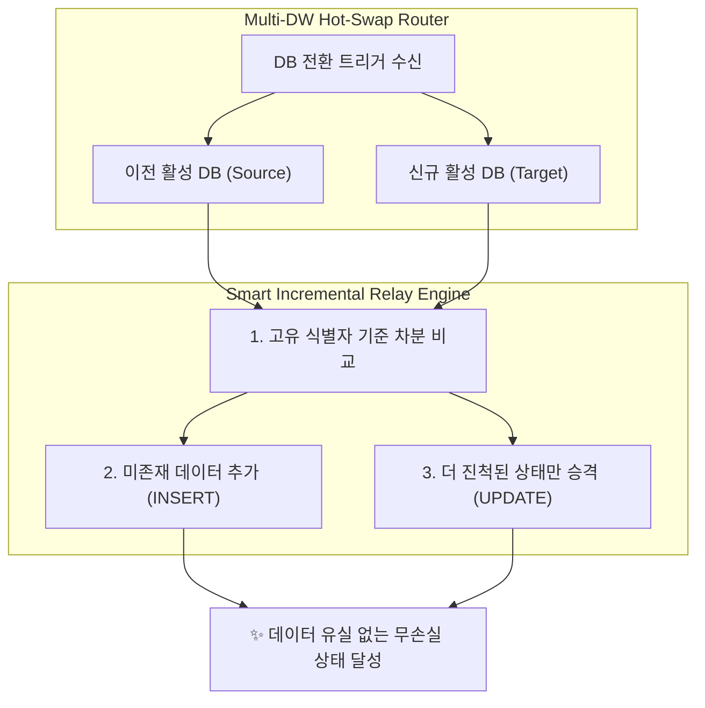

시스템의 가용성을 높이기 위해 다중 데이터베이스(Multi-DW) 환경을 구성하는 것은 흔한 일입니다. 하지만 **"클라우드 SaaS DB의 쿼터 제한"**이라는 인프라 비용 제약 조건과 **"장기 비동기 데이터 파이프라인"**이라는 비즈니스 요구사항이 만나면, 단순한 장애 복구(Failover) 프로세스도 복잡한 엔지니어링 문제로 돌변합니다.

최근 PickSafe 팀은 메인 DB와 예비 DB 간의 자동 복구(Auto-Failback) 과정에서 발생한 데이터 단절 문제를 해결하기 위해, 단순 복제를 넘어선 **'스마트 증분 이어달리기(Smart Incremental Relay)'** 아키텍처를 고안했습니다. 

제한된 클라우드 자원 속에서 어떻게 단 1건의 데이터 유실 없이 무중단 데이터 인계를 달성했는지, 그 여정과 엔지니어링 트레이드오프를 공유합니다.

---

## 1. 문제 정의: 핫스왑 복귀 후 사라진 4만 건의 데이터

### 1.1. 발단: 완벽해 보였던 자동 복구(Auto-Failback)의 배신
PickSafe는 비용 최적화를 위해 서버리스 Postgres 서비스인 Neon DB의 무료 쿼터를 적극 활용하고 있습니다. 메인 DB(DW1)의 월간 컴퓨팅 쿼터가 소진되면 예비 DB(DW2)로 자동 전환되고, 다음 달 쿼터가 리셋되면 다시 메인 DB(DW1)로 돌아오는 **'3중 핫스왑 인메모리 라우터'** 체계를 갖추고 있었습니다.

사건은 메인 DB의 리셋 주기와 대규모 글로벌 데이터 수집 배치가 맞물리면서 발생했습니다.

1. **DW2 활성화 상태**: 메인 DW1의 쿼터 소진으로 예비 DW2가 활성화된 상황에서 약 4만여 건의 글로벌 데이터 수집 배치가 실행되어 DW2의 임시 적재 테이블(`seeding_staging`)에 정상 적재되었습니다.
2. **DW1으로의 자동 복구**: 쿼터 리셋과 함께 시스템은 다시 주 DB인 DW1으로 핫스왑 복귀했습니다.
3. **증상 발생**: 관리자가 어드민 대시보드에 접속하자, 조금 전까지 DW2에 쌓여있던 수만 건의 글로벌 데이터가 화면에서 **0건**으로 표시되는 현상이 발생했습니다.

### 1.2. 원인 분석: 휘발성 버퍼라는 잘못된 가정
과거 설계 단계에서는 이 임시 적재 테이블을 **"수집 즉시 가공을 거쳐 마스터 테이블로 병합되고 바로 비워지는 휘발성 큐"**로 정의했습니다. 이 가정을 바탕으로 데이터베이스 스위칭 시 일별 통계 데이터만 동기화하고, 임시 적재 데이터는 동기화 대상에서 제외했습니다.

하지만 실제 운영 환경에서의 비즈니스 시나리오는 달랐습니다.
수집된 날것(Raw)의 데이터는 즉시 병합되지 않고, **식별 번호 자동 보강, 한글 음차 정규화, 알레르기 성분 매칭 등 사람이 수일에서 수주에 걸쳐 검토하는 장기 비동기 파이프라인**을 거쳐야 했습니다.

즉, DB 스위칭이 일어나는 순간 이전 DB에서 진행 중이던 작업 컨텍스트가 다음 DB로 인계되지 못해 데이터가 단절되는 구조적 결함이 존재했던 것입니다.

---

## 2. 기술적 고민과 대안 비교: 자원 제약 속에서의 트레이드오프

이 문제를 해결하기 위해 두 가지 데이터 인계 전략을 검토했습니다. 당사에 주어진 가장 큰 제약 조건은 **"예비 DB의 무료 컴퓨팅 쿼터 및 디스크 I/O 제한을 초과하지 않아야 한다"**는 점이었습니다.

### 대안 A: 전체 삭제 후 복사 (Full Wipe & Clone)
이전 DB의 데이터를 그대로 타깃 DB에 덮어쓰는 가장 직관적인 방법입니다. 타깃 DB를 비우고(`TRUNCATE`), 소스 DB의 전체 데이터를 다시 밀어 넣는 방식입니다.

* **단점**:
  1. **쿼터 조기 고갈**: 매 스위칭마다 수만 건의 데이터를 통째로 쓰기(Write) 트랜잭션으로 처리하므로 디스크 I/O와 네트워크 트래픽이 폭증합니다. 이는 예비 DB의 무료 쿼터를 단시간에 소모시킵니다.
  2. **양방향 작업분 유실 (Split-Brain)**: 만약 DW1과 DW2 양쪽에 서로 다른 유효 작업분이 나뉘어 존재할 경우, 한쪽을 밀어버리는 순간 반대쪽 작업이 영구 삭제됩니다.
  3. **네트워크 단절 위험**: 전송 도중 장애가 발생하면 테이블이 완전히 비어버리는 취약점이 있습니다.

### 대안 B: 스마트 증분 이어달리기 (Smart Incremental Relay) — *최종 채택*
타깃 DB의 데이터를 지우지 않고, 고유 식별자(예: 성분명)를 기준으로 양쪽 DB의 차분(Delta)만 감지하여 동기화하는 방식입니다.

* **동작 원리**: 없는 데이터는 추가(`INSERT`)하고, 이미 존재하는 데이터는 **더 많이 진행된 작업 상태(CAS 번호 검증 완료 상태 등)만 갱신(`UPDATE`)**합니다.
* **장점**:
  1. **네트워크/컴퓨팅 비용 99% 절감**: 오직 변경되거나 추가된 소량의 트래픽만 발생하므로 제한된 클라우드 무료 쿼터 내에서 완벽하게 동작합니다.
  2. **무손실 합집합 보장**: 어느 DB로 스위칭이 일어나더라도 양쪽의 작업 성과가 유실 없이 누적 합산됩니다.
  3. **비동기 핸드오버**: 핫스왑 즉시 백그라운드 스레드로 동기화가 동작하므로 사용자 화면 지연이 전혀 없습니다.

---

## 3. 구현: 스마트 증분 병합 엔진 설계

비동기 백그라운드 스레드에서 두 데이터베이스 간의 상태 정합성을 맞추기 위해 다음과 같은 흐름으로 동기화 엔진을 설계했습니다.



### 3.1. 테이블 성격별 차등 동기화 정책
시스템 전체의 효율성을 위해 모든 테이블을 동일하게 동기화하지 않고 세 가지 수준으로 분리했습니다.

1. **작업 큐 테이블 (`seeding_staging`)**: 고유 식별자 기반의 **스마트 증분 병합 (Smart Upsert)** 적용.
2. **통계 테이블 (`visitors_daily_summaries`)**: 날짜 기준의 Upsert 적용.
3. **시스템 로그성 테이블**: **동기화 제외**. 불필요한 대용량 쓰기를 방지하고 각 DB에 로컬 보존하여 쿼터 소모 최소화.

### 3.2. 상태 전이 기반의 스마트 병합 규칙 (Merge Precedence)
이미 존재하는 레코드의 경우, 무조건 덮어쓰는 것이 아니라 비즈니스적으로 **"더 진척된 상태"**일 때만 데이터를 업데이트합니다.

* **신규 데이터**: 타깃 DB에 식별자가 없으면 그대로 생성합니다.
* **기존 데이터 병합 우선순위**:
  * 타깃의 검증 상태가 '미완료(`needed`)'이나, 소스의 상태가 '검증 완료(`verified`)'라면 소스의 신뢰도 높은 데이터로 갱신합니다.
  * 타깃에 한글 번역명이 비어있고 소스에 존재한다면 해당 필드만 보강합니다.

### 3.3. 핵심 비즈니스 로직 예시 (Concept Python Code)

아래는 두 DB 간의 세션에서 데이터를 가져와 스마트하게 병합하는 백그라운드 서비스의 핵심 로직 구조입니다. (보안을 위해 내부 엔드포인트 및 원본 스키마는 마스킹 처리되었습니다.)

```python
async def relay_incremental_data(source_session_factory, target_session_factory):
    """
    이전 DB(Source)와 신규 DB(Target) 간의 임시 적재 데이터를 
    무손실로 동기화하는 스마트 증분 이어달리기 서비스
    """
    async with source_session_factory() as src_session, target_session_factory() as tgt_session:
        # 1. 양쪽 DB의 현재 적재 현황 조회 (고유 키와 진행 상태 기준)
        src_items = await get_all_staging_items(src_session)
        tgt_items_dict = {item.unique_key: item for item in await get_all_staging_items(tgt_session)}
        
        items_to_insert = []
        items_to_update = []
        
        for src_item in src_items:
            tgt_item = tgt_items_dict.get(src_item.unique_key)
            
            # Case 1: 신규 데이터 발견 -> INSERT 준비
            if not tgt_item:
                items_to_insert.append(src_item.to_dict())
                continue
            
            # Case 2: 이미 존재하지만, 이전 DB에서 작업이 더 진척된 경우 -> UPDATE 준비
            # 예: 미검증 상태에서 검증 완료 상태로 승격되었거나, 비어있던 데이터가 보강된 경우
            if is_source_state_advanced(src_item, tgt_item):
                items_to_update.append({
                    "unique_key": tgt_item.unique_key,
                    "verified_status": src_item.verified_status,
                    "enriched_info": src_item.enriched_info or tgt_item.enriched_info,
                    "translated_name": src_item.translated_name or tgt_item.translated_name
                })

        # 3. 타깃 DB에 차분 데이터 일괄 반영 (Bulk Operations)
        if items_to_insert:
            await bulk_insert_staging(tgt_session, items_to_insert)
        if items_to_update:
            await bulk_update_staging(tgt_session, items_to_update)
            
        await tgt_session.commit()
```

---

## 4. 도입 효과와 엔지니어링 교훈

### 4.1. 정량적/정성적 성과
* **완전한 무손실 이어달리기**: 인프라 이슈나 비용 쿼터 제한으로 인해 DW가 수시로 교체되더라도 관리자는 단일 고가용성 DB를 사용하는 것처럼 끊김 없이 작업을 이어갈 수 있게 되었습니다.
* **리소스 및 비용 99% 절감**: 무조건적인 전체 덤프 복제 방식 대비 트래픽 양을 메가바이트(MB) 단위에서 킬로바이트(KB) 단위로 낮추었으며, Neon DB 무료 쿼터 범위 내에서 안정적인 멀티 DW 운영이 가능해졌습니다.
* **운영 신뢰도 회복**: 대시보드 내 데이터 수집 지표의 정합성이 완벽하게 일치하여, 현업 운영진의 시스템 신뢰도를 크게 높였습니다.

### 4.2. 이번 장애 해결을 통해 배운 교훈 (Takeaways)
1. **'임시'라는 단어의 수명을 믿지 말 것**: 설계 당시 '임시 적재함'이라고 정의했더라도, 실제 비즈니스 프로세스에서는 수일간 머무르는 '영속적인 작업 공간'이 될 수 있습니다. 기술 디자인 시점에는 반드시 도메인의 실제 수명 주기(Lifecycle)를 면밀히 검토해야 합니다.
2. **제약 조건은 더 나은 아키텍처를 만든다**: 만약 무제한 리소스를 제공하는 고비용 DB를 사용했다면, 단순히 전체 복제 메커니즘을 적용하고 넘어갔을 것입니다. 무료 티어의 쿼터 제한이라는 제약 조건이 있었기에, 데이터 변경 상태를 정밀하게 전이시키는 더 정교하고 효율적인 동기화 엔진을 개발할 수 있었습니다.
3. **데이터 동기화는 차등 적용할 때 가장 효율적이다**: 모든 데이터를 똑같이 중요하게 다룰 필요는 없습니다. 비즈니스 중요도와 데이터의 특성에 맞춰 동기화 주기를 다르게 가져가는 설계 방식이 시스템의 생존력을 높입니다.