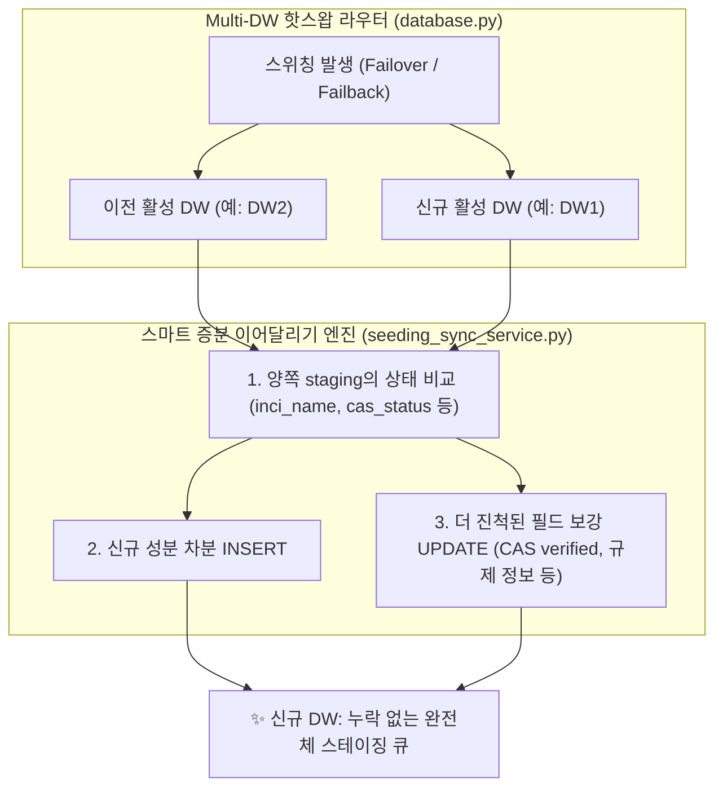

클라우드 무료 티어와 컴퓨팅 쿼터 제약을 활용하다 보면, 비용 효율성과 가용성 사이에서 치열한 트레이드오프를 마주하게 됩니다. PickSafe 백엔드 코어 아키텍처 팀은 한정된 쿼터(100 CU) 환경에서 복수의 데이터웨어하우스(DW1 ↔ DW2) 간 자동 페일오버(Failover) 및 페일백(Failback)을 수행하는 구조를 운영 중입니다.

최근, DB 자동 복구 과정에서 **"수일~수주에 걸쳐 점진적으로 처리되던 임시 스테이징 데이터가 소실되는 장애"**를 겪었습니다. 본 포스팅에서는 이 문제를 해결하기 위해 도입한 **'스마트 증분 이어달리기(Smart Incremental Relay)'** 아키텍처의 설계 고민과 해결 과정을 공유합니다.

---

## 1. 문제 정의: 휘발성 버퍼 가정의 오류와 데이터 단절

### 사건 개요
쿼터 소진으로 인해 주 DB(`DW1`)에서 예비 DB(`DW2`)로 스위칭이 일어났고, 그 사이 글로벌 성분 수집 배치로 인해 약 4만 건의 데이터가 DW2의 스테이징 테이블에 적재되었습니다. 이후 월간 쿼터가 리셋되면서 `database.py`의 자동 복구 데몬에 의해 다시 DW1로 핫스왑 복귀가 이루어졌습니다.

하지만 복귀 직후, 어드민 대시보드에서 이전 글로벌 수집 데이터가 누락되고 새로 수집한 국내 성분만 노출되는 데이터 불일치 이슈가 발생했습니다.

### 근본 원인 분석
과거 아키텍처 설계 시, 스테이징 테이블을 **"수집 즉시 마스터로 병합되고 비워지는 휘발성 임시 작업 큐"**로 가정했습니다. 

그러나 실제 비즈니스 로직은 단발성 처리가 아니었습니다. 화장품 성분 데이터 수집은 1단계(수집) 후 스테이징에 머문 채, **CAS 번호 자동 보강, 음차 정규화, 규제/알레르기 매칭 검토 등 수일~수주에 걸친 2단계 점진적 프로세스**로 동작하고 있었습니다. 이 상태에서 DB 스위칭이 발생하자, 이전 DB에서 진행 중이던 작업 내용이 다음 DB로 인계되지 못하고 단절된 것입니다.

---

## 2. 전략 대안 비교: 전체 덮어쓰기 vs 스마트 증분 병합

문제를 해결하기 위해 두 가지 아키텍처 대안을 검토했습니다.

### 대안 A: 전체 삭제 후 덮어쓰기 (Full Wipe & Clone)
* **방식**: 전환 대상 타깃 DB의 스테이징 테이블을 `TRUNCATE`하고, 이전 DB의 모든 데이터를 통째로 `INSERT`.
* **한계**:
  1. **쿼터 조기 고갈**: 대용량 데이터를 매번 전체 DELETE & INSERT 하므로 디스크 I/O와 수십 MB의 네트워크 Egress가 발생하여 Neon 무료 티어 제약을 급속히 소모시킵니다.
  2. **양쪽 작업분 영구 유실 (Split-Brain Loss)**: 스위칭 시점에 양쪽 DB에 유효한 작업분이 나뉘어 있을 때, 한쪽을 밀어버리면 반대쪽 작업이 영구 소실됩니다.
  3. **트랜잭션 중단 위험**: 수만 건 복제 중 네트워크 순단 시 테이블이 텅 빈 상태로 남게 됩니다.

### 대안 B: 스마트 증분 이어달리기 (Smart Incremental Relay / Upsert) — 🟢 최종 채택
* **방식**: 타깃 DB를 비우지 않고, 고유 식별자(`inci_name`)를 기준으로 차분(Delta)만 감지하여 **없는 성분은 INSERT, 이미 존재하는 성분은 더 진척된 작업 결과만 UPDATE(Merge)**.
* **장점**:
  1. **비용 99% 절감**: 변경되거나 누락된 차분만 전송하므로 수백 KB 이하의 트래픽과 1~2초 이내 완료로 무료 티어 제약에 완벽히 부합합니다.
  2. **Zero Data Loss (무손실 합집합 보장)**: 어느 DB로 바통을 넘겨도 양쪽의 작업 성과가 누적 합산되어 항상 완전체 데이터를 유지합니다.
  3. **무중단 백그라운드 핸드오버**: 핫스왑 즉시 비동기 스레드로 동기화를 처리하여 API 응답 지연을 방지합니다.

---

## 3. 핵심 아키텍처 및 구현 설계

### 테이블 성격별 차등 동기화 원칙
* **`seeding_staging` (성분 작업 큐)**: 스마트 증분 병합(`inci_name` 기준 무손실 합집합) 적용.
* **`visitors_daily_summaries` (일별 방문자 통계)**: 날짜(`date`) 기준 Upsert 유지.
* **`logs_system`, `visitors_events` (시계열 원천 로그)**: 동기화 제외. 불필요한 대용량 트래픽을 방지하고 각 DB에 로컬 보존하여 쿼터를 보호.

### 스마트 증분 병합 규칙 (Merge Precedence)
* **신규 성분**: 타깃 DB에 해당 식별자가 없으면 데이터 소스, 국문명, CAS 번호 등 일체 복제 생성.
* **기존 성분**: 타깃 DB에 이미 존재할 경우:
  * 타깃의 상태가 미완료(`needed`)이고 소스의 상태가 완료(`verified` / `suggested`)인 경우 소스의 CAS 정보로 승격.
  * 규제 정보나 국문명이 누락된 타깃 필드를 소스의 유효 데이터로 보강.

---

## 4. 엔지니어링 교훈 및 기대 효과 (Takeaways)

1. **인프라 제약을 고려한 현실적 아키텍처링**:
   단순한 "데이터 복제"를 넘어, 클라우드 무료 티어의 I/O 및 네트워크 쿼터 제약 안에서 동작하도록 **Delta 기반의 최소 전송 전략**을 수립하는 것이 얼마나 중요한지 확인했습니다.
2. **소프트웨어 설계와 실제 비즈니스 프로세스의 일치**:
   코드가 바라보는 데이터의 생명주기(휘발성 큐)와 실제 운영자가 다루는 비즈니스 루프(장기 검토 파이프라인) 간의 괴리를 파악하고, 이를 시스템 아키텍처에 정확히 반영해야 장애를 예방할 수 있음을 배웠습니다.

이번 아키텍처 개선을 통해, 다중 DW 환경에서도 관리자의 수만 건 작업 데이터가 유실 없이 안전하게 이어달려지는 고가용성 파이프라인을 구축할 수 있었습니다.