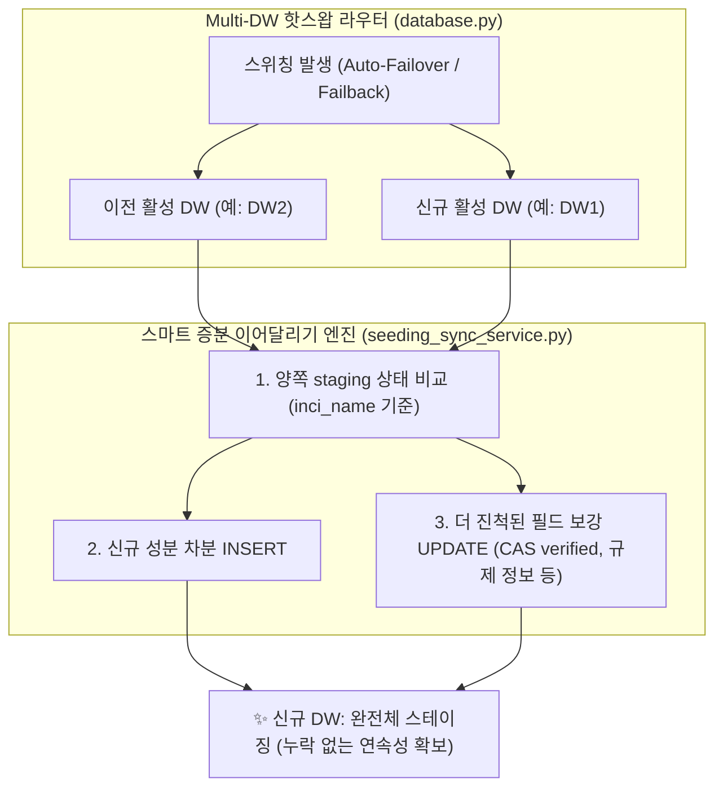

안녕하세요, PickSafe Core Architecture Team입니다. 

서비스를 운영하다 보면 인프라 비용 절감과 가용성을 위해 다중 데이터베이스(Multi-DW) 구조를 채택하거나 클라우드 무료 티어의 리소스를 극한으로 최적화해야 하는 순간을 마주합니다. PickSafe 역시 리소스 쿼터 제약에 대응하기 위해 주 DB(DW1)와 예비 DB(DW2) 간의 자동 핫스왑(Auto-Failover/Failback) 데몬을 운영하고 있습니다.

하지만 최근, DB 스위칭 과정에서 **"수집해 둔 대규모 성분 데이터가 증발하는 것처첨 보이는"** 치명적인 데이터 단절 현상을 겪었습니다. 이번 포스팅에서는 이 문제가 왜 발생했는지, 그리고 단순한 전체 복제 방식의 한계를 넘어 어떻게 **'스마트 증분 이어달리기(Smart Incremental Relay)'** 아키텍처로 해결했는지 그 기술적 고민과 트레이드오프 과정을 공유합니다.

---

## 1. 문제 정의: 휘발성 버퍼 가정의 오류와 단절된 바통 터치

### 사건의 발단
8말 9초에 걸쳐 다음과 같은 인프라 이벤트가 순차적으로 발생했습니다.
1. **DW1 쿼터 소진**: 월간 컴퓨팅 쿼터 소진으로 예비 DB인 **DW2**로 자동 스위칭.
2. **글로벌 성분 수집 진행**: DW2 환경에서 글로벌 성분 데이터 수집 배치(약 4.1만 건)가 실행되어 `seeding_staging` 테이블에 적재됨.
3. **자동 복구(Auto-Failback)**: 월간 쿼터 리셋과 함께 `database.py`의 데몬이 발동하여 다시 주 DB인 **DW1**로 핫스왑 복귀.
4. **데이터 불일치 인지**: 관리자가 대시보드에 접속했을 때, 새로 수집했던 글로벌 성분이 모두 사라지고 국내 수집 건만 남아있는 현상 포착.

### 근본 원인 분석
과거 초기 설계 당시, 우리는 `seeding_staging` 테이블을 **"수집 즉시 마스터로 병합되고 비워지는 휘발성 임시 작업 큐"**로 가정했습니다. 이에 따라 DB 스위칭 시 일별 통계 데이터만 동기화하고 스테이징 큐는 동기화 대상에서 제외했습니다.

하지만 실제 비즈니스 로직은 달랐습니다. 화장품 성분 수집은 1단계(수집) 후 즉시 마스터로 병합되지 않고, 스테이징 큐에 머무르며 **수일~수주에 걸쳐 2단계(CAS 번호 보강, 음차 정규화, 규제 매칭 등)를 점진적으로 거치는 장기 파이프라인**이었습니다. 

결과적으로 쿼터 한계로 인해 DW1 ➔ DW2 ➔ DW1으로 바통이 넘어갈 때, 이전 DB에서 작업 중이던 진행 상황이 다음 DB로 인계되지 않으면서 데이터가 단절되는 구조적 결함이 발생한 것입니다.

---

## 2. 전략 대안 비교: 전체 덮어쓰기 vs 차분 동기화

문제를 해결하기 위해 두 가지 아키텍처 대안을 놓고 트레이드오프를 검토했습니다.

### 대안 A: 전체 삭제 후 덮어쓰기 (Full Wipe & Clone)
* **방식**: 스위칭 시 타깃 DB의 스테이징 테이블을 `TRUNCATE`하고, 이전 DB의 모든 데이터를 통째로 `INSERT`하는 방식.
* **치명적 한계**:
  1. **무료 쿼터 조기 고갈**: 대용량 데이터를 매번 통째로 지우고 넣는 과정에서 디스크 I/O와 Write 트랜잭션, 대규모 네트워크 Egress가 발생하여 제한된 쿼터를 급속히 소모시킵니다.
  2. **양쪽 작업분 영구 유실 (Split-Brain Loss)**: 스위칭 시점에 양쪽 DB에 유효한 작업분이 나뉘어 있을 때, 한쪽을 밀어버리면 반대쪽 작업이 영구 삭제됩니다.
  3. **트랜잭션 중단 위험**: 수만 건 복제 중 네트워크 순단 발생 시 테이블이 텅 빈 상태로 방치될 위험이 있습니다.

### 대안 B: 스마트 증분 이어달리기 (Smart Incremental Relay) — 🟢 최종 채택
* **방식**: 타깃 DB를 지우지 않고, 고유 식별자(예: `inci_name`)를 기준으로 차분(Delta)만 감지하여 **없는 성분은 INSERT, 이미 존재하는 성분은 더 진척된 작업 결과만 UPDATE(Merge)** 하는 방식.
* **핵심 장점**:
  1. **비용 99% 절감**: 변경되거나 누락된 차분만 전송하므로 수백 KB 이내의 트래픽과 1~2초 내에 처리가 완료되어 무료 티어 제약에 완벽히 부합합니다.
  2. **Zero Data Loss (무손실 합집합 SSOT 보장)**: 어느 DB로 바통을 넘겨도 양쪽의 작업 성과가 누적 합산되어 항상 완전체 데이터가 유지됩니다.
  3. **무중단 백그라운드 핸드오버**: 핫스왑 즉시 백그라운드 스레드로 비동기 동기화하여 API 응답 지연이 전혀 발생하지 않습니다.

---

## 3. 핵심 아키텍처 및 구현 설계

### 테이블 성격별 차등 동기화 전략
모든 데이터를 무조건 동기화하는 것은 리소스 낭비입니다. 테이블의 역할에 따라 동기화 범위를 엄격하게 분리했습니다.
1. **`seeding_staging` (성분 작업 큐)**: `inci_name` 고유 키를 기준으로 한 **스마트 증분 병합(Smart Upsert)** 적용.
2. **`visitors_daily_summaries` (일별 통계)**: 날짜(`date`) 기준 Upsert 유지.
3. **`logs_system`, `scans_ocr_logs` (시계열 원천 로그)**: 동기화 제외. 불필요한 대용량 트래픽을 방지하고 각 DB에 로컬 보존하여 무료 티어 쿼터를 철저히 보호.

### 스마트 증분 병합 규칙 (Merge Precedence)
타깃 DB에 이미 존재하는 성분일 경우, 데이터의 정합성을 높이기 위해 다음과 같은 우선순위 규칙으로 필드를 보강합니다.
* 타깃의 상태가 미완료 상태이고 소스의 상태가 검증 완료(`verified` 등) 상태라면 소스의 정보로 승격합니다.
* 규제 정보(`restriction_info` 등)나 국문명이 비어있고 소스에 유효한 데이터가 존재할 경우 누락된 필드를 채워 넣습니다.

---

## 4. 엔지니어링 교훈 (Takeaways)

1. **아키텍처는 실제 비즈니스 흐름을 반영해야 한다**: 
   "휘발성 임시 큐"라는 가정은 시스템을 단순하게 만들었지만, 실제 운영 중인 파이프라인의 수일 간에 걸친 점진적 작업 흐름을 간과하여 데이터 유실 오해를 낳았습니다. 기술적 편의성보다 실제 도메인 사용 패턴이 우선되어야 합니다.
2. **리소스 제약을 고려한 트레이드오프**: 
   클라우드 무료 티어와 같은 인프라 제약 환경에서는 '전체 덤프' 같은 무식한 방법보다, 변경된 부분만 다루는 '차분 동기화(Delta Sync)'가 비용과 안정성 모두를 잡는 핵심 무기가 됩니다.

이번 개선을 통해 PickSafe는 다중 DW 환경이 빈번하게 교체되는 상황에서도 데이터 유실 없이 안정적으로 동작하는 견고한 데이터 파이프라인을 갖추게 되었습니다. 앞으로도 안정성과 확장성을 모두 잡는 아키텍처 고민을 공유하겠습니다. 

감사합니다.