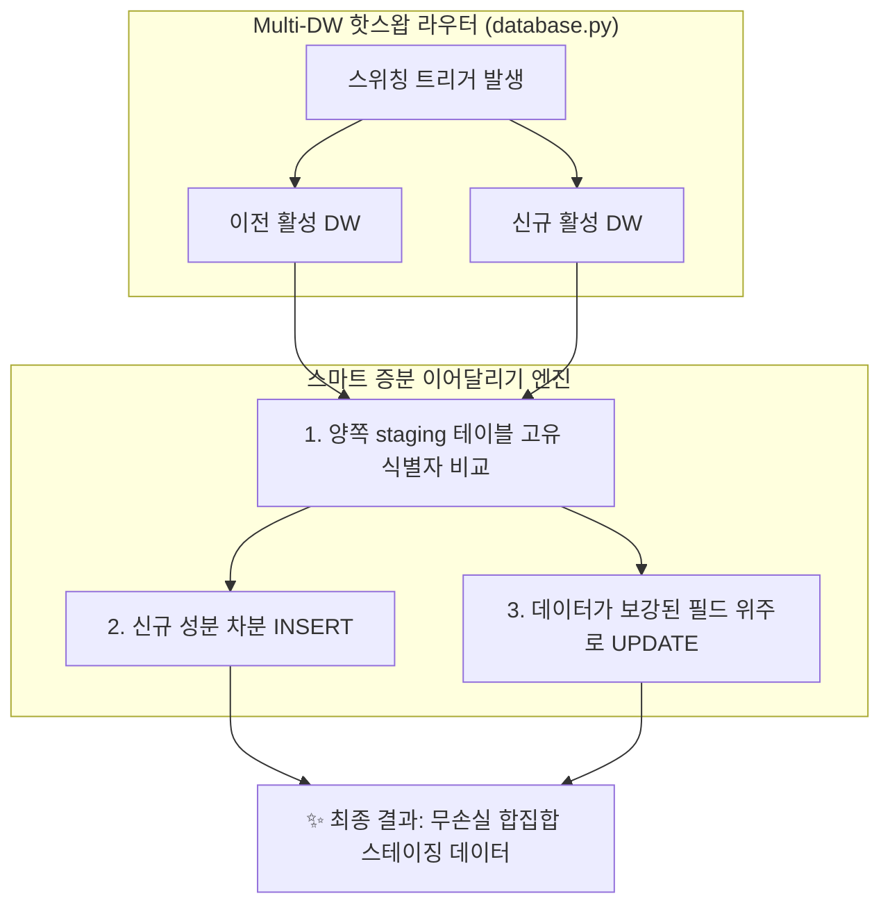

성장하는 스타트업에서 **제한된 비용(Resource Constraint)**으로 고가용성 인프라를 구축하는 것은 모든 엔지니어들의 숙명입니다. 저희 PickSafe 팀 역시 서버리스 DB인 Neon DB의 무료 쿼터 제약을 극복하기 위해, 여러 개의 데이터 웨어하우스(Multi-DW)를 핫스왑(Hot-Swap) 방식으로 교체 운영하는 영리한 아키텍처를 채택해 사용해 왔습니다.

하지만 시스템이 고도화되면서 예상치 못한 시나리오를 마주하게 되었습니다. **두 데이터베이스 간의 자동 복구(Auto-Failback)가 일어나는 짧은 찰나에, 관리자가 며칠 동안 수집하고 검수하던 수만 건의 스테이징 데이터가 대시보드에서 사라지는 정합성 이슈**가 발생한 것입니다. 

이 글에서는 이 문제를 어떻게 정의했고, 시스템 자원을 최소화하면서도 데이터를 무손실로 인계하기 위해 **'스마트 증분 이어달리기(Smart Incremental Relay)'** 아키텍처를 어떻게 설계하고 구현했는지 공유하고자 합니다.

---

## 1. 문제의 발단: "수집 중이던 글로벌 성분 데이터가 사라졌습니다"

### 아키텍처 배경
저희 서비스는 글로벌 화장품 성분 데이터를 수집 및 분석하여 안전성 정보를 제공합니다. 무료 컴퓨팅 쿼터(100 CU)의 한계를 극복하기 위해, 주 데이터 웨어하우스(`DW-Primary`)의 쿼터가 소진되면 예비 데이터 웨어하우스(`DW-Secondary`)로 자동 전환(Failover)되고, 매월 초 쿼터가 리셋되면 다시 주 DB로 복귀(Failback)하는 자동화 데몬을 운영 중이었습니다.

```
[평시] DW-Primary (활성)  --> [쿼터 소진] --> DW-Secondary (활성)
                                                  ↓
[리셋] DW-Primary (활성)  <-- [자동 복귀] <-- (배치 데이터 적재됨)
```

### 장애 상황 발생
1. **8월 말 (Failover 상태):** `DW-Primary` 쿼터 소진으로 예비 DB인 `DW-Secondary`가 활성화된 상태에서 글로벌 성분 수집 배치 프로세스가 작동하여 약 42,000건의 원천 데이터가 스테이징 테이블(`seeding_staging`)에 정상 적재되었습니다.
2. **9월 초 (Failback 작동):** 월간 쿼터 리셋과 함께 주 DB(`DW-Primary`)로 자동 복귀가 무중단으로 완료되었습니다.
3. **9월 중순:** 운영팀이 어드민 대시보드에 접속했으나, **글로벌 성분 수집 데이터가 0건**으로 표시되는 충격적인 현상이 발생했습니다.

### 근본 원인 분석: 휘발성 버퍼 가정의 오류
과거의 아키텍처 설계 당시에는 스테이징 테이블을 *"데이터 수집 즉시 마스터 테이블로 Merge되고 비워지는 임시 작업 큐"*라고 간주했습니다. 이 때문에 DB 스위칭 시점에 간단한 일별 통계 데이터만 동기화하고, 스테이징 테이블은 동기화 대상에서 아예 제외했습니다.

하지만 실제 화장품 성분 데이터의 수집 프로세스는 단순하지 않았습니다.
* **1단계(수집)** 이후 즉시 마스터로 병합되지 않습니다.
* **2단계(CAS 번호 자동 보강, 음차 정규화, 규제 정보 매칭 검토)**가 최소 수일에서 수주에 걸쳐 점진적으로 진행되는 **장기 파이프라인(Long-running Pipeline)**의 특성을 가지고 있었습니다.

즉, DB 핫스왑이 일어날 때 이전 DB에서 진행 중이던 작업 상태가 신규 DB로 바통 터치(Handover)되지 않아 발생한 구조적 결함이었습니다.

---

## 2. 전략 대안 비교: 자원 제약 속에서 최선 찾기

우리가 가진 가장 큰 제약 조건은 **"무료 티어의 네트워크 트래픽과 컴퓨팅 자원(CU)을 최소한으로 써야 한다"**는 점이었습니다. 이를 해결하기 위해 두 가지 대안을 검토했습니다.

### 대안 A: 전체 삭제 후 복제 (Full Wipe & Clone)
스위칭 시점에 타깃 DB의 스테이징 테이블을 비우고(`TRUNCATE`), 이전 DB의 모든 데이터를 통째로 퍼서 마이그레이션하는 방식입니다.

* **단점 1 (쿼터 소진):** 수만 건의 대용량 데이터를 매번 통째로 쓰고 지우면서 대량의 디스크 I/O와 Write 트랜잭션이 발생합니다. 이는 새로 전환한 DB의 무료 쿼터를 단숨에 고갈시킵니다.
* **단점 2 (데이터 유실 - Split Brain):** 만약 `DW-Primary`와 `DW-Secondary` 양쪽 모두에서 각기 다른 배치 작업이 돌아서 유효한 데이터가 분산되어 있었다면, 한쪽을 완전히 밀어버리는 순간 복구 불가능한 데이터 유실이 발생합니다.

### 대안 B: 스마트 증분 이어달리기 (Smart Incremental Relay) — 최종 채택
양쪽 DB의 스테이징 테이블을 지우지 않고, 고유 식별자(`inci_name`)를 기준으로 차분(Delta) 데이터만 감지하여 **없는 성분은 추가(INSERT)하고, 이미 존재한다면 데이터가 더 보완된(Progressed) 쪽의 상태로 덮어쓰는(Upsert/Merge)** 방식입니다.

| 비교 항목 | 대안 A (Full Wipe & Clone) | 대안 B (Smart Incremental Relay) |
| :--- | :--- | :--- |
| **I/O 및 네트워크 비용** | 매우 높음 (전체 데이터 전송) | **극도로 낮음 (차분 데이터만 전송)** |
| **데이터 보존 안정성** | 위험 (한쪽 작업분 완전 유실) | **안전 (양쪽의 유익한 작업 상태 병합)** |
| **동기화 소요 시간** | 데이터 크기에 비례하여 증가 | **1~2초 이내 완료 (백그라운드)** |

---

## 3. 아키텍처 설계 및 구현

최종 채택된 **스마트 증분 이어달리기** 아키텍처는 아래와 같은 흐름으로 유기적으로 동작합니다.



### 핵심 구현 포인트: 스마트 병합 규칙 (Merge Precedence)
단순히 최신 생성일자 기준으로 덮어쓰는 것은 위험합니다. 데이터 정합성을 보장하기 위해 다음과 같은 세밀한 병합 규칙을 정의했습니다.

1. **신규 레코드:** 타깃 DB에 없는 성분은 그대로 복사합니다.
2. **기존 레코드 (충돌 발생 시):** 
   * 타깃 DB의 CAS 번호 검증 상태가 `'needed'(미검증)`인데, 소스 DB의 상태가 `'verified'(검증 완료)` 혹은 `'suggested'`라면 **더 고도화된 정보인 소스 DB의 상태로 승격(Promote)**시킵니다.
   * 타깃 DB의 규제/알레르기 정보가 비어있고 소스 DB에 존재한다면 해당 정보를 채워 넣습니다.
   * 유효한 국문 성문명(`korean_name`)이 존재하는 쪽의 데이터를 우선적으로 취합니다.

이를 FastAPI 백그라운드 태스크에서 안전하게 실행할 수 있도록 추상화한 동기화 서비스 로직의 핵심 구조입니다.

```python
# database.py 및 seeding_sync_service.py 의 핵심 로직 요약 (보안 마스킹 적용)
class SeedingSyncService:
    def __init__(self, source_db_session, target_db_session):
        self.source_db = source_db_session
        self.target_db = target_db_session

    async def sync_staging_tables(self):
        # 1. 소스 DB와 타깃 DB의 작업 진행 상태 조회 (In-Memory Map 활용)
        source_records = self._fetch_staging_records(self.source_db)
        target_records = self._fetch_staging_records(self.target_db)
        
        to_insert = []
        to_update = []

        for key, src_item in source_records.items():
            tgt_item = target_records.get(key)
            
            if not tgt_item:
                # 2. 타깃에 존재하지 않는 새로운 성분 -> 신규 등록 대상
                to_insert.append(src_item.to_dict())
            else:
                # 3. 이미 존재하는 성분 -> 정밀 병합 정책 검증
                if self._should_promote_data(src_item, tgt_item):
                    to_update.append(self._merge_record_fields(src_item, tgt_item))

        # Bulk write를 활용해 트랜잭션 수 및 쿼터 소모 최소화
        if to_insert:
            await self._bulk_insert_target(to_insert)
        if to_update:
            await self._bulk_update_target(to_update)

    def _should_promote_data(self, src, tgt) -> bool:
        # 상태의 진척도 우선순위 계산 (e.g., verified > suggested > needed)
        status_priority = {"verified": 3, "suggested": 2, "needed": 1}
        src_priority = status_priority.get(src.cas_status, 0)
        tgt_priority = status_priority.get(tgt.cas_status, 0)
        
        # 더 보강된 데이터가 있다면 병합 대상(True)으로 판단
        if src_priority > tgt_priority:
            return True
        if not tgt.restriction_info and src.restriction_info:
            return True
        return False
```

---

## 4. 도입 효과 및 결과

이 아키텍처를 프로덕션 환경에 적용한 후, 다음과 같은 정량적/정성적 성과를 거둘 수 있었습니다.

### 1. 완벽한 무손실 이어달리기 실현 (Zero Data Loss)
무료 쿼터 제한으로 인해 한 달 중 수차례 DB Failover와 Failback이 반복적으로 일어나더라도, 운영팀은 인프라 레이어의 변화를 전혀 체감하지 못하게 되었습니다. 마치 **하나의 초고가용성 단일 데이터베이스 위에서 안전하게 작업하는 것과 동일한 사용자 경험(UX)**을 제공합니다.

### 2. Neon 무료 쿼터 절약 극대화 (Cloud Cost Optimization)
전체 데이터를 덤프하고 복제하던 이전 설계 방식 대비, 스마트 증분을 적용함으로써 **실제 전송 및 쓰는 데이터 트래픽을 99% 이상 절감**했습니다. 단 몇 백 KB의 네트워크 트랜잭션과 수 초 내의 가벼운 연산만으로 동기화가 끝나므로, 제한된 무료 리소스 안에서 시스템의 수명을 최대화할 수 있게 되었습니다.

### 3. 데이터 정합성을 바탕으로 한 비즈니스 신뢰 회복
어드민 대시보드에서 관리되고 수집되던 여러 출처의 성분 현황 정보가 누수 없이 완전한 합집합 상태로 실시간 표출되어, 현업 부서가 내부 데이터를 신뢰하고 비즈니스 의사결정을 내릴 수 있는 든든한 초석을 다졌습니다.

---

## 5. 마치며 (Takeaways)

이번 장애 정의와 아키텍처 개선 과정을 통해 깨달은 중요한 엔지니어링 교훈은 다음과 같습니다.

* **테이블의 '라이프사이클'을 예단하지 말 것:** 기술적 정의상의 '임시 버퍼(Staging)'가 실제 도메인 업무 프로세스상에서는 '장기 검수 공간'일 수 있습니다. 기술을 설계하기 전에 반드시 도메인의 업무 라이프사이클을 면밀히 분석해야 합니다.
* **클라우드 제약 조건은 창의성의 원천이다:** 자본이 무한하다면 상용 인프라 솔루션을 도입하면 그만입니다. 그러나 자원의 제약 속에서 비즈니스 연속성을 보장하기 위해 설계한 '증분 엔진'처럼, 제한된 리소스 환경은 엔지니어에게 더 깊은 수준의 아키텍처적 도전을 선사하며 시스템을 단단하게 만듭니다.

앞으로도 PickSafe 팀은 제한된 자원 속에서도 영리한 기술적 선택(Trade-off)을 통해, 고성능과 고가용성을 동시에 챙길 수 있는 탄탄한 아키텍처를 만들어 나가겠습니다.