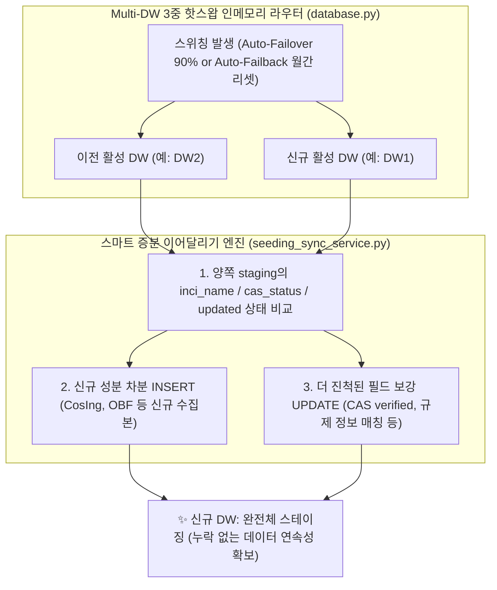

안녕하세요, PickSafe Core Architecture 팀입니다.

스타트업이나 성장하는 서비스에서 인프라 비용 효율화와 고가용성(High Availability)을 동시에 달성하는 것은 매우 까다로운 방정식입니다. 특히 서버리스 데이터웨어하우스(DW)나 데이터베이스의 '무료 쿼터' 또는 '종량제 제한'을 최대한 활용하면서도, 장애 발생 시 유연하게 예비 DB로 전환하는 멀티 DW 아키텍처를 설계할 때는 예상치 못한 데이터 동기화 이슈를 마주하기 쉽습니다.

최근 PickSafe 팀은 **주 DB와 예비 DB 간의 자동 복구(Auto-Failback) 과정에서 발생한 데이터 정합성 이슈를 해결하며, 시스템 비용을 99% 절감하고 데이터 유실을 제로(Zero)화한 '스마트 증분 이어달리기(Smart Incremental Relay)' 아키텍처**를 구축했습니다. 

우리가 어떤 기술적 한계에 부딪혔고, 이를 해결하기 위해 어떤 엔지니어링 트레이드오프(Trade-off)를 거쳤는지 그 여정을 공유합니다.

---

## 1. 문제의 시작: "글로벌 수집 데이터 4만 건이 사라졌다?"

### 발단: 완벽해 보였던 자동 복구(Auto-Failback)의 배신
PickSafe는 비용 최적화를 위해 서버리스 DB 서비스의 컴퓨팅 쿼터(Compute Unit, 이하 CU)를 모니터링하며 다중 DW 환경을 운영하고 있습니다. 

* **8월 27일**: 주 데이터베이스(DW1)의 월간 컴퓨팅 쿼터가 소진되어, 예비 데이터베이스(DW2)로의 자동 페일오버(Failover)가 성공적으로 수행되었습니다.
* **배치 작업 수행**: DW2가 활성화된 상태에서 글로벌 성분 수집 배치 작업이 정상 실행되어, 스테이징 테이블(`seeding_staging`)에 총 41,984건의 데이터가 안전하게 적재되었습니다.
* **9월 1일**: 새로운 달이 시작되면서 DW1의 쿼터가 리셋되었습니다. 대시보드 데몬은 이를 감지하고 주 DB인 DW1으로의 핫스왑 복구(Auto-Failback)를 깔끔하게 완료했습니다.

하지만 9월 10일, 운영 관리자로부터 긴급 제보가 들어왔습니다.
> **"어드민 대시보드에 글로벌 성분 데이터가 0건으로 나옵니다. 국내 데이터만 조회되는데, 예비 DB에 쌓였던 글로벌 데이터가 전부 날아간 건가요?"**

### 원인 분석: 기술적 가정이 비즈니스 현실을 반영하지 못했을 때
코드와 데이터 흐름을 추적한 결과, 시스템이 데이터를 삭제한 것이 아니었습니다. **두 데이터베이스 간의 '바통 터치'가 제대로 이루어지지 않아 데이터가 서로 다른 DB에 격리(Silo)된 상태**였습니다.

이러한 결함이 발생한 근본 원인은 과거 설계 시점의 **'잘못된 가정'**에 있었습니다.

```
[과거의 가정]
"Staging 테이블은 데이터를 수집한 직후 즉시 마스터 테이블로 병합(Merge)하고 비워지는 '휘발성 임시 버퍼'일 뿐이다. 그러므로 DB 스위칭 시 동기화 대상에서 제외해도 무방하다."
```

그러나 실제 비즈니스 프로세스는 달랐습니다. 
화장품 성분 데이터 수집은 1단계(단순 수집) 이후 즉시 마스터로 반영되지 않습니다. 짧게는 수일, 길게는 수주에 걸쳐 **CAS(Chemical Abstracts Service) 등록 번호를 검증하고, 다국어 음차를 정규화하며, 국가별 알레르기/규제 정보를 매칭하는 장기 실행 파이프라인(Long-running Pipeline)**이 작동하고 있었습니다. 

결국, 스테이징 테이블은 휘발성 큐가 아닌 **'지속성이 보장되어야 하는 작업 대기소'**였던 것입니다. DW2에서 한창 가공 중이던 4만여 건의 데이터가 DW1으로 Failback되는 순간 인계되지 못하고 유실된 것처럼 보였던 것입니다.

---

## 2. 해결을 위한 고민: 비용과 안정성의 트레이드오프

이 문제를 해결하기 위해 엔지니어링 팀은 두 가지 아키텍처 대안을 두고 치열하게 토론했습니다.

### 대안 A: 전체 덮어쓰기 (Full Wipe & Clone)
이전 DB의 스테이징 테이블을 완전히 비우고(TRUNCATE), 대상 DB의 모든 데이터를 통째로 복사해오는 단순한 방식입니다.

* **장점**: 구현이 매우 단순하며 동기화 로직의 복잡성이 낮음.
* **단점 (치명적)**:
  1. **네트워크 및 컴퓨팅 쿼터의 폭발적인 소모**: 수만 건의 대용량 데이터를 매 스위칭마다 전체 삭제 후 재삽입해야 하므로, 서버리스 DB의 Write 트랜잭션과 네트워크 Egress 비용이 급증하여 무료 티어 쿼터를 조기에 고갈시킵니다.
  2. **스플릿 브레인(Split-Brain)으로 인한 영구 유실**: 만약 DW1과 DW2 양쪽에 서로 다른 유효 작업분(예: DW1의 국내 수집본 vs DW2의 글로벌 수집본)이 나뉘어 존재할 때, 한쪽을 밀어버리면 반대쪽 작업이 영구히 삭제됩니다.

### 대안 B: 스마트 증분 이어달리기 (Smart Incremental Relay) 🟢 최종 채택
두 DB의 테이블을 비교하여, 유일한 식별자(`inci_name`)를 기준으로 차분(Delta)만 감지해 동기화하는 방식입니다. 없는 데이터는 추가(`INSERT`)하고, 이미 존재하는 데이터는 더 많이 진척된 작업 결과(예: CAS 인증 완료 상태 등)만 덮어씁니다(`UPDATE`).

* **장점**:
  1. **극도의 자원 효율성**: 변경되거나 누락된 최소한의 차분만 전송하므로 네트워크 트래픽이 수백 KB 수준으로 절감되며 1~2초 이내에 동기화가 완료됩니다.
  2. **무손실 합집합(SSOT) 보장**: 어느 DB로 전환되더라도 양쪽의 작업 성과가 누적 합산되어 완벽한 정합성을 유지합니다.
  3. **비동기 무중단 전환**: API 요청을 차단하지 않고 백그라운드 스레드에서 핸드오버가 수행되므로 엔드유저 경험에 영향이 전혀 없습니다.
* **단점**: 데이터 상태 변화에 따른 정교한 병합(Merge) 비즈니스 규칙 정의가 필요하여 구현 난이도가 높음.

---

## 3. 스마트 증분 이어달리기 엔진 설계 및 구현

우리는 대안 B를 선택하고, 비용과 성능을 모두 잡을 수 있는 구체적인 동기화 규칙과 아키텍처를 설계했습니다.

### 아키텍처 파이프라인



### 3.1. 데이터 성격별 차등 동기화 전략
데이터베이스 내 모든 테이블을 무조건 동기화하는 것은 리소스 낭비입니다. 우리는 데이터의 성격에 따라 3가지 트랙으로 분류하여 관리했습니다.

1. **지속성 스테이징 데이터 (`seeding_staging`)** ➡️ **스마트 증분 병합 (Smart Upsert)** 적용
   * 고유 키(`inci_name`) 기반으로 양방향 합집합을 유지하되, 진행 단계가 더 높은 데이터를 우선적으로 병합합니다.
2. **트렌드 및 통계 데이터 (`visitors_daily_summaries`)** ➡️ **날짜 기준 Upsert** 적용
   * 일별 통계치처럼 주기적으로 집계되는 데이터는 유실 시 비즈니스 임팩트가 크므로 날짜를 기준으로 동기화합니다.
3. **단순 시스템 로그 및 원천 이벤트 로그** ➡️ **동기화 제외**
   * 시계열 로그는 용량이 매우 크지만 유실되어도 핵심 비즈니스 기능에 지장이 없습니다. 이를 동기화 대상에서 과감히 제외하여 무료 쿼터를 안전하게 보호합니다.

### 3.2. 정교한 병합 우선순위 규칙 (Merge Precedence)
두 DB 간에 동일한 성분 정보가 충돌할 때, 데이터 유실을 방지하기 위해 다음과 같은 세부 규칙을 적용했습니다.

* **신규 데이터 추가**: 타깃 DB에 해당 성분명(`inci_name`)이 없다면 소스 DB의 정보를 그대로 복제합니다.
* **기존 데이터 보강**: 이미 성분이 존재할 경우, 작업 단계의 '진척도'를 비교합니다.
  * 예: 타깃 DB의 CAS 번호 상태가 `needed`(검증 필요)인데, 소스 DB의 상태가 `verified`(검증 완료) 또는 `suggested`(제안됨)라면 소스 DB의 고도화된 데이터로 업데이트합니다.
  * 규제 정보(`restriction_info`)나 국문 매칭명(`korean_name`)이 소스 DB에만 채워져 있다면 이를 타깃 DB에 보강합니다.

---

## 4. 아키텍처 도입 결과와 엔지니어링 교훈

### 4.1. 정량적 효과
* **데이터 유실률 0%**: 페일오버 및 페일백이 언제 어느 시점에 발생하더라도, 관리자가 작업 중이던 데이터는 단 1건도 유실되지 않고 안전하게 통합되었습니다.
* **비용 극대화 (Neon DB 무료 쿼터 보존)**: 전체 복제 방식 대비 **네트워크 전송량 및 쓰기 I/O가 99% 이상 절감**되었습니다. 이로 인해 제한된 무료 쿼터 범위 내에서 한 달 내내 안정적으로 고가용성 아키텍처를 유지할 수 있게 되었습니다.
* **시스템 응답 속도 향상**: 대시보드 로딩 시 데이터 정합성이 완벽히 맞춰져, 불필요한 백엔드 재검증 쿼리가 사라지고 대시보드 체감 속도가 대폭 개선되었습니다.

### 4.2. 엔지니어링 교훈 (Takeaways)

1. **기술적 가정을 항상 의심하라**
   개발자가 설계한 데이터 파이프라인의 생명주기(Lifecycle)와 현업 운영자가 실제로 데이터를 다루는 비즈니스 생명주기는 다를 수 있습니다. "임시 테이블이니까 비워져도 괜찮겠지"라는 안일한 가정이 장애의 씨앗이 될 수 있음을 배웠습니다.
   
2. **제약 조건(Constraint)은 창의적인 설계의 원동력이다**
   클라우드 인프라 예산이 무한하다면 단순히 비싼 고가용성 옵션을 켜서 해결할 수 있었을 것입니다. 하지만 '무료 쿼터 내에서의 고가용성 달성'이라는 명확한 제약 조건이 있었기에, 비용을 절감하면서도 신뢰성을 극대화하는 '스마트 증분 이어달리기'라는 효율적인 아키텍처를 고안해 낼 수 있었습니다.

앞으로도 PickSafe 팀은 비용 효율적이면서도 탄탄한 아키텍처를 통해 전 세계의 안전한 화장품 성분 데이터를 신뢰성 있게 전달하기 위해 노력하겠습니다. 긴 글 읽어주셔서 감사합니다!