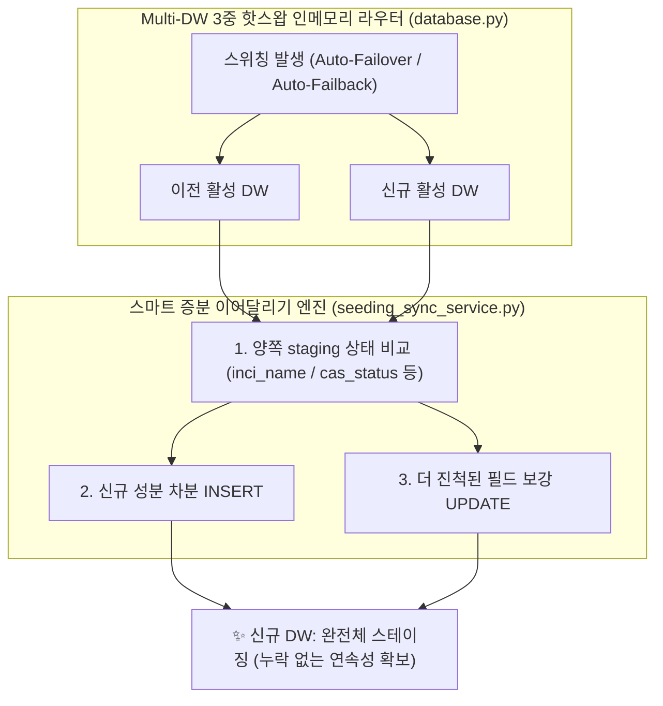

대규모 컴퓨팅 쿼터 제한이나 인프라 장애로 인해 데이터베이스를 예비 DW(Data Warehouse)로 스위칭(Failover/Failback)해야 하는 상황은 백엔드 엔지니어를 긴장시키는 대표적인 이벤트입니다. 

PickSafe 코어 아키텍처 팀은 최근 주 DB와 예비 DB 간 자동 복구(Auto-Failback) 과정에서 발생한 **스테이징 데이터 단절 및 유실 의혹**을 마주했습니다. 단순한 버그 조치를 넘어, 분산 및 이중화된 DW 환경에서 **데이터의 연속성과 무손실(Zero Data Loss)을 보장하는 스마트 증분 이어달리기(Smart Incremental Relay) 아키텍처**를 설계하게 된 과정을 공유합니다.

---

## 1. 배경 및 문제 정의 (Context & Problem Statement)

### 1.1. 사건 개요
PickSafe는 비용 효율적인 서버 운영을 위해 클라우드 DB의 월간 컴퓨팅 쿼터(CU) 한계에 도달하면 예비 DB(`DW2`)로 트래픽과 스토리지를 전환하는 핫스왑 아키텍처를 채택하고 있습니다.

- **8월 27일**: DW1의 쿼터 소진으로 예비 DB(`DW2`)가 활성화되어 운영 중이던 시기, 글로벌 화장품 성분 수집 배치(CosIng, OpenBeautyFacts 등 4만여 건)가 실행되어 DW2의 `seeding_staging` 테이블에 적재되었습니다.
- **9월 1일**: 월간 쿼터 리셋과 함께 자동 복구 데몬이 발동하여 주 DB인 `DW1`으로 핫스왑 복귀가 완료되었습니다.
- **9월 10일**: 관리자 어드민 대시보드에서 글로벌 성분이 0건으로 표시되고 국내 성분만 조회되는 데이터 불일치 및 유실 의혹이 제기되었습니다.

### 1.2. 근본 설계 결함 분석
원인을 파악한 결과, 과거 설계 당시의 치명적인 가정 오류가 있었습니다.
1. **휘발성 버퍼에 대한 잘못된 가정**: 과거 ADR에서는 `seeding_staging` 테이블을 "수집 즉시 마스터로 병합하고 비워지는 휘발성 임시 큐"로 간주했습니다. 따라서 DB 스위칭 시 일별 통계 테이블만 동기화하고 스테이징 데이터는 누락시켰습니다.
2. **실제 비즈니스 파이프라인과의 괴리**: 실제 화장품 성분 데이터는 수집(1단계) 후 즉시 마스터로 병합되지 않습니다. **CAS 번호 자동 보강, 음차 정규화, 규제/알레르기 매칭 검토 등 수일에서 수주에 걸쳐 점진적으로 수행(2단계)되는 장기 파이프라인**입니다.
3. **단절된 바통 터치**: 쿼터 한계로 인해 DW1 ➔ DW2 ➔ DW1으로 스위칭이 일어날 때, 이전 DB에서 작업 중이던 진행 상황이 다음 DB로 인계되지 않아 데이터 단절이 발생했습니다.

---

## 2. 전략 대안 비교 및 평가 (Architectural Alternatives)

이 문제를 해결하기 위해 두 가지 아키텍처 대안을 검토했습니다.

### 대안 A: 전체 삭제 후 덮어쓰기 (Full Wipe & Clone)
* **동작**: 전환 대상 타깃 DB의 스테이징 테이블을 `TRUNCATE`하고, 이전 DB의 모든 데이터를 통째로 `INSERT`합니다.
* **치명적 한계**:
  1. **무료 쿼터 조기 고갈**: 수만 건의 대용량 데이터를 매 전환마다 전체 DELETE & INSERT하면서 대량의 디스크 I/O와 Write 트랜잭션, 네트워크 Egress가 발생해 예비 DB의 제한된 자원을 급속히 소모시킵니다.
  2. **양쪽 작업분 영구 유실 (Split-Brain Loss)**: 스위칭 시점에 양쪽 DB에 유효한 작업분이 나뉘어 있을 때, 한쪽을 밀어버리면 반대쪽 작업이 영구 삭제됩니다.
  3. **트랜잭션 안정성 저하**: 대용량 복제 도중 네트워크 순단 시 테이블이 텅 빈 상태로 남을 위험이 있습니다.

### 대안 B: 스마트 증분 이어달리기 (Smart Incremental Relay / Upsert) — 🟢 최종 채택
* **동작**: 타깃 DB를 지우지 않고, 고유 식별자(`inci_name`)를 기준으로 차분(Delta)만 감지하여 **없는 성분은 INSERT, 이미 존재하는 성분은 더 진척된 작업 결과(CAS 보강 상태, 규제 정보)만 UPDATE(Merge)** 합니다.
* **핵심 장점**:
  1. **네트워크/컴퓨팅 비용 99% 절감**: 변경되거나 누락된 차분만 전송하므로 수백 KB 이하의 트래픽과 1~2초 이내의 처리 시간으로 무료 티어 제약에 완벽히 부합합니다.
  2. **Zero Data Loss (무손실 합집합 SSOT 보장)**: 어느 DB로 바통을 넘겨도 양쪽의 작업 성과가 누적 합산되어 항상 완전체 데이터가 유지됩니다.
  3. **무중단 백그라운드 핸드오버**: 핫스왑 즉시 백그라운드 스레드로 비동기 동기화하여 API 응답 지연이 전혀 발생하지 않습니다.

---

## 3. 핵심 아키텍처 및 구현 설계

### 3.1. 테이블 성격별 차등 동기화 원칙
비즈니스 특성에 따라 동기화 전략을 다르게 가져가 불필요한 컴퓨팅 리소스 소모를 방지했습니다.
- **`seeding_staging` (성분 작업 큐)**: 스마트 증분 병합(Smart Upsert) 적용. 고유 키 기준 무손실 합집합 유지.
- **`visitors_daily_summaries` (일별 방문자 통계)**: 날짜(`date`) 기준 Upsert 유지.
- **원천 로그성 테이블 (`logs_system`, `scans_ocr_logs` 등)**: **동기화 제외**. 대용량 트래픽 유발을 막고 각 DB에 로컬 보존하여 무료 티어 쿼터를 철저히 보호.

### 3.2. 스마트 증분 병합 규칙 (Merge Precedence)
타깃 DB에 이미 존재하는 성분이 겹칠 경우, 단순 덮어쓰기가 아닌 **"더 진척된 데이터(Progressive State)"**를 우선하는 병합 로직을 구현했습니다.
- 타깃의 `cas_status`가 미완료 상태(`needed`)이고 소스의 상태가 완료(`verified` / `suggested`)인 경우 소스의 CAS 정보로 승격합니다.
- 규제 정보(`restriction_info` / `regulation_info`)나 국문명(`korean_name`)이 비어있고 소스에 유효한 값이 존재할 경우 누락된 필드를 채워 넣습니다.

---

## 4. 엔지니어링 교훈 및 기대 효과 (Takeaways)

1. **인프라 제약 속 비즈니스 연속성 확보**: 클라우드 무료 티어나 쿼터 한계 환경에서도 DB 간 스위칭이 빈번하게 발생할 수 있음을 가정하고, 스테이징 영역의 데이터 연속성을 완벽히 보장하는 패턴을 정립했습니다.
2. **트래픽 및 리소스 최적화**: 전체 덤프 방식 대신 차분 기반 Upsert를 적용함으로써 동기화 트래픽을 99% 이상 절감하고, 리소스 제한으로 인한 서비스 중단 위험을 원천 차단했습니다.
3. **운영 투명성 및 신뢰 회복**: 어드민 대시보드에서 수집 출처별 성분 현황이 정확한 총합으로 영속적으로 표출되도록 개선하여, 데이터 정합성에 대한 신뢰를 회복했습니다.

비즈니스의 복잡성이 높아질수록 인프라 레이어의 변화(Failover/Failback)가 상위 어플리케이션의 상태에 영향을 미치지 않도록 설계하는 것이 시니어 엔지니어의 역할임을 다시 한번 깨닫는 프로젝트였습니다.