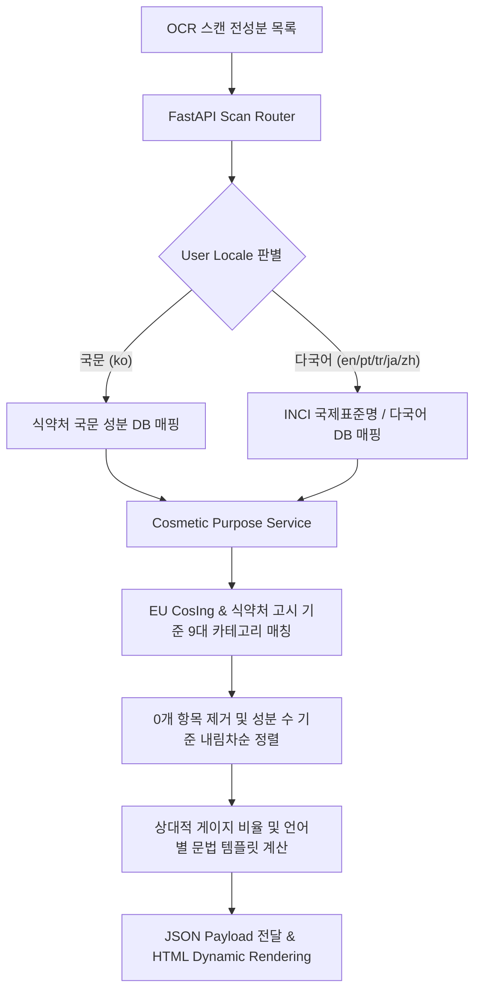

화장품 성분 분석 서비스 **PickSafe**는 사용자가 제품 성분 라벨을 스캔했을 때 알레르기 유발 물질이나 기피 성분을 빠르게 걸러내는 **'네거티브 안전 가드(Negative Safety Guard)'** 역할에 집중해 왔습니다. 

하지만 독성 물질이나 주의 성분을 피하는 것만으로 사용자의 의사결정이 끝나지는 않습니다. 소비자는 유해 성분 유무를 확인한 직후, **"그래서 이 제품은 보습에 집중된 제품인가, 아니면 진정이나 장벽 케어에 특화된 제품인가?"**라는 본질적인 질문을 던지게 됩니다.

이번 글에서는 단순한 '위험 감지'를 넘어 **공인 데이터 기반의 배합목적(Formulation Purpose) 시각화 기능**을 도입하면서 고민했던 아키텍처적 결단, 엄격한 도메인 경계 설정, 그리고 글로벌 7개 언어 대응을 위한 기술적 트레이드오프(Trade-off)를 공유하고자 합니다.

---

## 1. 문제 정의 (Problem Statement)

기존 시스템은 다음과 같은 세 가지 주요 기술적·기획적 한계를 안고 있었습니다.

1. **단편적인 유해성 중심 정보**: 성분의 위험도만 부각되다 보니, 제품이 가진 본연의 긍정적 가치(보습, 미백, 수렴 진정 등)를 파악하기 어려웠습니다.
2. **자의적 적합도 평가의 위험성**: 시장의 일부 서비스들은 "지성 피부 점수 80점"과 같은 임의의 정량 평가를 제공하지만, 이는 충분한 데이터가 결여될 경우 사용자 오판을 유발하고 의료법/표시·광고법적 리스크를 초래합니다.
3. **글로벌 사용자의 다국어 파편화**: 성분 분석 결과 데이터가 한국어 중심 명사 결합으로 구성되어 있어, 비한국어 로케일(영어, 포르투갈어, 튀르키예어 등)에서 문맥 오류 및 UI 레이아웃 깨짐 현상이 발생했습니다.

우리의 목표는 **"자의적 판단을 철저히 배제하되, 공인된 데이터(식약처, EU CosIng)만을 이용해 배합목적을 객관적으로 시각화하는 글로벌 아키텍처"**를 구축하는 것이었습니다.

---

## 2. 엔지니어링 의사결정 및 트레이드오프 (Key Decisions & Trade-offs)

### 2.1. [Trade-off 1] 피부 타입별 호불호 점수 전면 배제 (Fact over Speculation)

사용자 친화적인 UX를 위해 "민감성 피부 추천도 90점" 같은 스코어링 시스템을 도입하자는 내부 의견이 있었습니다. 하지만 엔지니어링 및 코어 아키텍처 팀은 이를 **명시적으로 배제(Strict Exclusion)**했습니다.

* **비판적 고찰**: 피부 반응은 개인의 바이오마커, 환경, 함량 비율에 따라 극심한 차이를 보입니다. 정밀한 임상 데이터 없이 자의적인 알고리즘으로 점수를 산출하는 것은 **전문성 훼손**과 **법적 리스크**를 수반합니다.
* **최종 선택**: 자의적 추천 점수를 포기하는 대신, **식약처 고시 및 유럽 CosIng(Cosmetic Ingredient database)에 등록된 객관적 사실(Fact) 데이터 기반의 9대 배합목적 카테고리 매핑**에 100% 집중했습니다.

```
[자의적 점수화 모델 (신뢰성 저하 리스크)] ❌
  └─ "지성 피부 적합도 85점!" (원인 미상/클라이언트 오판 유발)

[공인 규격 팩트 모델 (PickSafe 채택)] ✅
  └─ EU CosIng/식약처 데이터 기반 ➔ "피부 보습 5개, 수분 증발 차단 4개 배합" (객관적 정보)
```

### 2.2. [Trade-off 2] 사용자 멘탈 모델 보호를 위한 IA(정보 구조) 배치

안전 성분 판정 결과(`주의 성분` ➔ `이상없는 성분` ➔ `미식별 성분`)와 신규 기능인 `배합목적 분석` 카드의 위치를 두고 논의가 진행되었습니다.

* **최종 선택**: 성분 안전 판정은 사용자의 건강과 직결된 **단일 멘탈 모델(Single Unit of Mental Model)**입니다. 배합목적 카드를 중간에 삽입하면 사용자의 시선 흐름이 파편화됩니다. 따라서 **3섹션 성분 아코디언 완전체를 상단에 먼저 노출한 뒤, 그 바로 하단에 배합목적 카드를 배치**하도록 정보 위계를 단단히 정립했습니다.

### 2.3. [UI/UX] Data-Driven Dynamic Filtering & Sorting

모바일 화면에서 9개의 기둥을 모두 나열하면 불필요한 가로 스크롤과 빈 기둥(0개 목적)이 발생하여 시각적 노이즈를 유발합니다.

* **해결책**:
  1. **Zero-Count Filtering**: 검출된 성분이 0개인 목적 카테고리는 데이터 파이프라인 단계에서 즉시 드롭합니다.
  2. **Frequency-based Sorting**: 검출 성분 수가 많은 순(내림차순)으로 동적 정렬합니다.
  3. **Default Active Drawer**: 가장 높은 비율을 차지한 1위 목적을 페이지 로드 시 자동으로 `active` 처리하여 사용자 액션 없이도 즉시 상세 성분을 확인할 수 있도록 구현했습니다.

---

## 3. 다국어(i18n) 시스템 및 파이프라인 설계

글로벌 7개 언어(`ko`, `en`, `ja`, `pt-BR`, `tr`, `zh-CN`, `zh-TW`) 환경에서 일관된 품질의 데이터 표현을 제공하기 위해 백엔드와 프론트엔드 전체 파이프라인을 재설계했습니다.

### 3.1. 시스템 데이터 흐름 (Architecture Flow)



### 3.2. 문법 템플릿 기반 비문(非文) 차단 및 CSS 타이포그래피 방어

단순히 `카테고리명 + Ingredients` 형태로 문자열을 결합할 경우, 포르투갈어(`Ingredientes de...`)나 터키어 등에서 문법적 오류가 발생합니다. 이를 해결하기 위해 백엔드 서비스 레이어에 **언어별 문법 템플릿 엔진**을 적용했습니다.

* **백엔드 다국어 템플릿 적용 예시**:
  ```python
  # cosmetic_purpose_service.py 내부 언어별 템플릿 매핑 구조
  DRAWER_TITLE_TEMPLATES = {
      "ko": "{category} 배합 성분",
      "en": "{category} Ingredients",
      "pt-BR": "Ingredientes de {category}",
      "tr": "{category} Bileşenleri",
      "ja": "{category} 配合成分",
  }
  ```

* **CSS 타이포그래피 레이아웃 안정을 위한 레이어링**:
  포르투갈어와 같이 라틴 단어가 길어지는 언어 환경에서 기둥 아래 타이틀 레이블이 `Hidrataçã \n o` 처럼 철자 중간에서 끊어지는 현상을 방지하기 위해 텍스트 오버플로우 방어 규칙을 수립했습니다.

  ```css
  /* 기둥 레이블 타이포그래피 안정화 */
  .purpose-col .col-label {
    min-width: 66px;
    max-width: 84px;
    overflow-wrap: normal;
    word-break: keep-all; /* 단어 단위 줄바꿈 유지 */
    hyphens: auto;       /* 하이픈 기반 자연스러운 분절 */
    font-size: 0.64rem;
  }
  ```

---

## 4. 성과 및 핵심 교훈 (Takeaway)

### 4.1. 정량적·정성적 성과
1. **사용자 경험의 완성**: 사용자는 단 1회의 스캔으로 "피해야 할 성분"과 "제품을 써야 할 목적"을 한눈에 파악할 수 있게 되었습니다.
2. **글로벌 UI/UX 완결성 확보**: 7개 언어 대응 과정에서 발생하던 문자열 단절, 한국어 성분명 노출 결함, 레이아웃 찌그러짐 현상을 100% 해결했습니다.
3. **법적 리스크 원천 차단**: 식약처 표시·광고 가이드라인에 맞춘 필수 면책 문구(Disclaimer)를 명시하고, 자의적 적합도 스코어링을 배제하여 서비스의 공신력을 극대화했습니다.

### 4.2. 엔지니어링 교훈 (Engineering Takeaways)

> **"훌륭한 소프트웨어 아키텍처는 '무엇을 만들 것인가'뿐만 아니라, 데이터의 신뢰성과 법적 규제를 위해 '무엇을 만들지 않을 것인가'를 명확히 정의하는 것에서 시작된다."**

- **기술적 트레이드오프의 중요성**: 매력적인 기능(피부 타입별 자동 점수화)이라도 기반 데이터의 객관성이 담보되지 않는다면 엔지니어링 스펙에서 과감히 제외하는 결단이 필요합니다.
- **도메인 중심의 다국어 설계**: i18n은 단순한 번역 파일(`json`) 관리 문제에 그치지 않습니다. 데이터베이스 표준 규격(INCI) 선택부터 언어별 문법 구조, 렌더링 엔진의 타이포그래피 방어 기법까지 종합적으로 고려해야 하는 아키텍처 과제입니다.

PickSafe 팀은 앞으로도 객관적 사실 데이터와 사용자 중심의 아키텍처 수립을 통해, 글로벌 소비자가 신뢰할 수 있는 성분 분석 표준을 만들어 나갈 것입니다.