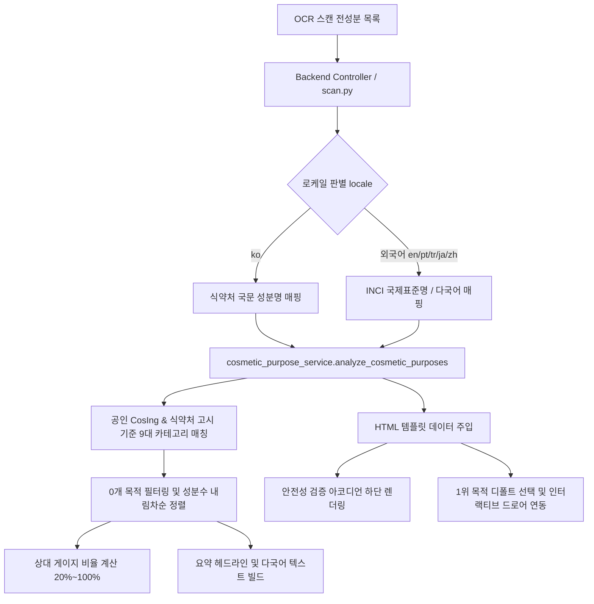

화장품 라벨을 스캔하는 사용자는 단지 **"나쁜 성분이 들어있는가?"**만 궁금해하지 않습니다. 이 제품이 **"보습을 위해 만들어졌는지, 아니면 피부 장벽 개선이나 진정에 집중된 제품인지"**와 같은 제품의 본질적인 긍정적 가치(Positive Value)를 원합니다.

성분 분석 플랫폼 **PickSafe** 팀은 최근 유해 성분을 걸러내는 '네거티브 안전 가드(Negative Safety Guard)' 중심의 시스템을 확장하여, 공인 데이터 기반의 **'화장품 핵심 배합목적 분석 및 인터랙티브 시각화'** 기능을 설계하고 구축했습니다.

이 포스팅에서는 기술적 구현 과정에서 마주한 도메인 제약조건, 오판 유발 요소를 제거하기 위한 트레이드오프(Trade-off), 그리고 7개 국어 지원 시 유연하게 작동하는 글로벌 UI/UX 아키텍처 설계 노하우를 공유합니다.

---

## 1. 문제 정의 (Problem Statement)

### 1.1. 안전 가드만으로는 부족한 사용자 경험
기존 시스템은 알레르기 유발 물질이나 사용자 기피 성분을 탐지하여 경고하는 데 치중되어 있었습니다. 하지만 소비자가 구매 의사결정을 내릴 때는 위험 요소 제거뿐만 아니라 **"이 제품이 내 목적에 맞는 성분 구성을 가졌는가?"**라는 정보가 필수적입니다.

### 1.2. 기술적 & 도메인적 도전 과제
1. **자체 평점 및 AI 자의적 판단의 리스크**: "이 제품은 건성 피부에 85점짜리입니다"와 같은 인위적 적합도 평점은 개인차가 극심하며, 의료/피부과적 오판을 유발하고 관련 규제 법률을 위배할 위험이 큽니다.
2. **정보 위계 파편화 문제**: 성분 안전 판정(`주의` / `안전` / `미식별`) 사이에 배합목적 카드가 비집고 들어갈 경우, 사용자의 멘탈 모델이 분산되는 UX 저하가 발생합니다.
3. **글로벌 다국어 렌더링 깨짐 (i18n UI 깨짐)**: 한국어 단어 위주로 설계된 차트 컴포넌트는 포르투갈어(`pt-BR`), 튀르키예어(`tr`) 등 라틴 문자계열의 긴 단어를 만났을 때 텍스트가 임의로 절단되거나 UI 레이아웃이 무너집니다.

---

## 2. 핵심 의사결정과 트레이드오프 (Trade-offs & Key Decisions)

### 🟢 Decision 1. 주관적 적합도 점수 전면 배제 vs. 100% 공인 데이터 기반 팩트 제공
* **고민**: "피부 타입별 적합도 점수"나 "좋아요/아쉬워요" 통계를 제공하면 직관적인 마케팅 효과를 얻을 수 있지 않을까?
* **선택 및 이유**: **자의적 평점 시스템 전면 배제.**
  피부 반응은 개별 환경과 컨디션에 따른 변동성이 매우 큽니다. 신뢰성이 담보되지 않은 인위적 스코어링은 서비스의 공신력을 훼손합니다. 대신 **식약처 기능성 고시 기준, 유럽 CosIng(Cosmetic Ingredient Database), 대한화장품협회 배합목적 사전** 등 100% 검증된 데이터에 기반하여 성분별 객관적 '배합목적(Formulation Purpose)' 사실만 집계하도록 설계했습니다.
* **법적 장치**: 화장품법 및 의약품 오인 방지 가이드라인을 준수하기 위해 완제품의 직접적 효능·효과를 보장하는 것이 아니라는 **법적 면책 문구(Disclaimer)**를 시스템 수준에서 명시했습니다.

### 🟢 Decision 2. 단일 멘탈 모델을 보존하는 정보 위계 배치 (IA Placement)
* **고민**: 스캔 결과 상단에 배합목적 카드를 먼저 놓을 것인가, 성분 목록 중간에 넣을 것인가?
* **선택 및 이유**: 성분 안전 판정(`[⚠️ 주의 성분]` ➔ `[✅ 이상없는 성분]` ➔ `[❓ 확인 불가 성분]`)은 사용자의 건강과 직결된 **단일 정보 단위(Single Unit of Mental Model)**입니다.
  따라서 안전 판정 아코디언 컴포넌트를 완전체로 먼저 제공한 직후, **바로 아래에 [✨ 화장품 핵심 배합 목적] 인포그래픽 카드를 배치**하여 정보 흐름의 연속성을 유지했습니다.

---

## 3. 다국어 지원 및 UI/UX 엔지니어링 (Multilingual & UI Resilience)

글로벌 7개 언어(`ko`, `en`, `ja`, `pt-BR`, `tr`, `zh-CN`, `zh-TW`)를 원활히 지원하기 위해 데이터 매핑 엔진과 프론트엔드 스타일링을 정교화했습니다.

### 3.1. 로케일별 성분명 표준화 및 언어 템플릿 도입
- **INCI / 다국어 성분명 매핑**: 한국어(`ko`) 외의 로케일에서는 한국어 성분명을 노출하지 않고, 국제표준명인 **INCI(International Nomenclature of Cosmetic Ingredients)** 및 언어별 공인 번역명을 최우선으로 매핑하도록 파이프라인을 구축했습니다.
- **문법 템플릿 처리**: 단순 문자열 결합(`${category} Ingredients`) 시 일부 언어에서 문법 왜곡이 발생하므로, 언어별 문법 템플릿(`{category} 배합 성분`, `Ingredientes de {category}`)을 정의하여 번역 품질을 높였습니다.

### 3.2. 반응형 캡슐 게이지 차트 & 레이아웃 안정화
모바일 환경의 가로폭 제약을 극복하고, 성분 수에 따른 직관성을 높이기 위해 다음 규칙을 적용했습니다.

1. **0개 목적 필터링 & 내림차순 정렬**: 검출된 성분이 0개인 불필요한 빈 카테고리를 차트에서 완전히 제거하고, **실제 검출 성분이 많은 순서로 정렬**하여 한눈에 핵심 기능을 파악하게 했습니다.
2. **타이포그래피 분절 차단 (CSS Resilience)**:
   ```css
   .purpose-col {
     flex: 1 1 66px;
     min-width: 66px;
     max-width: 84px;
   }
   .purpose-label {
     overflow-wrap: normal;
     word-break: keep-all;
     hyphens: auto;
     font-size: 0.64rem;
   }
   ```
   가변 너비 구조와 `word-break: keep-all` 설정을 통해 포르투갈어 등의 긴 단어가 `Hidrataçã \n o`처럼 부자연스럽게 잘리는 현상을 원천 차단했습니다.

---

## 4. 시스템 아키텍처 및 데이터 흐름

전성분 텍스트 스캔부터 다국어 매핑, 배합목적 분석, 최종 UI 렌더링까지의 데이터 흐름은 다음과 같습니다.



### 9대 표준 배합목적 분류 매핑 (예시)
스캔된 전성분은 백엔드 서비스 레이어에서 아래의 9대 핵심 카테고리로 필터링 및 그룹화됩니다.

* **피부 보습** (`humectant`, `moisturising`) : 히알루론산, 글리세린, 부틸렌글라이콜 등
* **피부 장벽·보호** (`skin protecting`, `barrier`) : 세라마이드, 판테놀, 엑토인 등
* **수렴 진정** (`soothing`, `astringent`) : 알란토인, 병풀추출물, 마데카소사이드 등
* **수분 증발 차단** (`emollient`, `occlusive`) : 스쿠알란, 시어버터, 호호바오일 등
* **피부 미백 / 주름 개선** : 식약처 고시 성분 (나이아신아마이드, 아데노신 등) 100% 매칭

---

## 5. 엔지니어링 교훈 (Takeaways)

1. **마케팅 요소보다 중요한 것은 '도메인 법적 준수성과 신뢰'**:
   체크박스형 스코어링 시스템이나 AI의 자의적 평점은 단기적으로 매력적이어 보일 수 있지만, 도메인 특성(헬스케어/뷰티)상 사용자 오판 및 규제 리스크를 초래할 수 있습니다. 100% 공인 데이터 기반 팩트 중심 설계가 서비스의 신뢰성을 지키는 열쇠입니다.
2. **데이터 밀도를 고려한 UX 구현**:
   단순히 데이터를 펼쳐 보여주는 것이 아니라, `0개 항목 숨김`, `성분 많은 순 정렬`, `1위 목적 디폴트 활성화 및 상세 드로어(Drawer) 연동` 기법을 통해 모바일 기기에서도 스크롤 압박 없이 핵심 정보를 소비할 수 있도록 설계했습니다.
3. **초기 단계부터 고민해야 하는 i18n 레이아웃**:
   다국어 번역 데이터가 프론트엔드 UI를 깨뜨리지 않도록 CSS 차원에서 `hyphens`, `word-break`, `flex-wrap` 조치를 정교하게 다루는 것이 글로벌 서비스 엔지니어링의 핵심 역량임을 다시 한번 확인했습니다.

---

> **PickSafe Team**은 사용자에게 안전하고 투명한 성분 정보를 제공하기 위해 데이터 아키텍처와 UX 프론티어를 지속해서 혁신하고 있습니다.