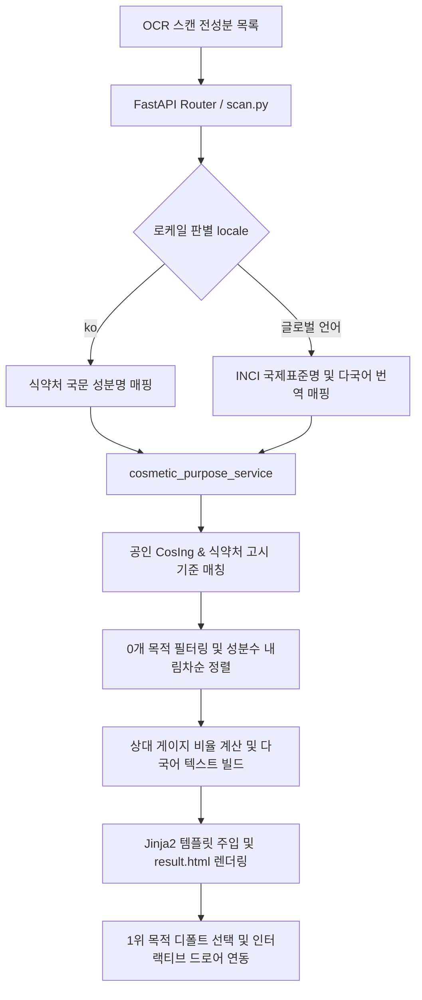

안녕하세요. PickSafe Core Architecture Team입니다. 

이번 포스팅에서는 최근 서비스에 도입한 **'화장품 핵심 배합목적 분석 및 시각화 인포그래픽 기능'**의 설계 과정과, 글로벌 다국어 환경 및 정보 위계(Information Architecture)를 다루며 마주했던 기술적 고민(Trade-off)과 해결 과정을 공유하려 합니다.

---

## 1. Problem: 네거티브 안전 가드(Negative Safety Guard)의 한계

기존의 화장품 성분 스캔 서비스들은 대개 **"이 제품에 주의해야 할 알레르기 유발 물질이나 기피 성분이 있는가?"**라는 네거티브 체크에 집중해 왔습니다. 

하지만 실제 소비자가 화장품을 선택할 때는 위험 성분이 없다는 사실 외에도 다음과 같은 본질적인 궁금증을 가집니다.
* *"이 제품이 과연 보습에 집중된 제품인가, 아니면 진정이나 미백에 초점이 맞춰져 있는가?"*

사용자는 단 한 번의 스캔으로 제품의 안전성과 함께 **'이 제품의 핵심 배합 목적(보습, 장벽 보호, 수렴 진정 등)'**을 직관적으로 파악하고 싶어 했습니다. 이를 구현하기 위해 우리는 공인된 데이터베이스(식약처 기능성 화장품 고시, 유럽 CosIng 성분 기능, 대한화장품협회 배합목적 사전)를 활용한 **목적별 성분 분석 및 시각화 기능**의 설계를 시작했습니다.

---

## 2. Key Decisions & Trade-offs: 무엇을 넣고, 무엇을 과감히 뺄 것인가?

기능을 설계하며 가장 중요하게 여긴 원칙은 **"무분별한 정보 제공은 오히려 독이 된다"**는 점이었습니다. 

### 2.1. 피부 타입별 적합도/호불호 통계의 전면 배제 (Critical Rule)
* **고민**: '지성/건성/민감성 피부에 좋아요/아쉬워요' 같은 통계나 AI 기반 피부 적합도 점수를 함께 제공하면 서비스가 더 풍성해 보이지 않을까?
* **결정**: **전면 배제.**
* **이유**: PickSafe의 핵심 기획 가이드라인인 *"의료/피부과적 처방이나 AI 피부 적합도 자의적 판단 금지"*에 위배됩니다. 또한 피부 반응은 개인차가 극심하여 충분한 표본 없는 자의적 점수화는 서비스의 전문성과 공신력을 떨어뜨립니다. 오직 객관적인 '성분의 배합목적' 사실에만 집중하기로 결정했습니다.

### 2.2. 정보 위계(IA)의 철저한 분리
* **고민**: 배합 목적 카드를 상단에 배치하면 유저가 더 흥미로워하지 않을까?
* **결정**: **안전성 판정 영역을 최우선 배치하고, 목적 카드는 그 하단에 배치.**
* **이유**: 성분 안전 판정(`[⚠️ 주의 성분]` ➔ `[✅ 안전 성분]` ➔ `[❓ 확인 불가 성분]`)은 사용자의 건강과 직결된 단일 멘탈 모델입니다. 중간에 목적 카드를 끼워 넣으면 인지 부하가 발생하므로, 안전 3섹션 완전체를 먼저 온전히 노출한 뒤 바로 아래에 배합 목적 카드를 배치했습니다.

### 2.3. 0개 목적 숨김 & 성분 많은 순(내림차순) 정렬
* 검출된 성분이 0개인 카테고리까지 빈 기둥으로 노출하면 모바일 화면에서 불필요한 스크롤을 유발합니다. 
* 실제 검출된 성분이 많은 순서대로 유효한 목적만 정렬하고, 모바일 가로폭에 맞춰 자연스럽게 스크롤되도록 UI를 설계했습니다.

---

## 3. Engineering Challenge: 글로벌 7개 언어 대응 및 UI 안정성

백엔드 로직에서 공인 데이터를 9대 목적(`피부 보습`, `수렴 진정`, `피부 미백` 등)으로 매핑하는 것만큼이나 까다로웠던 것은 **글로벌 7개 언어(`ko`, `en`, `pt-BR`, `tr`, `ja`, `zh-CN`, `zh-TW`) 환경에서의 UI/UX 안정성**이었습니다.

### 3.1. 비한국어 로케일 국제표준 INCI 적용
* 한국어(`ko`) 환경 외의 모든 외국어 로케일에서는 한국어 성분명 대신 국제표준 INCI 영문명 및 공인 다국어 번역명을 우선 노출하도록 로직을 분기했습니다.
* 단순 명사 결합(`${name} Ingredients`) 대신 언어별 문법 템플릿(`{category} 배합 성분`, `Ingredientes de {category}` 등)을 도입하여 번역의 자연스러움을 높였습니다.

### 3.2. 모바일 타이포그래피 및 레이아웃 깨짐 방지
* 라틴어 계열 언어는 단어의 길이가 길어 모바일 기둥 레이블에서 강제로 줄바꿈이 일어나거나 글자가 찌그러지는 현상이 발생했습니다.
* 이를 해결하기 위해 기둥 너비를 가변(`min-width: 66px ~ 84px`)으로 설정하고, CSS 속성을 조정하여 임의의 철자 분절을 원천 차단했습니다.
  ```css
  .purpose-col {
      flex: 1 1 66px;
      min-width: 66px;
      max-width: 84px;
      overflow-wrap: normal;
      word-break: keep-all;
      hyphens: auto;
      font-size: 0.64rem;
  }
  ```

---

## 4. System Architecture & Data Flow

시스템의 데이터 흐름은 다음과 같은 파이프라인으로 구성됩니다.



1. **백엔드 서비스 (`cosmetic_purpose_service.py`)**: 전성분 리스트를 받아 로케일에 맞는 성분명을 매칭하고, 9대 배합목적 카테고리로 분류합니다.
2. **정렬 및 필터링**: 검출된 성분 개수를 기준으로 내림차순 정렬하고, 0개인 카테고리는 뷰에서 배제합니다.
3. **프론트엔드 인터랙션**: 페이지 로드 시 가장 성분이 많은 1위 목적 기둥이 자동으로 `active` 상태가 되며, 하단 성분 드로어와 즉시 연동됩니다.

---

## 5. Takeaways & Conclusion

이번 화장품 배합목적 분석 시스템을 설계하며 얻은 엔지니어링 교훈은 다음과 같습니다.

1. **도메인 룰의 엄격함이 서비스를 지킨다**: 자의적인 AI 통계나 호불호 점수를 배제하고 공인된 팩트 데이터에만 의존함으로써, 서비스의 공신력과 법적 리스크(화장품법 및 표시광고법 준수)를 동시에 확보할 수 있었습니다.
2. **글로벌 서비스는 초기 설계부터 다국어 구조를 고려해야 한다**: 텍스트 길이의 가변성, 언어별 문법 구조, INCI 표준명 매핑 등을 백엔드와 프론트엔드 아키텍처에 미리 녹여낸 덕분에 7개 언어를 안정적으로 지원할 수 있었습니다.

PickSafe는 앞으로도 단순한 '위험 감지'를 넘어, 소비자가 화장품의 본질적 가치를 가장 안전하고 직관적으로 이해할 수 있는 프로덕트를 만들어 나가겠습니다. 

읽어주셔서 감사합니다.