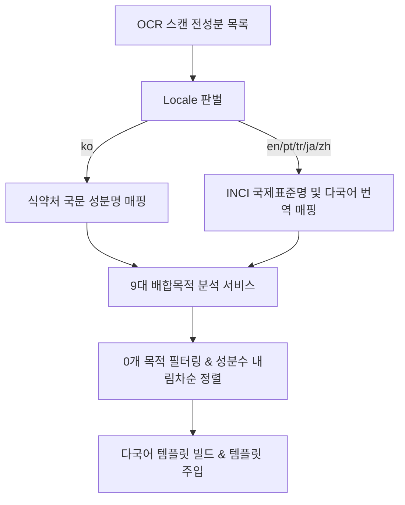

안녕하세요, PickSafe Core Architecture Team입니다. 

이번에 PickSafe는 사용자가 스캔 한 번으로 유해 성분을 필터링하는 것을 넘어, **"이 제품이 어떤 목적을 위해 만들어졌는가?"**라는 긍정적 배합 목적을 직관적으로 파악할 수 있는 인포그래픽 분석 기능을 도입했습니다. 

단순히 UI 컴포넌트 하나를 추가하는 작업에 그치지 않고, **비즈니스적 리스크 방어, 정보 계층화(IA), 그리고 글로벌 7개 언어 대응을 위한 다국어 안정성**을 어떻게 설계했는지 아키텍처 관점에서 공유해 드립니다.

---

## 1. Problem: 기존 시스템의 한계와 마주한 기술적 고민

기존 PickSafe의 스캔 결과 화면(`result.html`)은 알레르기 유발 물질이나 기피 성분을 검출하는 **네거티브 안전 가드(Negative Safety Guard)**에 집중되어 있었습니다. 

하지만 사용자는 단순히 "위험한 성분이 없는가?"뿐만 아니라, **"이 제품이 보습, 진정, 미백 등 어떤 목적을 위해 배합된 제품인가?"**라는 긍정적 정보(Positive Purpose Information)를 동시에 갈구합니다. 

이 기능을 기획하고 개발하는 과정에서 우리는 다음과 같은 까다로운 기술적·정책적 난관에 부딪혔습니다.

1. **규제 및 신뢰성 리스크**: 특정 피부 타입(지성/건성)별 '호불호 통계'나 'AI 피부 적합도 점수'를 자의적으로 제공할 경우, 의료/피부과적 오판을 유발하고 서비스 공신력을 잃을 수 있음.
2. **정보의 위계(IA) 파괴 우려**: 3섹션 아코디언(주의 성분 / 이상 없는 성분 / 확인 불가 성분)으로 이루어진 건강 직결 멘탈 모델 사이에 배합 목적 카드가 무분별하게 끼어들 경우 사용자의 인지 부하가 가중됨.
3. **글로벌 다국어 렌더링 결함**: 한국어 중심의 하드코딩된 레이아웃은 영어, 포르투갈어, 튀르키예어 등 7개 언어로 확장했을 때 단어 바꿈(Line Break) 오류, 텍스트 찌그러짐, INCI 표기 불일치 문제를 야기함.

---

## 2. Trade-off & Key Decisions: 아키텍처 설계 원칙

이러한 문제를 해결하기 위해 우리는 6가지 엄격한 설계 원칙을 수립하고 시스템에 반영했습니다.

### ① '피부 타입별 호불호' 전면 배제와 팩트 중심 매핑
자의적인 피부 타입별 평점을 과감히 배제했습니다. 오직 식약처 기능성 화장품 고시, 유럽 CosIng 성분 기능, 대한화장품협회 배합목적 사전 등 **공인된 데이터베이스의 객관적 '배합목적' 사실 데이터만을 집계**하기로 결정했습니다. 또한, 화장품법 준수를 위한 **법적 면책 문구(Disclaimer)**를 UI 하단에 고정 배치하여 규제 리스크를 원천 차단했습니다.

### ② 안전 최우선 정보 위계 (IA Placement)
사용자의 건강과 직결된 3섹션 성분 판정 아코디언을 최우선으로 완전히 노출한 뒤, 그 바로 아래에 **[✨ 화장품 핵심 배합 목적]** 카드를 배치했습니다. 멘탈 모델의 단절을 막고 안전 정보를 최우선으로 소비하게 유도하기 위함입니다.

### ③ 0개 목적 숨김 및 성분 많은 순(내림차순) 정렬
검출된 성분이 0개인 불필요한 카테고리 기둥은 과감히 숨기고, **실제 검출된 성분이 많은 순서대로 내림차순 정렬**하여 모바일 환경에서도 가로 스크롤 없이 핵심 성격을 한눈에 파악할 수 있도록 했습니다.

---

## 3. Implementation: 데이터 흐름과 글로벌 다국어 안정성

### 3.1. 백엔드 서비스 파이프라인 (`cosmetic_purpose_service.py`)
사용자가 OCR 스캔을 완료하면, 백엔드 라우터(`scan.py`)는 현재 사용자의 로케일(Locale)을 판별합니다.



- **국제표준 INCI 우선 노출**: 한국어(`ko`) 외의 로케일에서는 한국어 성분명 대신 공인 다국어 번역명 및 국제표준 INCI 영문명(`Caprylic/Capric Triglyceride` 등)을 우선 매핑하여 글로벌 사용자의 가독성을 높였습니다.

### 3.2. 7개 언어 대응 및 타이포그래피 안정화
단순 명사 접미사 결합 방식은 언어별 어순 차이로 인해 비문을 생성합니다. 이를 방지하기 위해 **언어별 문법 템플릿 체계**를 도입했습니다.

| 언어 코드 | 카드 타이틀 예시 | 드로어 타이틀 템플릿 |
| :--- | :--- | :--- |
| `ko` | 화장품 핵심 배합 목적 | `{category} 배합 성분` |
| `en` | Formulation Purpose Breakdown | `{category} Ingredients` |
| `ja` | 化粧品の主な配合目的 | `{category} 配合成分` |
| `pt-BR` | Finalidade da Formulação | `Ingredientes de {category}` |

또한, CSS 레이아웃 측면에서 긴 라틴어 단어가 임의로 분절되는 현상(`Hidrataçã \n o`)을 막기 위해 아래와 같은 타이포그래피 방어 코드를 적용했습니다.

```css
.purpose-col {
  flex: 1 1 66px;
  min-width: 66px;
  max-width: 84px;
  overflow-wrap: normal;
  word-break: keep-all;
  hyphens: auto;
  font-size: 0.64rem;
}
```

---

## 4. Takeaway & Conclusion

이번 배합목적 분석 기능 개발은 단순한 UI 확장이 아니라, **서비스의 신뢰성과 글로벌 확장성을 동시에 증명한 엔지니어링 마일스톤**이었습니다.

1. **서비스 가치 증대**: 유해 물질 회피(안전 가드)라는 방어적 기능에 머물지 않고, 제품의 본질적 가치를 직관적으로 보여주는 긍정적 정보 제공 체계를 완성했습니다.
2. **견고한 글로벌 아키텍처**: 7개 언어 환경에서의 다국어 문법 템플릿과 타이포그래피 예외 처리를 통해 국가별 사용자 경험의 편차를 없애고 글로벌 스케일아웃 기반을 다졌습니다.
3. **컴플라이언스 준수**: 자의적 통계나 AI 예측이라는 함정에 빠지지 않고, 공인된 데이터와 명확한 디스클레이머를 통해 법적 리스크 없는 클린한 아키텍처를 구축했습니다.

PickSafe 팀은 앞으로도 철저한 데이터 기반과 견고한 아키텍처 설계로 전 세계 사용자가 안심하고 사용할 수 있는 뷰티 테크 플랫폼을 만들어 나갈 것입니다. 감사합니다.