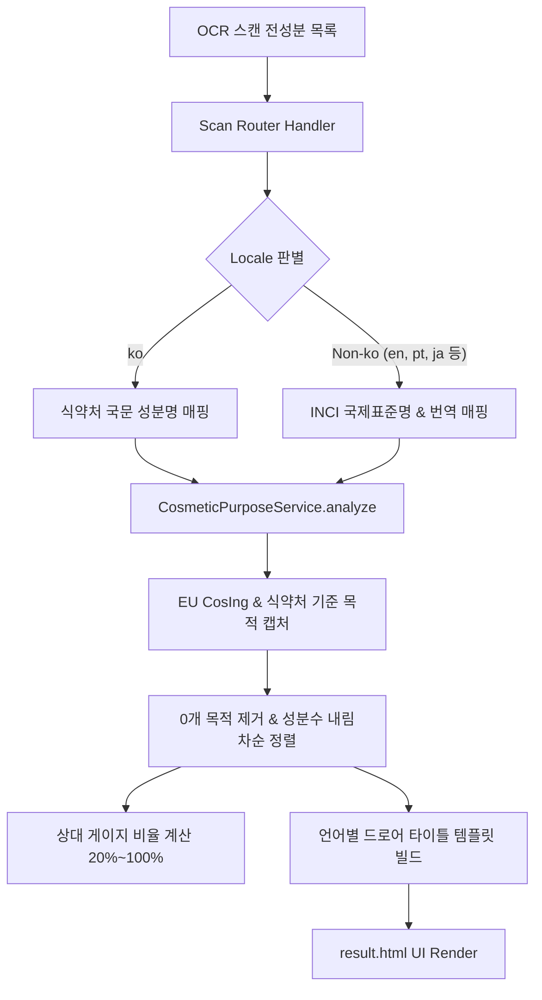

안녕하세요, **PickSafe** 코어 아키텍처 팀입니다.

성분 분석 플랫폼은 흔히 **"어떤 해로운 성분이 들어있는가?"**를 알려주는 네거티브 안전 가드(Negative Safety Guard) 역할에 치우치기 쉽습니다. 하지만 사용자가 제품을 구매할 때 진짜 알고 싶어 하는 핵심 질문 중 하나는 바로 **"이 제품은 내 피부의 어떤 고민(보습, 진정, 미백 등)을 위해 만들어졌는가?"**입니다.

이번 글에서는 PickSafe가 단순한 위험 성분 탐지기에서 벗어나, **공인 데이터 기반의 9대 배합목적 분석 인포그래픽 시스템**을 구축하며 고민했던 기술적 문제, 엄격한 덤프/배제 원칙, 그리고 글로벌 7개 언어 대응을 위한 UI/UX 아키텍처 설계 과정을 소개합니다.

---

## 1. 문제 정의: 네거티브 가드의 한계와 데이터의 신뢰성 문제

### 기존 시스템의 문제점
기존 PickSafe의 전성분 스캔 결과 화면은 알레르기 유발 물질이나 기피 성분을 탐지해 보여주는 데 집중되어 있었습니다. 

이러한 접근은 사용자의 위험을 차단하는 데에는 유효했으나, **제품 본연의 배합 가치를 체감하기 어렵다**는 피드백이 많았습니다. "주의할 성분이 없는 건 알겠는데, 그래서 이 크림이 보습 크림인가요, 미백 크림인가요?"라는 질문에 답을 주지 못했던 것입니다.

### 엔지니어링 및 기획적 페인 포인트
새로운 기능을 설계할 때 두 가지 큰 난관이 있었습니다.
1. **자의적 AI 추천/피부 타입 통계의 위협**: 서비스가 자의적으로 지성/건성 피부 타입별 점수를 매길 경우, 의료/피부과적 오판을 유발하고 공신력을 떨어뜨릴 위험이 존재했습니다.
2. **글로벌 다국어 파편화**: 7개 언어를 지원하는 서비스 특성상, 언어마다 성분명(INCI), 배합목적 문법 구조, CSS 텍스트 레이아웃이 붕괴되는 현상이 예상되었습니다.

---

## 2. 핵심 설계 결정 및 트레이드오프 (Trade-offs)

저희 팀은 엔지니어링 미팅을 통해 **4가지 주요 배제 및 아키텍처 원칙**을 정립했습니다.

```
       [PickSafe 핵심 설계 트레이드오프]

   ┌─────────────────────────────────────────┐
   │     피부 타입별 자의적 점수화 (배제)       │
   └────────────────────┬────────────────────┘
                        │  공인 팩트 데이터로 전환
                        ▼
   ┌─────────────────────────────────────────┐
   │ 식약처 고시 & EU CosIng 기준 배합목적 100% │
   └─────────────────────────────────────────┘
```

### Decision 1. 피부 타입별 적합도/평점의 명시적 배제 (Strict Exclusion)
- **고민**: "지성 피부 적합도 85점" 같은 직관적인 점수를 보여줄 것인가?
- **결정**: **전면 배제**.
- **이유**: 피부 반응의 개인차는 매우 극심합니다. 객관적 표본과 임상 결과 없이 자의적 규칙으로 점수화하는 것은 데이터의 전문성을 훼손합니다. 대신 **식약처 기능성 고시 기준 및 EU CosIng(유럽 화장품 성분 데이터베이스)**에 등록된 공인 성분 목적 팩트(Fact) 데이터만을 100% 사용하기로 결정했습니다.

### Decision 2. 안전 정보 우선의 도메인 위계 (IA Placement Principle)
- **고민**: 배합목적 카드를 화면 최상단에 놓아 마케팅 효과를 노릴 것인가?
- **결정**: **3섹션 안전 아코디언 완전체 하단에 배치**.
- **이유**: 성분 안전 판정(`주의 성분` ➔ `이상없는 성분` ➔ `확인 불가 성분`)은 단일한 사용자 멘탈 모델입니다. 안전 검증 영역 중간에 목적 카드를 삽입하면 사용자 경험이 파편화되므로, **안전성 판정을 모두 확인한 직후 배합목적을 탐색하도록 정렬**했습니다.

### Decision 3. Sparse Data 처리: 0개 목적 필터링 & 성분 수 내림차순 정렬
- **고민**: 9개 카테고리를 고정 그리드로 보여줄 것인가, Dynamic 렌더링을 할 것인가?
- **결정**: 성분 수가 0개인 항목은 완전 숨김 처리하고, **검출된 성분이 많은 순(내림차순)으로 dynamic 정렬**.
- **이유**: 모바일 환경에서 0개인 불필요한 빈 기둥이 차지하는 가로 스크롤을 제거하고, 단번에 제품의 가장 큰 핵심 배합 목적(예: 수분 증발 차단 1위)을 인지할 수 있도록 유도했습니다.

---

## 3. 기술적 해결 및 구현 (Technical Solutions)

### 1) 9대 핵심 배합목적 매핑 엔진
식약처 고시 데이터와 EU CosIng 키워드를 1대1로 정규화하여 9개 코어 카테고리로 도출했습니다.

```python
# [개념 예시] 배합목적 매핑 및 서비스 로직 구조 (보안 마스킹 완료)
class CosmeticPurposeAnalyzer:
    PURPOSE_MAP = {
        "MOISTURIZING": {"icon": "💧", "keywords": ["humectant", "moisturising", "히알루론", "글리세린"]},
        "BARRIER": {"icon": "🛡️", "keywords": ["skin protecting", "barrier", "세라마이드", "판테놀"]},
        "WHITENING": {"icon": "✨", "keywords": ["whitening", "나이아신아마이드", "알부틴"]},
        # ... 9대 표준 카테고리 매핑
    }

    def analyze(self, ingredients: list[str], locale: str) -> dict:
        # 1. 로케일 판단 및 INCI / 국문 성분명 정규화
        # 2. 공인 데이터베이스 키워드 스코어링
        # 3. 0개 항목 필터링 및 내림차순 정렬
        # 4. 언어별 템플릿 문법(i18n) 결합
        pass
```

### 2) 데이터 흐름 파이프라인 (Data Pipeline)

스캔된 전성분 데이터는 로케일 판별부터 시작하여 dynamic UI 데이터 구조로 변환됩니다.



### 3) 글로벌 7개 언어 대응 및 Typography Resilience

글로벌 확장 시 가장 큰 문제는 **언어별 문자 길이 폭발**과 **문법 구조 붕괴**였습니다.

- **문법 템플릿 처리**: 단순히 `${category} + Ingredients`로 결합할 경우 포르투갈어(`Ingredientes de {category}`)나 한국어(`{category} 배합 성분`)의 어순이 깨집니다. 7개 로케일별 **완전한 템플릿 스트링(`purpose_drawer_title_tpl`)**을 관리하여 자연스러운 문장을 제공했습니다.
- **CSS Layout Resilience (단어 분절 방지)**:
  포르투갈어 `Hidratação`(보습)과 같은 라틴어 단어가 좁은 가로 기둥(Gauge Bar) 레이블에서 `Hidrataçã \n o` 처럼 흉하게 깨지는 현상이 발생했습니다.

```css
/* 글로벌 Typography 깨짐 방지 핵심 CSS */
.purpose-col .col-label {
  font-size: 0.64rem;
  overflow-wrap: normal;
  word-break: keep-all; /* 동양어 단어 단위 끊김 */
  hyphens: auto;        /* 라틴어 하이픈 자동 처리 */
  text-align: center;
}

.purpose-col {
  flex: 1 1 66px;
  min-width: 66px;
  max-width: 84px; /* 모바일 대응 가변 폭 설정 */
}
```

---

## 4. 엔지니어링 교훈 및 인사이트 (Takeaways)

이번 배합목적 분석 및 시각화 아키텍처 개편을 통해 얻은 핵심 배움은 다음과 같습니다.

### 1. "데이터를 보여주지 않는 것"도 훌륭한 아키텍처 결정이다
사용자에게 많은 정보를 주기 위해 불확실한 통계(피부 타입별 자의적 점수)를 제공하려는 유혹이 있었습니다. 하지만 **"공인된 팩트 데이터에 집중하고 자의적 판단을 배제한다"**는 엄격한 기준을 적용함으로써, 서비스의 신뢰성을 지키고 법적 리스크를 완전히 제거할 수 있었습니다.

### 2. 다국어 지원(i18n)은 단순히 번역 텍스트를 치환하는 것이 아니다
i18n은 단순 리소스 파일 분리가 아니라 **문법 구조(Grammar Template), 성분 표준 규격(INCI), 그리고 CSS 레이아웃(Typography Resilience)**이 유기적으로 결합되어야 하는 복합적인 엔지니어링 과제임을 재확인했습니다.

### 3. 도메인 위계에 대한 존중이 UX의 밀도를 결정한다
안전 판정 3섹션 아코디언 뒤에 배합목적 분석 카드를 배치하고, 활성화된 목적 기둥과 하단 상세 성분 드로어(Drawer)를 포인터 인디케이터(▲)로 매끄럽게 연결함으로써, 사용자는 **[안전성 검증 ➔ 긍정적 가치 탐색]**이라는 명확한 멘탈 모델을 경험할 수 있게 되었습니다.

---

### 💡 마무리하며
PickSafe 팀은 단순한 기술 적용을 넘어, **"데이터의 공신력"**과 **"사용자의 직관적 경험"** 사이의 균형을 맞추기 위해 지속적으로 아키텍처를 개선하고 있습니다. 이번 배합목적 시각화 개편은 서비스의 정체성을 한 단계 끌어올린 뜻깊은 프로젝트였습니다.

긴 글 읽어주셔서 감사합니다. 아키텍처 설계와 관련해 궁금한 점이 있다면 언제든 댓글로 의견을 남겨주세요!