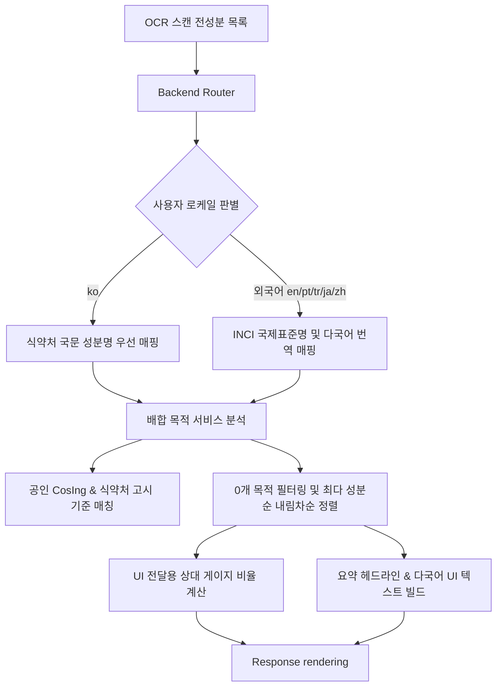

안녕하세요. PickSafe 제품 및 핵심 아키텍처 팀입니다.

제품을 개발하다 보면 **"사용자가 진짜로 원하는 가치는 무엇인가?"**라는 본질적인 질문과 마주할 때가 있습니다. PickSafe는 그동안 화장품 성분 스캔 시 '알레르기 유발 물질'이나 '사용자 기피 성분'을 걸러주는 **네거티브 가드(Negative Safety Guard)** 역할에 집중해 왔습니다. 유해 성분을 피하는 것은 안전을 위해 매우 중요한 가치입니다.

하지만 실제 유저 피드백을 분석해 보니, 소비자들은 성분의 위험성뿐만 아니라 **"이 제품이 내 피부 보습, 진정, 미백 등 어떤 목적을 위해 만들어진 화장품인가?"**라는 **긍정적 가치(Positive Purpose Information)**도 한눈에 알고 싶어 했습니다.

오늘 포스팅에서는 이 긍정적 가치를 제품에 녹여내기 위해 우리가 마주했던 **기술적/법적 규제 제약**, **아키텍처 관점에서의 트레이드오프(Trade-off)**, 그리고 **7개 국어에 완벽히 대응하는 글로벌 UI 구현 여정**을 공유합니다.

---

## 1. 문제 정의: 네거티브 필터링의 한계와 글로벌 확장 장벽

새로운 기능을 설계하며 기획 및 엔지니어링 팀은 세 가지 핵심 문제에 직면했습니다.

### 1.1. 안전 중심 멘탈 모델의 파편화 우려
사용자에게 성분 안전 정보(`[주의 성분]` ➔ `[이상 없는 성분]` ➔ `[확인 불가 성분]`)는 하나의 흐름으로 인지되어야 하는 단일 정보 단위(Single Unit of Mental Model)입니다. 만약 중간에 '배합 목적'이라는 새로운 분석 카드를 무작정 끼워 넣는다면, 사용자의 정보 습득 흐름이 끊어지고 인지 과부하가 발생할 우려가 있었습니다.

### 1.2. 법적 규제와 자의적 알고리즘의 한계 (Regulatory Risk)
"지성 피부에 90% 적합합니다"와 같은 통계적/AI 기반 피부 타입 적합도 서비스는 얼핏 매력적으로 보입니다. 하지만 화장품법 및 의약품 오인 방지 가이드라인에 따르면, **의료/피부과적 처방이 아닌 자의적 규칙으로 점수화하는 것은 심각한 법적 리스크**를 초래합니다. 또한 개인차가 극심한 피부 반응을 충분한 임상 표본 없이 통계화하는 것은 데이터의 객관성을 훼손하는 일이었습니다.

### 1.3. 글로벌 다국어(7개 언어) UI의 붕괴 현상
영어나 한국어에 맞춰진 UI 레이아웃은 포르투갈어(pt-BR), 튀르키예어(tr) 등 텍스트 길이가 극단적으로 길어지는 로케일에서 쉽게 깨집니다. 예를 들어, 모바일 화면의 좁은 가로폭에서 라틴계 긴 단어가 임의의 위치에서 잘려 가독성이 훼손되는 타이포그래피 이슈가 예상되었습니다.

---

## 2. 기술적 고민과 대안 비교 (Architecture & Trade-off)

우리는 위 문제들을 해결하기 위해 몇 가지 핵심 설계 결정을 내렸습니다.

### 고민 1. 자의적 AI 적합도 추천 vs 공인 규격 데이터 기반의 팩트(Fact) 매핑
*   **대안 A (추천 모델 도입):** 사용자 프로필과 성분을 대조하여 '피부 타입별 적합도 통계' 점수를 제공한다.
    *   *장점:* 마케팅적으로 자극적이고 유입을 늘리기 쉽다.
    *   *단점:* 알고리즘의 신뢰성 보장이 어렵고, 법적 소송 및 규제 기관(식약처 등)의 제재 위험이 매우 높음.
*   **대안 B (공인 데이터 100% 매핑 - 선택):** 국내 식약처(MFDS) 기능성 고시, 유럽 CosIng 성분 기능 데이터베이스, 대한화장품협회 배합목적 사전을 기준으로 한 **객관적 '배합목적(Formulation Purpose)' 정보만 집계**하여 보여준다.
    *   *선택 사유:* 규제 리스크 제로화, 서비스의 전문성과 공신력 극대화. 여기에 식약처 가이드를 준수한 공식 면책 문구(Disclaimer)를 명시하여 법적 안정성을 완전히 확보했습니다.

### 고민 2. 정보 구조(IA) 배치와 모바일 사용성 극대화
단순히 모든 성분의 배합목적 카테고리를 펼쳐놓으면 모바일에선 무의식적인 피로감을 유발합니다. 이를 해결하기 위해 두 가지 뷰포트 최적화 로직을 적용했습니다.

1.  **0개 카테고리 필터링 및 내림차순 정렬:** 검출 성분이 0개인 불필요한 영역은 화면에서 숨기고, 성분 개수가 많은 순으로 정렬하여 제한된 모바일 화면을 효율적으로 활용하도록 했습니다.
2.  **위계 분리:** 기존 안전 판정 3섹션 아코디언을 온전히 먼저 노출하여 기존 멘탈 모델을 유지하고, 그 바로 아래에 `[✨ 화장품 핵심 배합 목적]` 카드를 배치했습니다.

---

## 3. 글로벌 다국어 안정화를 위한 시스템 아키텍처

우리는 한국어(`ko`), 영어(`en`), 포르투갈어(`pt-BR`), 튀르키예어(`tr`), 일본어(`ja`), 중국어 간체/번체(`zh-CN`, `zh-TW`) 등 총 7개 언어를 완벽하게 지원하는 아키텍처를 설계했습니다.

### 데이터 흐름도 (Data Flow)

스캔한 성분을 파싱하고 다국어 대응 데이터로 가공해 프론트엔드로 전달하기까지의 파이프라인은 다음과 같습니다.



### 글로벌 UI 깨짐을 극복한 세부 엔지니어링 (CSS & I18n)

다국어 대응 시 가장 까다로웠던 부분은 **타이포그래피의 가변성**이었습니다. 

예를 들어, "피부 보습"이라는 4글자 한국어 단어는 포르투갈어 번역 시 `"Hidratação da pele"`로 대폭 길어집니다. 이를 처리하기 위해 프론트엔드와 백엔드 모두에 다음과 같은 방어적 설계를 구축했습니다.

#### 1. 비문 방지를 위한 언어별 문법 템플릿 (Dynamic Templates)
단순히 `카테고리명 + "성분"` 형태로 문자열을 이어 붙이면 라틴계 언어에서는 문법 파괴가 일어납니다. 우리는 번역 리소스 관리에 플레이스홀더를 도입해 언어별로 유연하게 빌드되도록 설계했습니다.
*   **한국어:** `{category} 배합 성분` ➔ `피부 보습 배합 성분`
*   **포르투갈어:** `Ingredientes de {category}` ➔ `Ingredientes de Hidratação`

#### 2. 철자 임의 잘림 방지 (Word Break & Hyphenation)
모바일 기둥 차트 레이블이 좁아질 때 단어 중간이 이상하게 찢어지는 현상(`Hidrataçã \n o`)을 막기 위해 아래의 CSS 규칙을 적용했습니다.

```css
.purpose-column-label {
  font-size: 0.64rem;
  overflow-wrap: normal;
  word-break: keep-all; /* 단어 단위 줄바꿈 유지 */
  hyphens: auto;        /* 다국어 하이픈 자동 처리 */
  text-align: center;
}
```

#### 3. 반응형 가변 폭 및 가로 스크롤 지원
기둥의 너비를 고정하는 대신 `flex: 1 1 66px; min-width: 66px; max-width: 84px;` 방식을 채택하여 모바일 해상도에 맞게 유연하게 늘어나도록 구현했습니다. 영역을 초과하는 다국어 레이블이 있더라도 부드러운 가로 스크롤(`overflow-x: auto`)을 통해 레이아웃 붕괴를 원천 차단했습니다.

---

## 4. 구현 성과 및 엔지니어링 교훈 (Takeaways)

이번 배합목적 분석 및 시각화 기능 구현을 통해 얻은 값진 교훈들입니다.

### 1. 사용자 경험(UX) 중심의 성분 정보 전달 성공
단순히 성분의 위험성만 경고하던 네거티브 앱에서, 제품의 구매 가치를 긍정적으로 분석해 주는 동반자적 서비스로 거듭났습니다. 사용자는 1회의 스캔만으로 **"안전성 검증"**과 **"제품의 목적 부합 여부"**를 동시에 판단할 수 있게 되었습니다.

### 2. 컴플라이언스(법적 규제) 우선 설계의 중요성
도전적이고 현란한 '피부 맞춤 점수'의 유혹을 뿌리치고, 규제 친화적이고 객관적인 공인 규격 데이터(식약처, EU CosIng) 기반 설계를 고수한 덕분에 **규제 기관 및 화장품 브랜드사와의 마찰 리스크를 제로화**하면서 서비스의 신뢰도를 탄탄하게 쌓았습니다.

### 3. 글로벌 확장을 고려한 견고한 프론트엔드 아키텍처
처음부터 i18n 구조를 고려하여 유연한 CSS 가변 레이아웃과 동적 번역 템플릿을 설계하지 않았다면, 글로벌 론칭 단계에서 무수히 많은 레이아웃 핫픽스(Hotfix)에 시달렸을 것입니다. 글로벌 도메인으로의 확장을 염두에 둔다면, **UI 가변성과 언어별 템플릿화는 선택이 아닌 필수**임을 깊이 깨달았습니다.

---

> **"안전하게 지켜주고, 가치를 더해주는 서비스"**  
> PickSafe는 앞으로도 신뢰할 수 있는 엄격한 기술 아키텍처 위에서 전 세계 사용자가 안심하고 화장품을 선택할 수 있는 문화를 만들어 가겠습니다.