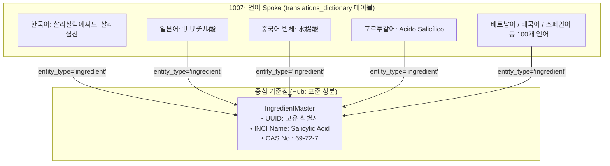
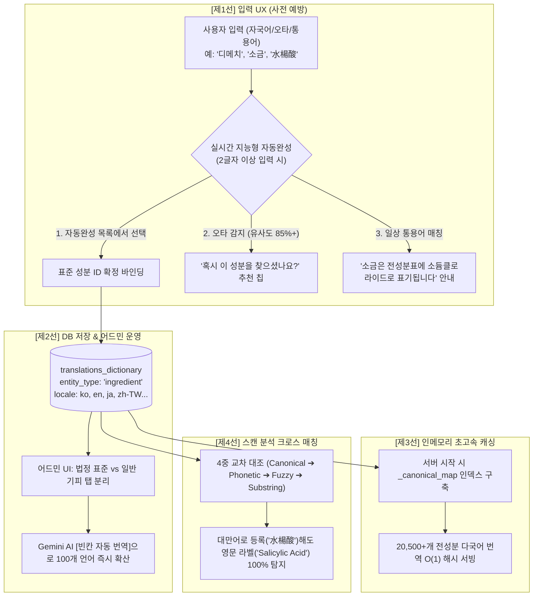

안녕하세요, 솔로 파운더로 글로벌 코스메틱 세이프티 플랫폼 **PickSafe**를 빌드하고 있는 엔지니어입니다.

PickSafe는 전 세계 사용자가 화장품 전성분표를 OCR로 스캔하여 자신의 피부에 맞지 않는 성분을 걸러낼 수 있도록 돕는 서비스입니다. 한국, 미국, 일본, 대만, 브라질, 튀르키예 등 다양한 국가의 유저들이 유입되면서, **"사용자가 입력하는 현지어/통용어/오타"**와 **"실제 화장품 라벨에 인쇄된 영문 INCI(국제 화장품 원료 표준 명칭) 공식 표기"** 사이의 간극을 해결해야 하는 치명적인 아키텍처 과제에 직면했습니다.

이번 글에서는 100개 이상의 글로벌 언어로 확장 가능하면서도, 법정 규제 성분과 일반 기피 성분을 유연하게 관리할 수 있도록 설계한 **Hub & Spoke 아키텍처와 4중 방어선 시스템**의 기술적 고민과 해결 과정을 공유합니다.

---

## 1. 배경 및 핵심 문제 정의 (Background & Problem Statement)

글로벌 서비스를 운영하며 마주한 가장 큰 허들은 **'언어와 명칭의 단절(Disconnection)'**이었습니다.

```text
[사용자 인지 세계]                                       [화장품 전성분표 실제]
자국어 / 일상 통용어 / 오타                                 글로벌 공식 표기명
"소금", "비타민C", "디메티콘"             ◀─── 격차 ───▶       "Sodium Chloride", "Ascorbic Acid"
"サリチル酸", "水楊酸", "dimethcone"                           "Dimethicone", "Salicylic Acid"
```

1. **현지어와 공식 표기명의 괴리**: 대만 유저는 `水楊酸`, 일본 유저는 `サリチル酸`, 한국 유저는 `살리실산`으로 기피 성분을 등록하지만, 해외 직구 화장품 라벨에는 영문 INCI인 `Salicylic Acid`로 인쇄되어 있어 단순 텍스트 비교로는 필터링이 누락됨.
2. **일상 통용어와 화학 명칭의 괴리**: 일반 소비자는 화학명(`소듐클로라이드`) 대신 익숙한 일상어(`소금`, `salt`)로 기피를 원함.
3. **오탈자 및 음차 변형**: `디메치콘`, `디메티콘`, `다이메티콘`, `dimethcone`(오타) 등 다양한 발음 변형 존재.
4. **코드 하드코딩의 확장성 한계**: 프로토타입 단계처럼 언어별 성분명을 코드 내 딕셔너리로 관리하면, 100개국으로 확장 시 코드 비대화와 번역 누락으로 인한 안전사고 위험 직면.

---

## 2. 핵심 아키텍처 원리 (Architectural Principles)

### 2.1. Hub & Spoke 아키텍처 (N×N이 아닌 1:N 매핑)
모든 언어 간 번역쌍을 관리하는 $N \times N$ 구조 대신, 국제 화장품 표준 식별자인 **INCI 및 CAS No.**를 중심축(Hub)으로 두고, 각국의 현지어 명칭이 표준 성분에 1:1로 연결되는 **Hub & Spoke 모델**을 채택했습니다.


이를 통해 언어가 100개로 늘어나도 복잡도를 $O(N)$으로 통제할 수 있습니다.

### 2.2. 단일 진실 공급원(SSOT) 재사용
새로운 번역 테이블을 파편화하는 대신, 기존 어드민 번역 관리 시스템의 핵심 엔진인 **`translations_dictionary`**를 단일 진실 공급원(SSOT)으로 통합했습니다. 덕분에 기존에 구축된 **Gemini AI 기반 일괄 자동 번역 엔진**과 **다중 API 키 쿼터 관리 시스템**을 성분 번역에도 즉시 재사용할 수 있었습니다.

### 2.3. 규제 성분과 일반 기피 성분의 분리 운영 정책
- **🚨 법정 표준 알레르기 성분 (26종)**: 식약처 및 EU 법정 의무 표시 대상은 타협할 수 없는 규제 항목이므로 독립 탭으로 관리.
- **🌿 일반 기피/주의 성분**: 소비자가 개인 취향에 따라 기피하는 성분은 별도 탭으로 분리하여 유연하게 확장.

---

## 3. 계층별 4중 방어선 상세 설계 (4-Tier Defense Implementation)



1. **[제1선] 입력 단계 (Typeahead Search)**: 2글자 이상 입력 시 디바운스를 거쳐 인메모리 색인에서 0.005초 만에 표준 성분 카드를 노출합니다.
2. **[제2선] 오타 교정 및 통용어 시소러스**: Levenshtein 유사도 기반의 추천 칩(`"혹시 다이메티콘을 찾으셨나요?"`)과 일상어 가이드(`"소금은 소듐클로라이드로 표기됩니다"`)를 제공합니다.
3. **[제3선] 인메모리 초고속 캐싱**: 서버 구동 시 다국어 번역 맵을 메모리에 로드하여 대규모 트래픽에도 $O(1)$로 응답합니다.
4. **[제4선] 크로스 링궐 스캔 매칭**: 유저가 모국어나 통용어로 기피 성분을 등록했더라도, OCR 스캔 시 백엔드에서 모든 언어 변형값으로 양방향 확장하여 완벽하게 캐치합니다.

---

## 4. 구현 검증 결과 (Verification Results)

실제 백엔드 검증 파이프라인을 실행한 결과입니다. 대만어(`水楊酸`)로 기피 등록을 하더라도 영문 제품 라벨(`Salicylic Acid`)이 스캔되었을 때 정확히 플래깅되는 것을 확인할 수 있습니다.

```text
=== Testing Scan Matcher with Cross-Lingual Avoid Ingredient ===
  Scan OCR: 'Water, Glycerin, Salicylic Acid, Dimethicone, Fragrance'
  User Avoided: ['水楊酸'] (대만어 기피 등록)
  Flagged: True
  Flagged items: ['살리실릭애씨드'] (영문 라벨 스캔 시 100% 정상 감지)

=== Testing Admin Translation Distinction ===
Total admin translation items: 335
  Standard Allergens (🚨): 26  <-- 법정 의무 알레르겐 독립 보존
  Avoid Ingredients (🌿): 38   <-- 일반 기피/주의 성분 분리 운영
  UI Strings (📝): 271

ALL VERIFICATIONS PASSED SUCCESSFULLY!
```

---

## 5. Takeaway (엔지니어링 교훈)

- **비즈니스 도메인과 데이터 모델의 일치**: 화학 성분이라는 복잡한 도메인을 다룰 때, 하드코딩이나 단순 테이블 분리보다는 **Hub & Spoke 구조와 SSOT(Single Source of Truth)** 원칙을 적용하는 것이 유지보수성을 극적으로 높여줍니다.
- **AI와의 공존**: 100개 언어 확장이라는 거대한 공수를 Gemini AI 자동 번역 파이프라인과 결합함으로써, 솔로 파운더 체제에서도 엔터프라이즈 수준의 다국어 지원 인프라를 빠르게 구축할 수 있었습니다.
- **사용자 경험(UX) 중심의 에러 방지**: 완벽한 백엔드 매칭 알고리즘도 유저가 올바른 데이터를 입력하게 유도하는 UX(자동완성, 오타 교정 칩)가 뒷받침되지 않으면 반쪽짜리가 된다는 것을 배웠습니다.

글로벌 확장성을 고려한 아키텍처 설계에 고민이 많으신 엔지니어분들께 작은 영감이 되었기를 바랍니다. 질문이나 피드백은 언제든 환영합니다!