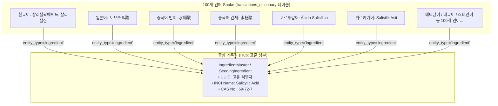
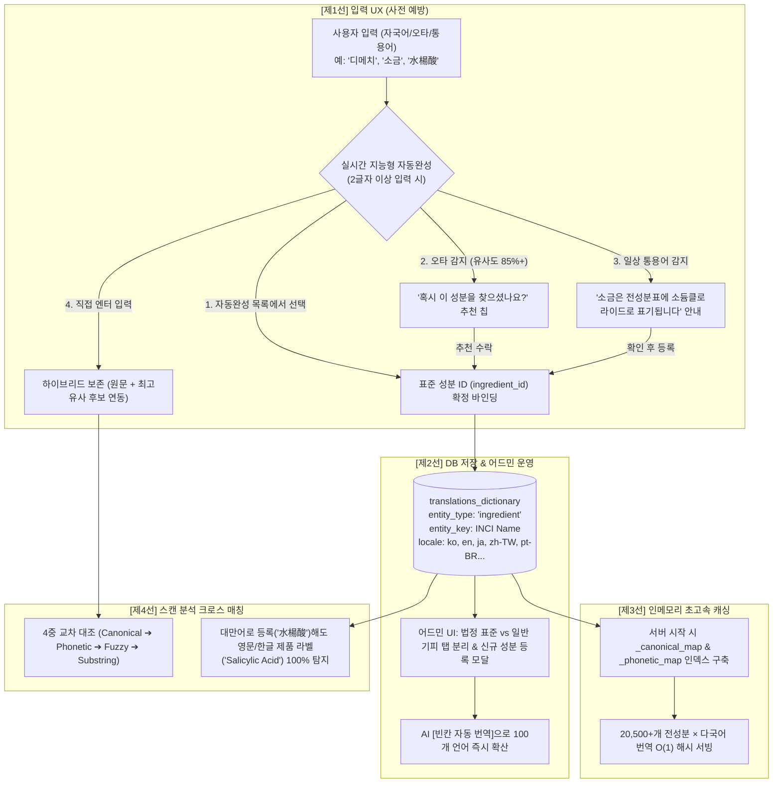

글로벌 사용자를 대상으로 화장품 전성분표를 OCR로 스캔하여 안전성을 분석해주는 서비스를 운영하다 보면, 피할 수 없는 근본적인 벽에 부딪힙니다. 바로 **"사용자가 입력하는 언어"**와 **"화장품 라벨에 인쇄된 실제 성분명"** 사이의 간극입니다.

이번 포스팅에서는 대만 사용자가 `水楊酸`으로 기피 성분을 등록했을 때, 일본어, 한국어, 그리고 해외 여행지에서 구매한 영문 INCI 표기(`Salicylic Acid`)까지 어떻게 100% 누락 없이 크로스 매칭할 수 있었는지, 그 DB 중심의 Hub & Spoke 아키텍처 설계 과정과 4중 방어선 구현 전략을 공유합니다.

---

## 1. 배경 및 핵심 문제 정의

초기 기피 성분 등록 및 스캔 분석 운영 과정에서 다음과 같은 **3대 인지 단절(Disconnections)**과 확장성 한계가 도출되었습니다.

```text
[사용자 인지 세계]                                       [화장품 전성분표 실제]
자국어 / 일상 통용어 / 오타                                 글로벌 공식 표기명
"소금", "비타민C", "디메티콘"             ◀─── 격차 ───▶       "Sodium Chloride", "Ascorbic Acid"
"サリチル酸", "水楊酸", "dimethcone"                           "Dimethicone", "Salicylic Acid"
```

1. **현지어 vs 화장품 전성분 공식 표기명의 괴리**:
   대만 사용자(`水楊酸`), 일본 사용자(`サリチル酸`), 한국 사용자(`살리실산`)는 자국어로 기피 성분을 등록하지만, 실제 화장품 라벨은 영문 INCI(`Salicylic Acid`)나 수입국 표기로 인쇄되어 있어 단순 텍스트 비교 시 필터링이 누락됩니다.
2. **소비자 일상 통용어 vs 화학 전문 명칭의 괴리**:
   일반 소비자는 화학 전문 표기(`소듐클로라이드`) 대신 일상어(`소금`, `salt`)로 기피하고 싶어 합니다.
3. **오탈자 및 음차 표기 변형 누락 위험**:
   `디메치콘` / `디메티콘` / `다이메티콘` / `dimethcone`(오타) 등 수많은 발음 차이와 오타가 존재합니다.
4. **100개 언어 확장에 따른 코드 하드코딩의 한계**:
   초기 프로토타입처럼 파이썬 딕셔너리에 언어별 성분명을 하드코딩할 경우, 언어가 수십~100개로 늘어날 때 코드 비대화 및 번역 누락으로 안전사고가 발생할 수 있으므로 **DB 중심의 정규화된 Hub & Spoke 아키텍처**가 필수적이었습니다.

---

## 2. 핵심 아키텍처 원리

### 2.1. Hub & Spoke 아키텍처 (N×N이 아닌 1:N 매핑)
국제 화장품 표준 식별자인 **INCI(International Nomenclature of Cosmetic Ingredients)** 및 **CAS No.**를 중심 축(Hub)으로 삼아, 모든 언어의 현지어 명칭이 표준 성분에 1:1로 매달리도록 구성했습니다.



언어가 100개가 되더라도 언어 간 번역쌍(10,000개)이 필요하지 않으며, **오직 INCI 기준 1:N 매핑**으로 복잡도를 $O(N)$으로 통제합니다.

### 2.2. 단일 진실 공급원(SSOT)으로서 `translations_dictionary` 활용
불필요한 테이블 분리로 인한 운영 이원화를 지양하고, 기존 어드민 번역 관리 시스템의 핵심 엔진인 **`translations_dictionary`**를 단일 진실 공급원으로 통합 채택했습니다. 이를 통해 기존에 구축된 **AI 일괄 자동 번역 엔진**과 **다중 API 키 쿼터 관리 시스템**을 성분 번역에도 즉시 재사용할 수 있게 되었습니다.

### 2.3. 법정 표준 알레르겐 vs 일반 기피 성분의 엄격한 분리 운영
- **`🚨 법정 표준 알레르기 성분`**: 법정 의무 표시 대상 성분은 타협할 수 없는 필수 규제 항목이므로 독립 탭으로 우선 관리합니다.
- **`🌿 기타 기피/주의 성분`**: 소비자가 개인 취향 및 피부 반응에 따라 기피하는 성분은 별도 탭으로 분리하여 유연하게 확장합니다.
- **테이블 '구분' 컬럼 신설**: 뱃지를 명확히 표시하여 어드민 운영 효율을 극대화했습니다.

---

## 3. 계층별 4중 방어선 상세 설계 및 구현



### 3.1. [제1선] 입력 단계: 다국어 지능형 자동완성 (Typeahead Search)
- **실시간 검색**: 2글자 이상 입력 시 디바운스(200ms) 후 인메모리 색인에서 검색하여, `水楊酸`, `サリチル酸`, `소금` 어느 것을 입력해도 0.005초 만에 표준 성분 카드를 노출합니다.
- **하이브리드 등록**: 목록에 없는 신조어(`개똥쑥추출물` 등)도 엔터 입력 시 자유롭게 등록되며, 내부적으로 최고 유사 성분 후보 ID를 연동합니다.

### 3.2. [제2선] 오타 교정 및 통용어 시소러스
- **형태소 정규화 규칙**: `디메치콘` ➔ `다이메티콘`, `나트륨` ➔ `소듐` 등 화학 명명법 규칙을 선적용합니다.
- **오타 감지 추천 칩**: Levenshtein 유사도 85% 이상 시 *"혹시 '다이메티콘'을 찾으셨나요?"* 추천 칩을 노출합니다.
- **일상 통용어 매핑**: `소금` ➔ `소듐클로라이드`, `비타민C` ➔ `아스코빅애씨드` 등의 통용어 시소러스를 제공합니다.

### 3.3. [제3선] 인메모리 초고속 캐싱
서버 구동 시점에 DB의 다국어 번역 맵을 인메모리 해시 구조로 적재하여, 스캔 분석 시 디스크 I/O 없이 $O(1)$ 시간 복잡도로 전성분을 교차 대조합니다.

### 3.4. [제4선] 스캔 분석 크로스 매칭 (Cross-lingual Scan Matching)
사용자가 대만 번체(`水楊酸`)로 기피 성분을 등록했더라도, 스캔 매처 서비스가 다국어 맵을 참조해 영문(`Salicylic Acid`) 및 국문(`살리실릭애씨드`) 변형을 양방향 확장하므로, 영문 전성분표 스캔 시 위험 성분을 100% 정상 플래깅합니다.

---

## 4. 엔지니어링 Takeaway (교훈 및 시사점)

1. **글로벌 서비스에서 다국어는 사후 고려사항이 될 수 없다**:
   초기 단계부터 데이터 모델 설계 시 Hub & Spoke 구조(INCI 중심 표준화)를 채택하지 않으면, 언어가 늘어날수록 폭발적인 스키마 변경과 마이그레이션 지옥을 겪게 됩니다.
2. **정확성과 유연성의 조화 (Hybrid Approach)**:
   법정 규제 항목과 같은 엄격한 데이터는 철저히 표준화(SSOT)하되, 사용자가 입력하는 오타와 일상어는 퍼지 매칭과 시소러스로 유연하게 포용하는 **이원화된 접근**이 실사용자 경험(UX)을 결정합니다.
3. **AI 번역 파이프라인의 시스템 결합**:
   번역 전용 딕셔너리 테이블에 LLM 일괄 자동 번역 파이프라인을 사전 연동해 둠으로써, 도메인 데이터(성분명)가 추가될 때마다 개발 비용 없이 100개 언어로 즉시 확장 가능한 기반을 마련할 수 있었습니다.