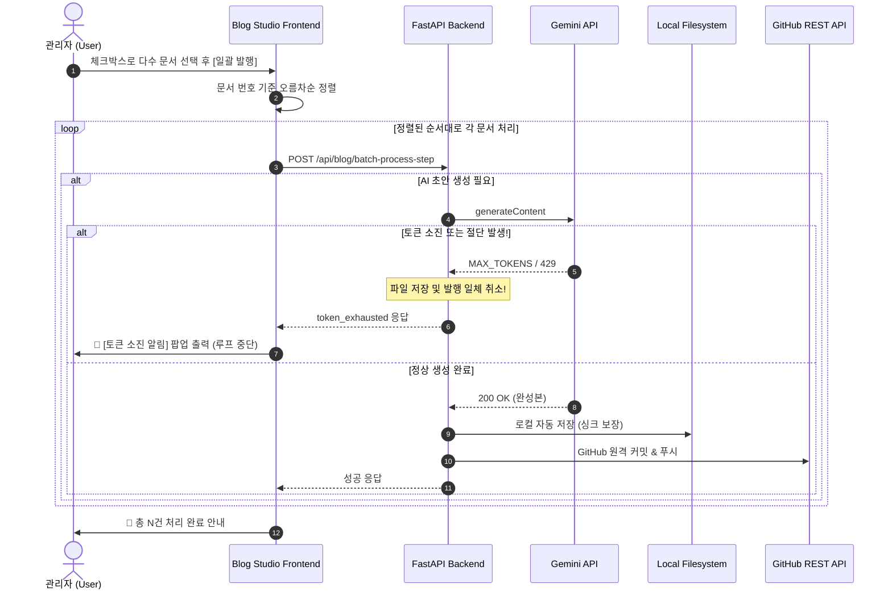

안녕하세요, PickSafe Core Architecture Team입니다.

서비스 오픈을 앞두고 사내에 쌓여 있는 수십 편의 아키텍처 결정 문서(ADR)를 기술 블로그 포스트로 변환해 외부에 공개해야 하는 미션이 떨어졌습니다. 초기 시스템은 **"에디터에 활성화된 1건의 글을 개별 배포하는 구조"**였기에, 수십 건의 문서를 하나씩 열고 검토·발행하는 반복 작업은 너무나도 비효율적이었습니다.

그렇다고 단순히 "로컬에 저장된 모든 글을 한 번에 배포"하는 무작위 일괄 발행을 구현하자니 치명적인 리스크가 보였습니다. 미완성 초안이 유출될 수 있고, 릴리즈 일정에 맞춰 글을 선별 배제할 수도 없었죠.

이번 글에서는 **미완성 초안 유출을 막고, 데이터 싱크를 맞추며, AI 토큰 소진까지 방어하는 견고한 일괄 발행 파이프라인**을 어떻게 설계하고 구현했는지 공유하고자 합니다.

---

## 1. 마주한 기술적 문제들 (Troubleshooting)

기능 개발 전후로 실전 테스트를 거치며 다음과 같은 4가지 핵심 싱크 및 UX 결함들을 마주했습니다.

1. **발행 시 로컬 저장본 유실 및 싱크로율 붕괴**
   - 백엔드 발행 로직에서 정제된 슬러그 파일명으로 저장하면서, 기존 원본 ADR 파일명을 가진 로컬 초안 파일을 `os.remove()`로 삭제해 버렸습니다. 이로 인해 발행 직후 문서를 다시 열면 최신 저장본을 찾지 못하고 초기 원본 텍스트로 되돌아가는 데이터 불일치 버그가 발생했습니다.
2. **일괄 발행 후 UI 먹통 현상**
   - 다수 선택 일괄 발행 완료 시 버튼 라벨만 변경된 채 `disabled = true`가 유지되어, 사용자가 추가적인 액션을 취할 수 없는 UX 버그가 있었습니다.
3. **AI 토큰 소진 및 출력 절단에 따른 '미완성 글' 오염**
   - AI 초안 생성 중 모델의 토큰 상한(`MAX_TOKENS`)에 도달하거나 할당량(Quota 429)이 소진되면 글이 중간에 끊깁니다. 이 미완성 찌꺼기 글이 그대로 저장·배포될 경우 블로그 품질에 치명적입니다.
4. **동일 일자 다수 글 등록으로 인한 정렬 왜곡**
   - 하루에 5~7개의 글이 동시에 배포되면 Hugo 정적 블로그 엔진 특성상 가나다순으로 정렬이 꼬여, 실제 개발 흐름(#1 ➔ #2 ➔ #3...)과 블로그 노출 순서가 어긋나는 문제가 발생했습니다.

---

## 2. 기술적 고민과 아키텍처 설계

이 문제를 해결하기 위해 다음과 같은 핵심 설계 원칙을 세웠습니다.

### ① 빠른 번호순 오름차순 정렬 (`Frontend`)
사용자가 어떤 순서로 문서를 체크하든 상관없이, 시스템 내부적으로 문서 번호(`seq_num` / `number`)를 기준으로 오름차순 정렬을 강제하여 개발 흐름과 블로그 노출 순서를 일치시켰습니다.

```javascript
const selectedList = allDecisions
    .filter(d => selectedDocFilenames.has(d.filename))
    .sort((a, b) => (a.number || a.seq_num || 999999) - (b.number || b.seq_num || 999999));
```

### ② Fail-Safe Guardrail: 토큰 소진 및 절단 방어 (`Backend`)
AI API 호출 시 Quota 고갈(429)이나 출력 상한 도달(`MAX_TOKENS`)을 감지하면, **파일 저장 및 GitHub API 호출을 원천 차단(미저장 폐기)**하고 즉시 에러를 반환하도록 설계했습니다. 특히, 이전에 정상 완료된 건들은 온전히 보존되어 안전성을 높였습니다.

```python
# 단일 출력 상한 도달에 의한 중간 절단 방어
if finish_reason in ["MAX_TOKENS", "LENGTH"]:
    return {
        "success": False,
        "error_type": "max_tokens_reached",
        "message": "최대 출력 토큰 상한에 도달하여 저장을 취소합니다."
    }
```

### ③ 1일 1포스팅 스마트 밀어내기 배분 알고리즘
동일 일자에 집중된 포스팅들을 캘린더의 빈 날짜(주말, 공백일)를 활용해 하루에 1글씩 순차적으로 전진 분산 배정했습니다.

```python
current_cascaded = None
for it in items:
    doc_date_str = it.get("date", "")
    if doc_date_str and len(doc_date_str) == 10:
        d = datetime.strptime(doc_date_str, "%Y-%m-%d").date()
        if current_cascaded is None:
            current_cascaded = d
        else:
            current_cascaded = max(d, current_cascaded + timedelta(days=1))
        it["cascaded_date"] = current_cascaded.strftime("%Y-%m-%d")
```

### ④ 기존 AI 초안 본문 100% 무손실 보존
이미 공들여 작성된 AI 초안의 본문(Markdown Body, 다이어그램, 코드 스니펫 등)은 단 한 글자도 재호출하거나 오염시키지 않고, YAML Frontmatter 영역의 `date:` 필드만 정규식으로 안전하게 치환하여 일자를 동기화했습니다.

---

## 3. 시스템 아키텍처 (Sequence Diagram)

전체 일괄 AI 생성 및 발행 라이프사이클은 다음과 같은 원자적(Atomic) 스텝으로 동작합니다.



---

## 4. 결론 및 배운 점 (Takeaways)

이번 파이프라인 고도화를 통해 얻은 엔지니어링 교훈은 명확합니다.

1. **자동화와 안정성은 동의어**: 단순히 편의성을 위한 일괄 처리(Automation)를 도입할 때, 예외 케이스(토큰 소진, 미완성 글 유출)에 대한 방어 기제(Fail-Safe)가 없다면 운영 리스크가 폭증한다는 것을 확인했습니다.
2. **데이터 싱크의 원칙 확립**: "발행 = 로컬 자동 저장"이라는 명확한 원칙을 세워, UI와 파일시스템 간의 데이터 불일치 문제를 깔끔하게 해결했습니다.
3. **콘텐츠 무결성 보장**: 대규모 배치 처리 과정에서도 기존에 생성된 자산(AI 초안 본문)이 오염되지 않도록 정규식을 활용한 정밀 치환 구조를 채택함으로써 시스템의 신뢰성을 높였습니다.

수십 개의 문서를 다루는 백엔드 파이프라인이나 AI 기반 콘텐츠 자동화 시스템을 고민하시는 분들께 이 아키텍처가 작은 영감이 되었기를 바랍니다. 

감사합니다.