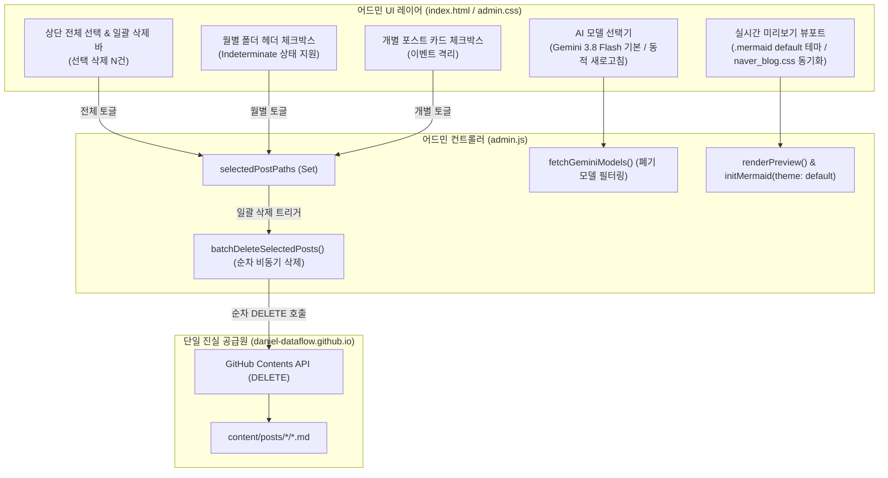

# [ADR-002] 블로그 어드민 고도화: 최신 Gemini 3.8 Flash 동적 연동, 다중 선택 일괄 삭제 및 실시간 뷰어 테마 일치화

- **상태 (Status)**: 채택됨 (Accepted)
- **일자 (Date)**: 2026-09-14
- **작성자 (Author)**: Daniel (Backend & Systems Architect)
- **대상 시스템**: `daniel-dataflow.github.io` (Standalone In-Repo Web Admin Studio & CMS: `static/admin`)

---

## 1. 배경 및 문제 정의 (Context & Problem Statement)

독립형 통합 블로그 어드민 CMS(ADR-001) 구축 이후, 실제 포스트 운영 및 유지보수 과정에서 다음과 같은 3가지 사용성 및 렌더링 병목이 식별되었습니다:

1. **AI 모델 라인업의 노후화 및 폐기 모델 관리 부재**:
   - Google Gemini의 신규 모델(Gemini 3.8 Flash)이 출시되었으나 기존 어드민은 `gemini-3.5-flash`에 머물러 있었음.
   - 이미 서비스 지원이 중단(Deprecated)된 레거시 모델이나 비생성형 모델이 선택지에 남아 사용자 혼란을 유발할 수 있음.
   - 이에 따라 항상 최신 출시 버전이 기본 권장값으로 반영되고, 지원 중단 모델은 자동 제외되는 유연한 모델 탐색 체계가 요구됨.

2. **기발행 글 관리 시 대량 선택 및 일괄 삭제(Batch Delete) 부재**:
   - 사이드바 목록(68건 이상)에서 개별 포스트 단위로만 삭제할 수 있어, 특정 월의 글이나 대량의 포스트를 정리할 때 비효율이 극심함.
   - 전체 선택, 월별(YYYY-MM) 그룹 선택, 개별 체크박스 선택을 지원하는 다중 선택 체계와 원클릭 GitHub 일괄 삭제(Batch Deletion) 기능이 필수적임.

3. **실시간 미리보기 화면과 실제 배포 블로그 간의 테마 불일치 (Mermaid 렌더링 오류)**:
   - 미리보기 화면(` 실시간 네이버 블로그 뷰어`)의 배경은 밝은 화이트 테마임에도 불구하고, Mermaid 다이어그램이 `theme: 'dark'`로 하드코딩 초기화되어 검은색 박스와 식별 곤란한 텍스트로 렌더링됨.
   - 실제 배포 사이트의 네이버 블로그 스타일 테마(카드형 둥근 모서리, 연보라색 노드, 보라색 테두리, 선명한 본문 타이포그래피)와 100% 동일하게 렌더링되지 않는 괴리 발생.

---

## 2. 핵심 설계 원칙 및 아키텍처 결정 (Design Decisions)

### ① 최신 Gemini 3.8 Flash 동적 탐색 및 상용화 폐기 모델 자동 필터링
- **기본 권장 모델 승격**: 최신 `gemini-3.8-flash`를 1순위 권장 모델로 지정.
- **동적 모델 조회 파이프라인**:
  - API Key가 입력되었을 때 Google Gemini Models API(`GET /v1beta/models`)를 호출하여 사용 가능한 모델을 동적으로 갱신.
  - 지원 종료된 레거시 모델(`gemini-1.0-pro`, `gemini-pro`, `embedding-*`, `aqa` 등) 및 텍스트 생성을 지원하지 않는 모델을 자동 제외(Blacklist/Filter).
- **지능형 폴백 체계**:
  - 초안 생성 호출 시 `[선택 모델, gemini-3.8-flash, gemini-3.7-flash, gemini-3.6-flash, gemini-3.5-flash]` 순으로 자동 재시도하여 쿼터 초과나 일시 장애 발생 시에도 무결점 생성 보장.

### ② 3단계 다중 선택 및 안전한 순차 일괄 삭제 (Batch Delete)
- **3계층 선택 체계**:
  1. `전체 선택`: 상단 툴바 체크박스로 현재 로드된 전체 포스트 일괄 토글.
  2. `월별 선택`: `YYYY-MM` 폴더 헤더 체크박스로 해당 월에 속한 포스트 그룹 토글 (부분 선택 시 indeterminate 시각화).
  3. `개인 선택`: 각 포스트 카드 좌측 체크박스로 개별 토글 (카드 클릭 시 에디터 로드 이벤트 버블링 차단).
- **GitHub API 안전 삭제 파이프라인**:
  - 선택된 포스트들을 순차 비동기(Promise Chain)로 GitHub REST API(`DELETE /contents/{path}`)에 요청하여 GitHub Rate Limit 방어.
  - 진행률 토스트(Progress Indicator)를 통해 실시간 삭제 현황 안내 후 로컬 상태 자동 갱신.

### ③ 미리보기 뷰어와 실제 블로그 테마 100% 일치화
- **Mermaid 다이어그램 테마 교체**:
  - `mermaid.initialize` 설정을 실제 블로그와 동일한 `theme: "default"`로 변경하여 연보라색 노드와 보라색 스트로크, 어두운 텍스트를 정확히 복원.
  - 다이어그램 래퍼 컨테이너 클래스를 `.mermaid`로 통일하고 실제 블로그 CSS(`static/css/naver_blog.css`)의 카드형 섀도우 및 패딩 스타일 완벽 적용.
- **본문 타이포그래피 및 컴포넌트 스타일 동기화**:
  - 소제목(H2 그린 바, H3), 인용구(Blockquote 그린 바), 코드 블록, 테이블의 여백 및 폰트를 실제 배포 뷰포트와 1:1로 일치시킴.

---

## 3. 세부 구현 내역 (Implementation Specification)

---

## 4. 도입 효과 및 결과 (Consequences & Impact)

| 비교 항목 | 개선 전 | 개선 후 |
| :--- | :--- | :--- |
| **기본 AI 모델** | `gemini-3.5-flash` | **`gemini-3.8-flash` (최신 모델 반영)** |
| **모델 관리성** | 정적 하드코딩 / 폐기 모델 미필터링 | **API 동적 최신화 / 폐기 모델 자동 제외 / 지능형 Fallback** |
| **포스트 삭제 생산성** | 개별 포스트 1건씩 수동 삭제만 가능 | **전체 / 월별 / 개인 3단계 선택 & 원클릭 일괄 삭제** |
| **Mermaid 다이어그램** | 다크 테마 하드코딩 (검은색 박스 / 글씨 식별 곤란) | **실제 사이트와 100% 동일한 연보라색 default 카드 테마** |
| **미리보기 시각적 일치도**| 본문 및 다이어그램 스타일 괴리 존재 | **실제 배포된 네이버 블로그 테마와 1:1 완벽 일치** |
